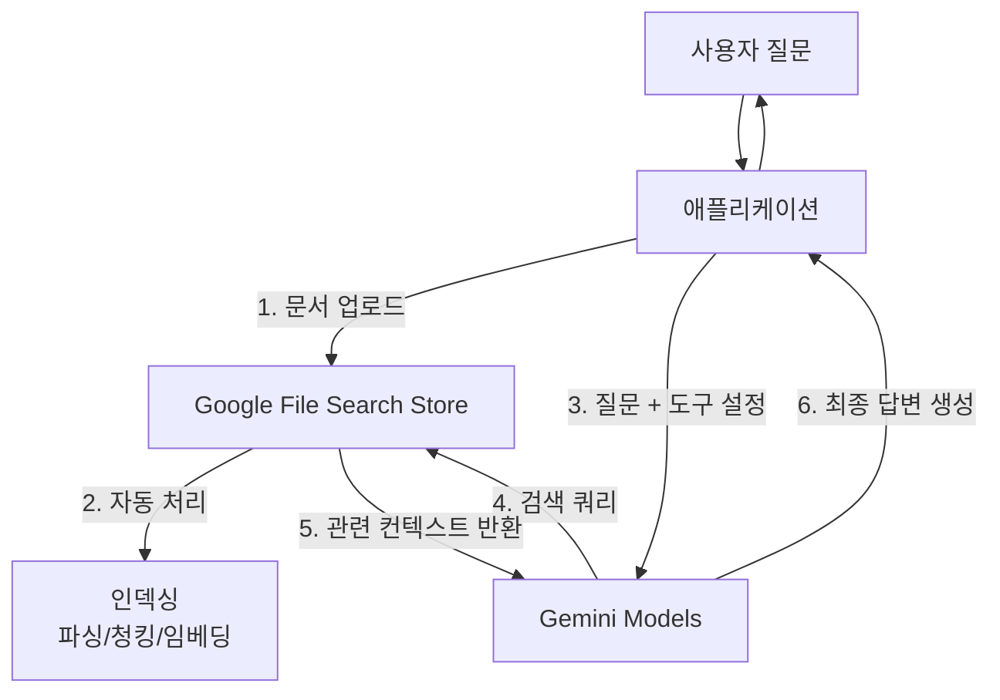

# Google File Search Store를 활용한 RAG 시스템 구축 가이드

> 한국어 개발자를 위한 Google Gemini File Search Store 기반 RAG(Retrieval-Augmented Generation) 시스템 구축 튜토리얼

## 📋 목차

- [프로젝트 소개](#-프로젝트-소개)
- [왜 Google File Search Store인가?](#-왜-google-file-search-store인가)
- [시스템 아키텍처](#-시스템-아키텍처)
- [환경 구축](#-환경-구축)
- [빠른 시작](#-빠른-시작)
- [상세 가이드](#-상세-가이드)
- [트러블슈팅](#-트러블슈팅)
- [참고 자료](#-참고-자료)

---

## 🎯 프로젝트 소개

이 프로젝트는 **Google Gemini API의 File Search Store** 기능을 사용하여 별도의 벡터 데이터베이스 구축 없이 고성능 RAG(Retrieval-Augmented Generation) 시스템을 구축하는 실전 가이드입니다.

### 주요 특징

- ✅ **Serverless RAG**: 복잡한 벡터 DB 관리 불필요
- ✅ **자동화된 파이프라인**: 문서 파싱, 청킹, 임베딩, 인덱싱 자동 처리
- ✅ **고성능 검색**: Google의 검색 기술을 활용한 정확한 정보 추출
- ✅ **손쉬운 통합**: Python SDK를 통한 간편한 구현

### 학습 목표

이 가이드를 완료하면 다음을 할 수 있습니다:

1. Google Gemini API 환경 설정 및 API 키 발급
2. File Search Store 생성 및 문서 업로드
3. Gemini 모델과 File Search 도구를 연동한 RAG 구현
4. Python을 이용한 RAG 애플리케이션 개발

### 실제 활용 사례

File Search Store 기반 RAG는 다음과 같은 시나리오에서 효과적입니다:

-   **📚 기술 문서 검색 챗봇**: 사내 기술 문서, API 문서, 가이드를 업로드하여 직원들이 질문하면 정확한 답변 제공
-   **🏢 고객 지원 자동화**: 제품 매뉴얼, FAQ, 정책 문서를 기반으로 고객 질문에 즉시 응답
-   **📊 리포트 분석 도우미**: 대량의 보고서, 논문, 연구 자료에서 필요한 정보를 빠르게 추출
-   **💼 법률/계약서 검색**: 계약서, 법률 문서에서 특정 조항이나 내용을 검색하고 요약
-   **🎓 교육 콘텐츠 어시스턴트**: 강의 자료, 교재를 업로드하여 학생들의 질문에 답변하는 스터디 도우미

---

## 📋 주요 사양 (Specs)

### 지원하는 Gemini 모델 (2025년 기준)

File Search Store는 다음 Gemini 모델들과 호환됩니다:

| 모델명 | 특징 | 권장 사용처 |
|--------|------|------------|
| **gemini-2.5-flash** | 빠른 속도, 낮은 비용 | 일반적인 RAG, 실시간 챗봇 |
| **gemini-2.5-flash-lite** | 초경량, 초고속 | 간단한 문서 검색, 대량 요청 처리 |
| **gemini-2.5-pro** | 높은 추론 능력, 긴 컨텍스트 | 복잡한 분석, 전문 문서 이해 |
| **gemini-1.5-flash** | 안정적인 성능 | 레거시 호환성 필요 시 |
| **gemini-1.5-pro** | 검증된 고성능 | 프로덕션 환경의 고품질 RAG |

### 지원하는 파일 형식
File Search는 다양한 문서 및 코드 형식을 지원합니다.

- **문서**: PDF, HTML, Markdown, CSV, XML, RTF, Plain Text 등
- **코드**: Python, JavaScript, TypeScript, Java, C++, Go, PHP, Ruby, Swift 등
- **기타**: JSON, YAML 등
- *참고: 이미지나 비디오 파일은 File Search Store에 직접 업로드할 수 없습니다.*

### 제한 사항 (Quotas & Limits)
- **최대 파일 크기**: 파일당 100MB
- **Store 저장 용량**:
    - **Free Tier**: 총 1GB
    - **Pay-as-you-go**: 총 10GB (Tier 1) ~ 1TB (Tier 3)
- **권장 사항**: 검색 지연 시간을 최적화하기 위해 단일 Store 크기를 20GB 미만으로 유지하는 것을 권장합니다.

### 가격 정책 (Pricing)
- **저장 비용**: 무료 (Storage is free of charge)
- **검색 비용**: 무료 (Query time embeddings are free of charge)
- **인덱싱 비용**: $0.15 / 1M 토큰 (문서 업로드 시 발생)
- **생성 비용**: 검색된 텍스트를 LLM이 처리할 때 일반적인 입력 토큰 비용 발생

---

## 🤔 왜 Google File Search Store인가?

### 기존 RAG vs File Search Store

| 기능 | 기존 RAG (PostgreSQL/pgvector 등) | Google File Search Store |
|------|-----------------------------------|--------------------------|
| **인프라** | DB 설치, 관리, 튜닝 필요 | **완전 관리형 (Serverless)** |
| **구현 복잡도** | 파싱, 청킹, 임베딩 직접 구현 | **API 호출로 자동 처리** |
| **검색 품질** | 임베딩 모델 및 검색 알고리즘에 의존 | **Google 검색 기술 + LLM 최적화** |
| **유지보수** | 지속적인 인덱스 관리 필요 | **관리 불필요** |
| **비용** | 인프라 운영 비용 발생 | **API 사용량 기반 과금** |

### RAG에 최적인 이유

1. **개발 생산성**: 복잡한 전처리 로직 없이 문서 업로드만으로 RAG 준비 완료
2. **최신 모델 활용**: Gemini 1.5 Flash/Pro의 강력한 성능 즉시 활용
3. **정확한 인용**: 답변 생성 시 참고한 문서의 부분을 정확하게 인용 가능

---

## 🏗 시스템 아키텍처

### RAG 워크플로우



### 핵심 컴포넌트

1.  **FileSearchManager**: Store 생성, 파일 업로드, 삭제 등 관리
2.  **AIManager (Gemini Client)**: 모델 설정, 도구(Tool) 연결, 답변 생성

### 워크플로우 상세 설명

#### 1단계: 문서 업로드 (일회성 작업)
```python
# File Search Store 생성
store = client.file_search_stores.create(
    config={'display_name': 'My Knowledge Base'}
)

# 문서 업로드 - Google이 자동으로 처리:
# - 문서 파싱 (PDF, DOCX 등에서 텍스트 추출)
# - 청킹 (의미 단위로 문서 분할)
# - 임베딩 생성 (벡터 변환)
# - 인덱싱 (빠른 검색을 위한 색인 생성)
client.file_search_stores.upload_to_file_search_store(
    file="company_handbook.pdf",
    file_search_store_name=store.name
)
```

#### 2단계: RAG 질의 (반복 작업)
```python
# Gemini 모델에 File Search Tool 연결
response = client.models.generate_content(
    model="gemini-2.5-flash",
    contents="연차 휴가는 몇 일까지 가능해?",
    config=types.GenerateContentConfig(
        tools=[
            types.Tool(
                file_search=types.FileSearch(
                    file_search_store_names=[store.name]
                )
            )
        ]
    )
)

# 내부 프로세스:
# 1. Gemini가 질문을 분석하고 File Search Store에 검색 쿼리 전송
# 2. Store가 관련 문서 청크를 검색하여 반환
# 3. Gemini가 검색된 컨텍스트를 바탕으로 최종 답변 생성
```

#### 핵심 장점
- **자동화**: 파싱, 청킹, 임베딩을 직접 구현할 필요 없음
- **스케일**: 수백 개의 문서를 쉽게 처리 가능
- **정확도**: Google의 검색 기술로 관련성 높은 정보 추출
- **인용**: 답변의 출처를 자동으로 추적하여 신뢰도 향상

---

## 🚀 환경 구축

### 시스템 요구사항

-   **OS**: Windows, macOS, Linux
-   **Python**: 3.8 이상
-   **Google Cloud Project**: Gemini API 사용을 위한 프로젝트

### 1. Python 패키지 설치

```bash
# 가상 환경 생성 (권장)
python -m venv venv
source venv/bin/activate  # macOS/Linux
# venv\Scripts\activate   # Windows

# 필수 패키지 설치
pip install google-genai python-dotenv
```

### 2. API 키 발급

1.  [Google AI Studio](https://aistudio.google.com/) 접속
2.  `Get API key` 클릭 후 키 생성
3.  `.env` 파일 생성 및 키 설정:

```env
GEMINI_API_KEY=your_api_key_here
```

### 3. 설치 확인

설치가 정상적으로 완료되었는지 확인합니다:

```python
# test_setup.py
import os
from google import genai
from dotenv import load_dotenv

load_dotenv()

try:
    client = genai.Client(api_key=os.getenv("GEMINI_API_KEY"))
    models = client.models.list()
    print("✅ API 연결 성공!")
    print(f"사용 가능한 모델: {len(list(models))}개")
except Exception as e:
    print(f"❌ 연결 실패: {e}")
```

**실행 방법:**
```bash
python test_setup.py
```

**예상 출력:**
```
✅ API 연결 성공!
사용 가능한 모델: 15개
```

### 💡 설치 시 자주 발생하는 문제

<details>
<summary><b>문제 1: ModuleNotFoundError: No module named 'google.genai'</b></summary>

**원인**: 패키지가 제대로 설치되지 않았거나 가상환경이 활성화되지 않음

**해결책**:
```bash
# 가상환경 활성화 확인
which python  # macOS/Linux
where python  # Windows

# 패키지 재설치
pip uninstall google-genai
pip install google-genai
```
</details>

<details>
<summary><b>문제 2: 403 Forbidden 또는 API key not valid</b></summary>

**원인**: API 키가 잘못되었거나 환경변수가 제대로 로드되지 않음

**해결책**:
```python
# .env 파일이 올바른 위치에 있는지 확인
import os
from pathlib import Path

print("현재 디렉토리:", Path.cwd())
print(".env 파일 존재:", Path(".env").exists())
print("API 키 로드:", os.getenv("GEMINI_API_KEY")[:10] + "..." if os.getenv("GEMINI_API_KEY") else "None")
```
</details>

<details>
<summary><b>문제 3: SSL Certificate Error</b></summary>

**원인**: 네트워크 방화벽이나 프록시 문제

**해결책**:
```bash
# 기업 네트워크인 경우 인증서 무시 (테스트용만 권장)
export REQUESTS_CA_BUNDLE=""  # macOS/Linux
set REQUESTS_CA_BUNDLE=  # Windows
```
</details>

---

## ⚡ 빠른 시작

### 1. 기본 RAG 스크립트 (simple_rag.py)

```python
import os
import time
from google import genai
from google.genai import types
from dotenv import load_dotenv

load_dotenv()

def main():
    client = genai.Client(api_key=os.getenv("GEMINI_API_KEY"))

    # 1. File Search Store 생성
    print("Creating File Search Store...")
    store = client.file_search_stores.create(
        config={'display_name': 'Quick Start Store'}
    )
    print(f"Store created: {store.name}")

    try:
        # 2. 파일 업로드 (예: sample.pdf)
        # 실제 파일 경로로 변경해주세요
        file_path = "sample.pdf" 
        if not os.path.exists(file_path):
            # 테스트용 더미 파일 생성
            with open("sample.txt", "w", encoding="utf-8") as f:
                f.write("Google File Search Store는 RAG를 쉽게 구현하게 해줍니다.")
            file_path = "sample.txt"

        print(f"Uploading {file_path}...")
        client.file_search_stores.upload_to_file_search_store(
            file=file_path,
            file_search_store_name=store.name,
            config={'display_name': 'Sample Doc'}
        )

        # 업로드 처리 대기 (인덱싱 시간 필요)
        print("Waiting for indexing...")
        time.sleep(5) 

        # 3. RAG 질의
        query = "File Search Store의 장점이 뭐야?"
        print(f"\nQuestion: {query}")

        response = client.models.generate_content(
            model="gemini-2.5-flash",
            contents=query,
            config=types.GenerateContentConfig(
                tools=[
                    types.Tool(
                        file_search=types.FileSearch(
                            file_search_store_names=[store.name]
                        )
                    )
                ]
            )
        )

        print(f"\nAnswer: {response.text}")
        
        # 인용 정보 확인 (선택 사항)
        # print(response.candidates[0].citation_metadata)

    finally:
        # 4. 정리 (Store 삭제)
        print("\nCleaning up...")
        client.file_search_stores.delete(name=store.name)
        print("Store deleted.")

if __name__ == "__main__":
    main()
```

### 2. 스크립트 실행

```bash
python simple_rag.py
```

### 3. 예상 출력

```
Creating File Search Store...
Store created: fileSearchStores/abc123xyz

Uploading sample.txt...
Waiting for indexing...

Question: File Search Store의 장점이 뭐야?

Answer: File Search Store의 가장 큰 장점은 RAG(Retrieval-Augmented Generation) 시스템을 쉽게 구현할 수 있다는 점입니다.
제공된 문서에 따르면 "Google File Search Store는 RAG를 쉽게 구현하게 해줍니다." 

Cleaning up...
Store deleted.
```

### 4. 다음 단계

기본 RAG 스크립트가 작동하는 것을 확인했다면:

1. **여러 문서 업로드**: PDF, Markdown, 코드 파일 등 다양한 문서를 추가해보세요
2. **다양한 질문 시도**: 문서 내용에 대한 다양한 질문을 시도하며 검색 품질을 확인하세요
3. **인용 확인**: `response.candidates[0].grounding_metadata`를 출력하여 답변의 출처를 확인하세요

---

## 📚 상세 가이드

### 1. File Search Manager 구현

파일 업로드와 Store 관리를 담당하는 클래스입니다.

```python
import os
import asyncio
from google import genai
from google.genai import types

class FileSearchManager:
    def __init__(self, api_key):
        self.client = genai.Client(api_key=api_key)
        self.store = None

    async def initialize_store(self, store_name="RAG Store"):
        """Store 생성 또는 로드"""
        # 실제 구현에서는 기존 Store ID를 저장해두고 재사용하는 로직 권장
        self.store = self.client.file_search_stores.create(
            config={'display_name': store_name}
        )
        return self.store.name

    async def upload_file(self, file_path, display_name=None):
        """파일 업로드"""
        if not self.store:
            raise Exception("Store not initialized")
            
        print(f"Uploading {file_path}...")
        # 동기 API를 비동기로 래핑하여 사용 가능
        operation = self.client.file_search_stores.upload_to_file_search_store(
            file=file_path,
            file_search_store_name=self.store.name,
            config={'display_name': display_name or os.path.basename(file_path)}
        )
        
        # 완료 대기 로직 필요 (Polling)
        # ...
        return operation
```

### 2. Gemini RAG 엔진 구현

Gemini 모델에 File Search Tool을 연결하여 답변을 생성합니다.

```python
class RAGEngine:
    def __init__(self, api_key):
        self.client = genai.Client(api_key=api_key)

    async def generate_answer(self, query, store_name):
        """질문 답변 생성"""
        response = self.client.models.generate_content(
            model="gemini-2.5-flash",
            contents=query,
            config=types.GenerateContentConfig(
                temperature=0.1,  # 사실 기반 답변을 위해 낮게 설정
                tools=[
                    types.Tool(
                        file_search=types.FileSearch(
                            file_search_store_names=[store_name]
                        )
                    )
                ]
            )
        )
        return response.text
```

### 3. 팁 및 모범 사례

-   **Store 재사용**: 매번 Store를 생성하지 말고, ID를 저장해두고 재사용하세요.
-   **비동기 처리**: 파일 업로드는 시간이 걸릴 수 있으므로 비동기 처리나 백그라운드 작업으로 구현하는 것이 좋습니다.
-   **파일 정리**: 더 이상 필요 없는 Store나 파일은 삭제하여 관리하세요. `client.files.delete(name=file_name)`

---

## 🔧 트러블슈팅

### 1. `403 Permission Denied`
-   API 키가 올바른지 확인하세요.
-   Google Cloud 프로젝트에서 Generative AI API가 활성화되어 있는지 확인하세요.

### 2. 검색 결과가 없음
-   파일이 정상적으로 업로드되고 인덱싱이 완료되었는지 확인하세요. (업로드 직후에는 검색이 안 될 수 있음)
-   질문이 문서의 내용과 관련이 있는지 확인하세요.

### 3. 할당량 초과 (Quota Exceeded)
-   무료 티어 사용 시 요청 제한이 있을 수 있습니다.
-   유료 계정(Pay-as-you-go)으로 전환하거나 요청 빈도를 조절하세요.

---

## 🔗 참고 자료

### 공식 문서 및 도구

-   **[Google AI Studio](https://aistudio.google.com/)**: Gemini API를 위한 통합 개발 환경
    -   API 키 발급 및 관리
    -   브라우저에서 바로 Gemini 모델 테스트 가능
    -   프롬프트 실험 및 프로토타이핑 도구 제공
    -   File Search Store 관리 인터페이스

-   **[Gemini API 문서 - File Search](https://ai.google.dev/gemini-api/docs/file-search)**: File Search 공식 가이드
    -   지원 모델: `gemini-2.5-pro`, `gemini-2.5-flash`, `gemini-2.5-flash-lite` 등
    -   의미 기반 검색(Semantic Search) 원리 및 구현 방법
    -   커스텀 청킹(Chunking) 설정 방법
    -   메타데이터 태깅 및 필터링 쿼리 문법
    -   Grounding Metadata를 통한 출처 인용 추적

-   **[Google GenAI Python SDK](https://github.com/googleapis/python-genai)**: Python 공식 SDK 저장소
    -   설치: `pip install google-genai`
    -   [SDK 문서](https://googleapis.github.io/python-genai/)에서 상세 API 레퍼런스 확인 가능
    -   동기/비동기(async) 작업 모두 지원
    -   Gemini Developer API 및 Vertex AI 통합 지원
    -   라이선스: Apache 2.0

### 추가 학습 자료

-   **[Gemini API Cookbook](https://github.com/google-gemini/cookbook)**: 실전 예제 코드 모음
-   **[API 가격 정책](https://ai.google.dev/pricing)**: 최신 가격 정보 및 할당량 확인
-   **[Vertex AI 통합](https://cloud.google.com/vertex-ai/generative-ai/docs/embeddings/get-text-embeddings)**: 엔터프라이즈급 배포를 위한 GCP 통합 가이드

### 커뮤니티 및 지원

-   **[Google AI for Developers](https://developers.googleblog.com/en/google-ai/)**: 공식 블로그 및 업데이트
-   **[GitHub Issues](https://github.com/googleapis/python-genai/issues)**: SDK 관련 이슈 및 질문
-   **[Stack Overflow - google-gemini](https://stackoverflow.com/questions/tagged/google-gemini)**: 개발자 커뮤니티 Q&A
