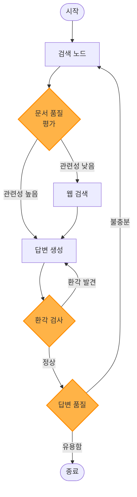
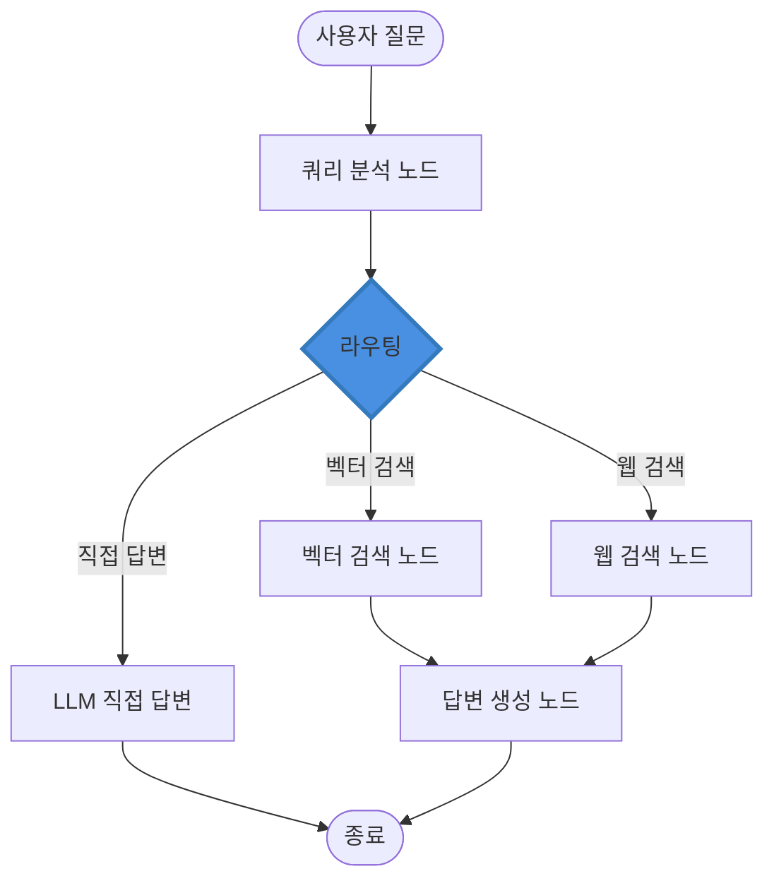

# LangGraph를 활용한 RAG 시스템 구축 가이드

> 한국어 개발자를 위한 LangGraph 기반 고급 RAG(Retrieval-Augmented Generation) 시스템 완벽 구축 가이드

## 📋 목차

- [프로젝트 소개](#-프로젝트-소개)
- [왜 LangGraph인가?](#-왜-langgraph인가)
- [주요 사양](#-주요-사양-specs)
- [시스템 아키텍처](#-시스템-아키텍처)
- [환경 구축](#-환경-구축)
- [빠른 시작](#-빠른-시작)
- [상세 가이드](#-상세-가이드)
- [고급 RAG 패턴](#-고급-rag-패턴)
- [에이전트 RAG 시스템](#-에이전트-rag-시스템)
- [성능 최적화](#-성능-최적화)
- [프로덕션 배포](#-프로덕션-배포)
- [실무 가이드](#-실무-가이드)
- [트러블슈팅](#-트러블슈팅)
- [FAQ](#-faq)
- [참고 자료](#-참고-자료)

---

## 🎯 프로젝트 소개

이 프로젝트는 **LangGraph 프레임워크**를 활용하여 복잡한 워크플로우를 가진 고급 RAG(Retrieval-Augmented Generation) 시스템을 구축하는 실전 가이드입니다.

### LangGraph란?

**LangGraph**는 LangChain 팀이 개발한 상태 기반(stateful) 멀티 에이전트 워크플로우 구축 프레임워크입니다. 순환 그래프 구조로 복잡한 AI 애플리케이션을 구현할 수 있습니다.

- **개발사**: LangChain Inc.
- **출시**: 2024년 1월
- **GitHub Stars**: 10,000+ (2024년 12월 기준)
- **지원 언어**: Python, JavaScript
- **라이선스**: MIT License

### 주요 특징

- ✅ **상태 관리**: 그래프 전체에서 상태를 유지 및 업데이트
- ✅ **순환 구조**: DAG(방향성 비순환 그래프)가 아닌 순환 그래프 지원
- ✅ **조건부 라우팅**: 동적으로 다음 노드 결정
- ✅ **Human-in-the-Loop**: 사람의 개입 및 승인 지점 설정
- ✅ **체크포인트**: 상태 저장 및 복원 (오류 복구, 중단-재개)
- ✅ **병렬 실행**: 여러 노드 동시 실행 가능
- ✅ **스트리밍**: 실시간 상태 업데이트 및 출력
- ✅ **시각화**: 그래프 구조 시각화 도구 제공

### 학습 목표

이 가이드를 완료하면 다음을 할 수 있습니다:

1. LangGraph 핵심 개념 (StateGraph, Node, Edge) 이해
2. 상태 관리 및 Reducer 활용
3. 조건부 엣지로 동적 워크플로우 구현
4. Adaptive RAG, Corrective RAG, Self-RAG 등 고급 패턴 구현
5. 멀티 에이전트 RAG 시스템 구축
6. Human-in-the-Loop RAG 구현
7. 체크포인트와 메모리로 복원 가능한 시스템 구축
8. LangGraph Studio로 디버깅 및 시각화

### 실제 활용 사례

LangGraph 기반 RAG는 다음과 같은 복잡한 시나리오에서 효과적입니다:

- **🔄 Adaptive RAG**: 쿼리 품질에 따라 검색 전략 동적 변경
- **✅ Corrective RAG**: 검색 결과 품질 평가 및 재검색
- **🤖 Multi-Agent RAG**: 여러 전문 에이전트가 협업하는 RAG
- **👤 Human-in-the-Loop**: 중요 결정에 사람의 승인 필요
- **🔍 Research Agent**: 반복적으로 검색하며 답변 생성
- **📊 분석 워크플로우**: 데이터 수집 → 분석 → 리포트 생성
- **🛠️ 도구 사용 RAG**: 검색 외 외부 API, DB 쿼리 등 도구 활용

---

## 🤔 왜 LangGraph인가?

### LangChain vs LangGraph

| 기능 | LangChain | LangGraph |
|------|-----------|-----------|
| **주요 목적** | 간단한 체인, 기본 RAG | **복잡한 워크플로우, 멀티 에이전트** |
| **상태 관리** | 제한적 (메모리) | **전역 상태 그래프** |
| **순환 구조** | ❌ 지원 안 함 | **✅ 순환 그래프 지원** |
| **조건부 분기** | 제한적 | **✅ 동적 라우팅** |
| **Human-in-the-Loop** | 구현 복잡 | **✅ 기본 지원** |
| **체크포인트** | ❌ 없음 | **✅ 상태 저장/복원** |
| **시각화** | 제한적 | **✅ LangGraph Studio** |
| **사용 난이도** | 쉬움 | **중급-고급** |

### 고급 RAG에 최적인 이유

1. **복잡한 검색 전략**: 쿼리 분석 → 검색 → 평가 → 재검색 루프
2. **멀티 스텝 추론**: 여러 단계를 거쳐 답변 생성
3. **조건부 로직**: 검색 품질에 따라 다른 경로 선택
4. **에이전트 협업**: 여러 전문 에이전트가 RAG 작업 분담
5. **Human-in-the-Loop**: 중요 답변은 사람이 검토
6. **오류 복구**: 체크포인트로 실패 지점부터 재시작
7. **확장성**: 새로운 노드 추가로 기능 확장 용이

---

## 📋 주요 사양 (Specs)

### 지원하는 LLM

LangGraph는 LangChain의 LLM 통합을 그대로 사용합니다.

| 제공사 | 모델 예시 | 클래스 |
|--------|----------|--------|
| **OpenAI** | GPT-4o, GPT-4o-mini | `ChatOpenAI` |
| **Anthropic** | Claude 3.5 Sonnet, Claude 3 Opus | `ChatAnthropic` |
| **Google** | Gemini 2.5 Flash, Gemini 2.5 Pro | `ChatGoogleGenerativeAI` |
| **AWS Bedrock** | Claude, Llama 3.1 | `BedrockChat` |
| **Ollama** | Llama 3.1, Mistral | `ChatOllama` |

### LangGraph 핵심 컴포넌트

| 컴포넌트 | 설명 | 용도 |
|---------|------|------|
| **StateGraph** | 상태 기반 그래프 | RAG 워크플로우 정의 |
| **State** | 그래프 전역 상태 | 쿼리, 문서, 답변 등 저장 |
| **Node** | 실행 함수 | 검색, LLM 호출, 평가 등 |
| **Edge** | 노드 간 연결 | 워크플로우 흐름 정의 |
| **Conditional Edge** | 조건부 분기 | 동적 라우팅 |
| **Checkpointer** | 상태 저장소 | 메모리, SQLite, Postgres 등 |
| **ToolNode** | 도구 실행 노드 | 검색, API 호출 등 |

### RAG 워크플로우 패턴

| 패턴 | 설명 | 복잡도 |
|------|------|-------|
| **Basic RAG** | 검색 → LLM | 낮음 |
| **Adaptive RAG** | 쿼리 분석 → 경로 선택 | 중간 |
| **Corrective RAG** | 검색 → 평가 → 재검색 | 중간 |
| **Self-RAG** | 반복적 자기 평가 및 개선 | 높음 |
| **Agentic RAG** | 에이전트가 도구 선택 | 높음 |
| **Multi-Agent RAG** | 여러 에이전트 협업 | 매우 높음 |

### 예상 비용 (2025년 기준)

#### 소규모 프로젝트 (개발/테스트)
```
✅ LangGraph 프레임워크
- LangGraph: 무료 (오픈소스)
- LangGraph Platform: 무료 티어 (1,000 실행/월)

✅ LLM API
- OpenAI GPT-4o-mini: ~$5-10/월 (월 1,000 쿼리)
- Ollama (로컬): $0/월

✅ 체크포인터
- MemorySaver: $0/월
- SQLite: $0/월

📊 총 예상 비용: $0-10/월
```

#### 중규모 프로젝트 (프로덕션)
```
✅ LangGraph Platform
- Plus Plan: $49/월 (50,000 실행)

✅ LLM API
- OpenAI GPT-4o: ~$100-200/월 (월 10,000 쿼리)
- Anthropic Claude 3.5 Sonnet: ~$150/월

✅ 체크포인터
- PostgreSQL (Supabase Pro): $25/월
- Redis: $30/월

✅ 벡터 스토어
- Pinecone Standard: $70/월

📊 총 예상 비용: $300-500/월
```

#### 대규모 엔터프라이즈
```
✅ LangGraph Platform
- Enterprise: Custom pricing

✅ LLM API
- OpenAI GPT-4o: $1,000-5,000/월
- Azure OpenAI: Custom

✅ 인프라
- PostgreSQL (RDS): $200-500/월
- Redis (ElastiCache): $150-300/월
- 벡터 DB: $500-2,000/월

📊 총 예상 비용: $2,000-10,000+/월
```

**비용 최적화 팁:**
- **MemorySaver**: 개발 환경에서 메모리 체크포인터 사용
- **Ollama**: 로컬 LLM으로 API 비용 제로
- **배치 처리**: 여러 쿼리를 묶어서 처리
- **캐싱**: 동일 쿼리 결과 재사용
- **조건부 실행**: 필요한 경우에만 LLM 호출

---

## 🏗 시스템 아키텍처

### LangGraph RAG 워크플로우



### Adaptive RAG 아키텍처



### LangGraph 핵심 개념

```
[LangGraph RAG 시스템]
         |
         v
    StateGraph (상태 그래프)
         |
    +----+----+----+----+
    |    |    |    |    |
    v    v    v    v    v
  Node Node Node Node Node
(검색)(평가)(생성)(도구)(검사)
    |
    +--- State (전역 상태) ---+
    |                         |
messages: list[Message]   documents: list[Document]
query: str                generation: str
steps: int                quality_score: float
```

### 상태(State) 구조

```python
# RAG State 예시
class RAGState(TypedDict):
    """RAG 워크플로우 상태"""
    # 입력
    question: str                    # 사용자 질문

    # 검색
    documents: list[Document]        # 검색된 문서
    web_results: Optional[str]       # 웹 검색 결과

    # 평가
    relevance_score: float           # 관련성 점수
    hallucination_detected: bool     # 환각 여부

    # 생성
    generation: str                  # 생성된 답변

    # 메타
    steps: int                       # 실행 단계 수
    should_continue: bool            # 계속 여부
```

### 노드(Node) 예시

```python
def retrieve(state: RAGState) -> RAGState:
    """검색 노드"""
    question = state["question"]

    # 벡터 검색
    docs = vectorstore.similarity_search(question, k=3)

    return {
        "documents": docs,
        "steps": state.get("steps", 0) + 1
    }

def grade_documents(state: RAGState) -> RAGState:
    """문서 평가 노드"""
    question = state["question"]
    documents = state["documents"]

    # LLM으로 관련성 평가
    score = llm.evaluate_relevance(question, documents)

    return {
        "relevance_score": score,
        "steps": state["steps"] + 1
    }
```

### 프로덕션 아키텍처

```
[클라이언트 계층]
웹/모바일 앱
     |
     v
[API 계층]
FastAPI Server
├─ 인증/인가
├─ Rate Limiting
└─ LangGraph 실행
     |
     v
[LangGraph 계층]
StateGraph
├─ 검색 노드 (Retrieval)
├─ 평가 노드 (Grading)
├─ 생성 노드 (Generation)
├─ 도구 노드 (Tools)
└─ 조건부 엣지 (Routing)
     |
     +-------------+-------------+
     |             |             |
     v             v             v
[Vector DB]   [LLM API]   [Checkpointer]
Pinecone      OpenAI      PostgreSQL
Chroma        Claude      SQLite
     |
     v
[모니터링]
├─ LangSmith (추적)
├─ Prometheus (메트릭)
└─ Sentry (에러)
```

---

## 🚀 환경 구축

### 시스템 요구사항

- **Python**: 3.9 이상 (3.11+ 권장)
- **메모리**: 최소 4GB RAM (8GB+ 권장)
- **운영체제**: Windows 10+, macOS 11+, Ubuntu 20.04+

### 1. LangGraph 설치

```bash
# LangGraph 설치
pip install langgraph

# LangChain 통합 (필수)
pip install langchain langchain-community langchain-openai

# 벡터 스토어 (선택)
pip install faiss-cpu chromadb

# 체크포인터 (선택)
pip install aiosqlite  # SQLite 체크포인터
```

#### 전체 requirements.txt

```txt
# LangGraph 핵심
langgraph==0.2.0
langchain==0.1.0
langchain-community==0.0.13
langchain-core==0.1.10

# LLM 통합
langchain-openai==0.0.2
langchain-anthropic==0.0.1

# 벡터 스토어
faiss-cpu==1.7.4
chromadb==0.4.22

# 체크포인터
aiosqlite==0.19.0

# 유틸리티
python-dotenv==1.0.0
tiktoken==0.5.2
```

### 2. 환경 변수 설정

`.env` 파일 생성:

```env
# LLM API 키
OPENAI_API_KEY=sk-your-openai-key
ANTHROPIC_API_KEY=sk-ant-your-anthropic-key

# LangSmith (선택, 디버깅용)
LANGCHAIN_TRACING_V2=true
LANGCHAIN_API_KEY=your-langsmith-key
LANGCHAIN_PROJECT=langgraph-rag

# Tavily (웹 검색, 선택)
TAVILY_API_KEY=tvly-your-key
```

### 3. 설치 확인

```python
# test_setup.py
import os
from dotenv import load_dotenv

load_dotenv()

def test_imports():
    """패키지 import 테스트"""
    print("1️⃣ 패키지 import 테스트...\n")

    try:
        import langgraph
        print(f"✅ LangGraph 버전: {langgraph.__version__}")

        from langgraph.graph import StateGraph, END
        print("✅ LangGraph Graph")

        from langgraph.checkpoint.memory import MemorySaver
        print("✅ LangGraph Checkpointer")

        from langchain_openai import ChatOpenAI
        print("✅ LangChain OpenAI")

        return True
    except ImportError as e:
        print(f"❌ Import 실패: {e}")
        return False

def test_simple_graph():
    """간단한 그래프 테스트"""
    print("\n2️⃣ 그래프 생성 테스트...\n")

    try:
        from langgraph.graph import StateGraph, END
        from typing import TypedDict

        # 상태 정의
        class State(TypedDict):
            message: str

        # 노드 함수
        def node_1(state: State) -> State:
            return {"message": state["message"] + " -> Node1"}

        # 그래프 생성
        workflow = StateGraph(State)
        workflow.add_node("node_1", node_1)
        workflow.set_entry_point("node_1")
        workflow.add_edge("node_1", END)

        graph = workflow.compile()
        print("✅ StateGraph 생성 성공")

        # 실행
        result = graph.invoke({"message": "Start"})
        print(f"✅ 실행 결과: {result['message']}")

        return True
    except Exception as e:
        print(f"❌ 그래프 테스트 실패: {e}")
        return False

def test_llm():
    """LLM 연결 테스트"""
    print("\n3️⃣ LLM 연결 테스트...\n")

    try:
        from langchain_openai import ChatOpenAI

        llm = ChatOpenAI(model="gpt-4o-mini", temperature=0)
        response = llm.invoke("안녕하세요!")

        print(f"✅ LLM 응답: {response.content[:50]}...")
        return True
    except Exception as e:
        print(f"❌ LLM 연결 실패: {e}")
        return False

def main():
    print("=" * 60)
    print("  LangGraph RAG 환경 설정 확인")
    print("=" * 60 + "\n")

    imports_ok = test_imports()
    graph_ok = test_simple_graph()
    llm_ok = test_llm()

    print("\n" + "=" * 60)
    if imports_ok and graph_ok and llm_ok:
        print("🎉 모든 설정이 완료되었습니다!")
        print("   이제 LangGraph RAG 시스템을 구축할 준비가 되었습니다.")
    else:
        print("⚠️  일부 설정이 완료되지 않았습니다.")
        print("   위의 오류 메시지를 확인하고 문제를 해결하세요.")
    print("=" * 60)

if __name__ == "__main__":
    main()
```

**실행:**
```bash
python test_setup.py
```

**예상 출력:**
```
============================================================
  LangGraph RAG 환경 설정 확인
============================================================

1️⃣ 패키지 import 테스트...

✅ LangGraph 버전: 0.2.0
✅ LangGraph Graph
✅ LangGraph Checkpointer
✅ LangChain OpenAI

2️⃣ 그래프 생성 테스트...

✅ StateGraph 생성 성공
✅ 실행 결과: Start -> Node1

3️⃣ LLM 연결 테스트...

✅ LLM 응답: 안녕하세요! 무엇을 도와드릴까요?...

============================================================
🎉 모든 설정이 완료되었습니다!
   이제 LangGraph RAG 시스템을 구축할 준비가 되었습니다.
============================================================
```

---

## ⚡ 빠른 시작

### 기본 RAG 그래프 (10분 만에 구현)

```python
# quick_start.py
import os
from typing import TypedDict, Annotated
from dotenv import load_dotenv

from langchain_openai import ChatOpenAI, OpenAIEmbeddings
from langchain_community.vectorstores import FAISS
from langchain_core.documents import Document

from langgraph.graph import StateGraph, END
from langgraph.graph.message import add_messages

load_dotenv()

# 1. 상태 정의
class RAGState(TypedDict):
    """RAG 워크플로우 상태"""
    question: str                          # 사용자 질문
    documents: list[Document]              # 검색된 문서
    generation: str                        # 생성된 답변

# 2. 벡터 스토어 준비
print("📂 벡터 스토어 준비 중...")
docs = [
    Document(page_content="LangGraph는 LangChain 팀이 만든 상태 기반 워크플로우 프레임워크입니다."),
    Document(page_content="StateGraph를 사용하여 복잡한 RAG 시스템을 구축할 수 있습니다."),
    Document(page_content="조건부 엣지로 동적 라우팅이 가능합니다."),
]

embeddings = OpenAIEmbeddings(model="text-embedding-3-small")
vectorstore = FAISS.from_documents(docs, embeddings)
print("✅ 벡터 스토어 준비 완료\n")

# 3. LLM 설정
llm = ChatOpenAI(model="gpt-4o-mini", temperature=0)

# 4. 노드 함수 정의
def retrieve(state: RAGState) -> RAGState:
    """검색 노드"""
    print(f"🔍 검색 중: {state['question']}")

    # 벡터 검색
    documents = vectorstore.similarity_search(state["question"], k=2)

    return {"documents": documents}

def generate(state: RAGState) -> RAGState:
    """답변 생성 노드"""
    print("💡 답변 생성 중...")

    question = state["question"]
    documents = state["documents"]

    # 컨텍스트 구성
    context = "\n\n".join([doc.page_content for doc in documents])

    # 프롬프트
    prompt = f"""다음 컨텍스트를 사용하여 질문에 답변하세요:

컨텍스트:
{context}

질문: {question}

답변:"""

    # LLM 호출
    response = llm.invoke(prompt)

    return {"generation": response.content}

# 5. 그래프 구성
workflow = StateGraph(RAGState)

# 노드 추가
workflow.add_node("retrieve", retrieve)
workflow.add_node("generate", generate)

# 엣지 정의
workflow.set_entry_point("retrieve")
workflow.add_edge("retrieve", "generate")
workflow.add_edge("generate", END)

# 컴파일
graph = workflow.compile()

# 6. 실행
print("=" * 70)
print("  LangGraph RAG 빠른 시작")
print("=" * 70 + "\n")

question = "LangGraph란 무엇인가요?"
print(f"❓ 질문: {question}\n")

result = graph.invoke({"question": question})

print(f"\n💬 답변:\n{result['generation']}\n")
print(f"📚 참고 문서: {len(result['documents'])}개")
```

**실행:**
```bash
python quick_start.py
```

**예상 출력:**
```
============================================================
  LangGraph RAG 빠른 시작
============================================================

❓ 질문: LangGraph란 무엇인가요?

🔍 검색 중: LangGraph란 무엇인가요?
💡 답변 생성 중...

💬 답변:
LangGraph는 LangChain 팀이 만든 상태 기반 워크플로우 프레임워크입니다.
StateGraph를 사용하여 복잡한 RAG 시스템을 구축할 수 있으며, 조건부
엣지로 동적 라우팅이 가능합니다.

📚 참고 문서: 2개
```

### 조건부 라우팅 예제

```python
# conditional_routing.py
from typing import Literal
from langgraph.graph import StateGraph, END

# 상태
class RouterState(TypedDict):
    question: str
    route: str
    answer: str

# 라우팅 함수
def route_question(state: RouterState) -> Literal["vectorstore", "websearch"]:
    """질문 유형에 따라 라우팅"""
    question = state["question"].lower()

    # 간단한 규칙 기반 라우팅
    if "langgraph" in question or "langchain" in question:
        return "vectorstore"
    else:
        return "websearch"

# 노드
def vectorstore_search(state: RouterState) -> RouterState:
    print("📚 벡터 스토어 검색")
    return {"route": "vectorstore", "answer": "벡터 스토어에서 검색됨"}

def web_search(state: RouterState) -> RouterState:
    print("🌐 웹 검색")
    return {"route": "websearch", "answer": "웹에서 검색됨"}

# 그래프
workflow = StateGraph(RouterState)
workflow.add_node("vectorstore_search", vectorstore_search)
workflow.add_node("web_search", web_search)

# 조건부 엣지
workflow.set_conditional_entry_point(
    route_question,
    {
        "vectorstore": "vectorstore_search",
        "websearch": "web_search"
    }
)

workflow.add_edge("vectorstore_search", END)
workflow.add_edge("web_search", END)

graph = workflow.compile()

# 실행
print("\n테스트 1: LangGraph 질문")
result1 = graph.invoke({"question": "LangGraph란?"})
print(f"결과: {result1}\n")

print("테스트 2: 일반 질문")
result2 = graph.invoke({"question": "날씨는 어때?"})
print(f"결과: {result2}")
```

---

## 📚 상세 가이드

### 1. StateGraph 기본

#### 1.1 상태(State) 정의

```python
from typing import TypedDict, Annotated, Sequence
from langchain_core.messages import BaseMessage
from langgraph.graph.message import add_messages

# 기본 상태
class BasicState(TypedDict):
    question: str
    answer: str

# 메시지 포함 상태 (채팅용)
class ChatState(TypedDict):
    messages: Annotated[Sequence[BaseMessage], add_messages]

# 복잡한 RAG 상태
class AdvancedRAGState(TypedDict):
    # 입력
    question: str

    # 검색
    documents: list[Document]
    web_results: Optional[str]

    # 평가
    relevance_scores: list[float]
    is_relevant: bool

    # 생성
    generation: str
    confidence: float

    # 제어
    retry_count: int
    max_retries: int
```

#### 1.2 Reducer 함수

```python
from operator import add

# 리스트 누적
class StateWithList(TypedDict):
    results: Annotated[list[str], add]  # 자동으로 리스트에 추가

# 커스텀 Reducer
def merge_documents(existing: list, new: list) -> list:
    """중복 제거하며 문서 병합"""
    seen = {doc.page_content for doc in existing}
    merged = existing.copy()

    for doc in new:
        if doc.page_content not in seen:
            merged.append(doc)
            seen.add(doc.page_content)

    return merged

class StateWithMerge(TypedDict):
    documents: Annotated[list[Document], merge_documents]
```

#### 1.3 노드(Node) 정의

```python
def simple_node(state: RAGState) -> RAGState:
    """간단한 노드"""
    return {"answer": "Simple answer"}

def node_with_logic(state: RAGState) -> RAGState:
    """로직이 있는 노드"""
    question = state["question"]

    # 복잡한 처리
    if len(question) > 50:
        result = "긴 질문"
    else:
        result = "짧은 질문"

    return {"answer": result}

async def async_node(state: RAGState) -> RAGState:
    """비동기 노드"""
    import asyncio
    await asyncio.sleep(1)
    return {"answer": "Async result"}
```

#### 1.4 엣지(Edge) 정의

```python
from langgraph.graph import StateGraph, END

workflow = StateGraph(RAGState)

# 노드 추가
workflow.add_node("node1", node1_func)
workflow.add_node("node2", node2_func)

# 일반 엣지 (항상 실행)
workflow.add_edge("node1", "node2")
workflow.add_edge("node2", END)

# 진입점 설정
workflow.set_entry_point("node1")

# 조건부 엣지
def should_continue(state: RAGState) -> Literal["node2", END]:
    if state.get("should_continue", True):
        return "node2"
    return END

workflow.add_conditional_edges(
    "node1",
    should_continue,
    {
        "node2": "node2",
        END: END
    }
)
```

### 2. Checkpointer: 상태 저장 및 복원

#### 2.1 MemorySaver (메모리)

```python
from langgraph.checkpoint.memory import MemorySaver

# 체크포인터 생성
checkpointer = MemorySaver()

# 그래프에 적용
graph = workflow.compile(checkpointer=checkpointer)

# 실행 (스레드 ID로 세션 관리)
config = {"configurable": {"thread_id": "user_123"}}
result = graph.invoke({"question": "첫 번째 질문"}, config)

# 같은 스레드로 이어서 실행 (상태 유지)
result2 = graph.invoke({"question": "두 번째 질문"}, config)
```

#### 2.2 SqliteSaver (영구 저장)

```python
from langgraph.checkpoint.sqlite import SqliteSaver

# SQLite 체크포인터
checkpointer = SqliteSaver.from_conn_string("checkpoints.db")

graph = workflow.compile(checkpointer=checkpointer)

# 실행
config = {"configurable": {"thread_id": "session_001"}}
result = graph.invoke({"question": "질문"}, config)

# 나중에 같은 스레드로 재개 가능
```

#### 2.3 상태 기록 조회

```python
# 특정 스레드의 상태 기록
config = {"configurable": {"thread_id": "user_123"}}
state_history = graph.get_state_history(config)

for state in state_history:
    print(f"체크포인트 ID: {state.config['configurable']['checkpoint_id']}")
    print(f"상태: {state.values}")
    print()
```

### 3. 스트리밍

#### 3.1 노드별 스트리밍

```python
# 각 노드 실행 결과를 스트리밍
for event in graph.stream({"question": "LangGraph란?"}):
    print(event)

# 출력:
# {'retrieve': {'documents': [...]}}
# {'generate': {'generation': '...'}}
```

#### 3.2 실시간 업데이트 스트리밍

```python
# 상태 업데이트를 실시간으로 받기
for chunk in graph.stream(
    {"question": "질문"},
    stream_mode="updates"
):
    print(chunk)
```

#### 3.3 값 스트리밍

```python
# 최종 상태만 스트리밍
for value in graph.stream(
    {"question": "질문"},
    stream_mode="values"
):
    print(value)
```

### 4. Human-in-the-Loop

#### 4.1 중단점 설정

```python
from langgraph.graph import StateGraph, END

# 그래프 정의
workflow = StateGraph(RAGState)
workflow.add_node("retrieve", retrieve)
workflow.add_node("generate", generate)
workflow.add_edge("retrieve", "generate")
workflow.add_edge("generate", END)
workflow.set_entry_point("retrieve")

# 중단점 설정 (generate 전에 멈춤)
graph = workflow.compile(
    checkpointer=checkpointer,
    interrupt_before=["generate"]  # generate 노드 전에 중단
)

# 실행
config = {"configurable": {"thread_id": "review_001"}}
result = graph.invoke({"question": "질문"}, config)

print("중단됨. 문서 검토:")
print(result["documents"])

# 사용자 확인 후 재개
approval = input("계속하시겠습니까? (y/n): ")
if approval.lower() == 'y':
    result = graph.invoke(None, config)  # None으로 재개
    print(f"최종 답변: {result['generation']}")
```

#### 4.2 상태 업데이트 후 재개

```python
# 중단된 상태 가져오기
state = graph.get_state(config)

# 상태 수정
state.values["documents"] = filtered_documents  # 사용자가 문서 수정

# 수정된 상태로 재개
graph.update_state(config, state.values)
result = graph.invoke(None, config)
```

### 5. 도구 사용

#### 5.1 ToolNode

```python
from langchain_core.tools import tool
from langgraph.prebuilt import ToolNode

# 도구 정의
@tool
def search_wikipedia(query: str) -> str:
    """Wikipedia 검색"""
    # 실제 구현
    return f"Wikipedia 결과: {query}"

@tool
def calculator(expression: str) -> float:
    """계산기"""
    return eval(expression)

tools = [search_wikipedia, calculator]

# ToolNode 생성
tool_node = ToolNode(tools)

# 그래프에 추가
workflow.add_node("tools", tool_node)
```

#### 5.2 에이전트 패턴

```python
from langchain_openai import ChatOpenAI
from langchain_core.messages import HumanMessage

# 도구 바인딩
llm = ChatOpenAI(model="gpt-4o")
llm_with_tools = llm.bind_tools(tools)

def agent(state: AgentState):
    """에이전트 노드"""
    messages = state["messages"]
    response = llm_with_tools.invoke(messages)
    return {"messages": [response]}

def should_continue(state: AgentState) -> Literal["tools", END]:
    """도구 사용 여부 판단"""
    last_message = state["messages"][-1]

    if last_message.tool_calls:
        return "tools"
    return END

# 그래프
workflow = StateGraph(AgentState)
workflow.add_node("agent", agent)
workflow.add_node("tools", tool_node)
workflow.set_entry_point("agent")
workflow.add_conditional_edges("agent", should_continue)
workflow.add_edge("tools", "agent")  # 도구 실행 후 다시 에이전트
```

---

## 🚀 고급 RAG 패턴

### 1. Adaptive RAG (적응형 RAG)

```python
# adaptive_rag.py
from typing import Literal
from langchain_openai import ChatOpenAI
from langchain_core.prompts import ChatPromptTemplate

class AdaptiveRAGState(TypedDict):
    question: str
    documents: list[Document]
    generation: str

llm = ChatOpenAI(model="gpt-4o-mini")

# 쿼리 분석 노드
def analyze_query(state: AdaptiveRAGState) -> AdaptiveRAGState:
    """쿼리 복잡도 분석"""
    question = state["question"]

    prompt = ChatPromptTemplate.from_template(
        """질문의 복잡도를 평가하세요:

질문: {question}

다음 중 선택:
- simple: 단순 사실 질문
- complex: 복잡한 추론 필요
- web: 최신 정보 필요

답변 (단어 하나):"""
    )

    response = llm.invoke(prompt.format(question=question))
    complexity = response.content.strip().lower()

    return {"complexity": complexity}

# 라우팅 함수
def route_query(state: AdaptiveRAGState) -> Literal["vectorstore", "websearch", "direct"]:
    """복잡도에 따라 라우팅"""
    complexity = state.get("complexity", "simple")

    if complexity == "web":
        return "websearch"
    elif complexity == "complex":
        return "vectorstore"
    else:
        return "direct"

# 노드들
def vectorstore_retrieval(state: AdaptiveRAGState) -> AdaptiveRAGState:
    """벡터 검색"""
    docs = vectorstore.similarity_search(state["question"], k=5)
    return {"documents": docs}

def web_search(state: AdaptiveRAGState) -> AdaptiveRAGState:
    """웹 검색"""
    # Tavily 또는 다른 웹 검색 API
    results = "웹 검색 결과"
    return {"web_results": results}

def direct_answer(state: AdaptiveRAGState) -> AdaptiveRAGState:
    """직접 답변"""
    response = llm.invoke(state["question"])
    return {"generation": response.content}

def generate_answer(state: AdaptiveRAGState) -> AdaptiveRAGState:
    """문서 기반 답변 생성"""
    # 컨텍스트 구성 및 생성
    # ...
    return {"generation": "답변"}

# 그래프 구성
workflow = StateGraph(AdaptiveRAGState)

workflow.add_node("analyze", analyze_query)
workflow.add_node("vectorstore", vectorstore_retrieval)
workflow.add_node("websearch", web_search)
workflow.add_node("direct", direct_answer)
workflow.add_node("generate", generate_answer)

workflow.set_entry_point("analyze")

workflow.add_conditional_edges(
    "analyze",
    route_query,
    {
        "vectorstore": "vectorstore",
        "websearch": "websearch",
        "direct": "direct"
    }
)

workflow.add_edge("vectorstore", "generate")
workflow.add_edge("websearch", "generate")
workflow.add_edge("direct", END)
workflow.add_edge("generate", END)

graph = workflow.compile()
```

### 2. Corrective RAG (교정 RAG)

```python
# corrective_rag.py
class CorrectiveRAGState(TypedDict):
    question: str
    documents: list[Document]
    relevance_score: float
    generation: str
    retry_count: int

# 문서 평가 노드
def grade_documents(state: CorrectiveRAGState) -> CorrectiveRAGState:
    """문서 관련성 평가"""
    question = state["question"]
    documents = state["documents"]

    prompt = ChatPromptTemplate.from_template(
        """문서가 질문과 관련이 있는지 평가하세요:

질문: {question}
문서: {document}

관련성 (yes/no):"""
    )

    relevant_docs = []
    for doc in documents:
        response = llm.invoke(
            prompt.format(question=question, document=doc.page_content)
        )
        if "yes" in response.content.lower():
            relevant_docs.append(doc)

    score = len(relevant_docs) / len(documents) if documents else 0

    return {
        "documents": relevant_docs,
        "relevance_score": score
    }

# 재검색 결정
def decide_research(state: CorrectiveRAGState) -> Literal["generate", "websearch"]:
    """관련성 점수에 따라 결정"""
    score = state.get("relevance_score", 0)
    retry = state.get("retry_count", 0)

    # 점수가 낮고 재시도 횟수가 적으면 웹 검색
    if score < 0.5 and retry < 2:
        return "websearch"
    return "generate"

# 웹 검색 노드
def web_search_fallback(state: CorrectiveRAGState) -> CorrectiveRAGState:
    """웹 검색으로 보완"""
    # Tavily 또는 웹 검색 수행
    web_docs = [
        Document(page_content="웹에서 검색된 내용")
    ]

    return {
        "documents": state["documents"] + web_docs,
        "retry_count": state.get("retry_count", 0) + 1
    }

# 그래프
workflow = StateGraph(CorrectiveRAGState)

workflow.add_node("retrieve", retrieve)
workflow.add_node("grade", grade_documents)
workflow.add_node("websearch", web_search_fallback)
workflow.add_node("generate", generate)

workflow.set_entry_point("retrieve")
workflow.add_edge("retrieve", "grade")

workflow.add_conditional_edges(
    "grade",
    decide_research,
    {
        "websearch": "websearch",
        "generate": "generate"
    }
)

workflow.add_edge("websearch", "grade")  # 재평가
workflow.add_edge("generate", END)

graph = workflow.compile()
```

### 3. Self-RAG (자기 평가 RAG)

```python
# self_rag.py
class SelfRAGState(TypedDict):
    question: str
    documents: list[Document]
    generation: str
    hallucination_check: bool
    answer_useful: bool
    iteration: int

# 환각 검사
def check_hallucination(state: SelfRAGState) -> SelfRAGState:
    """생성된 답변이 문서에 근거했는지 확인"""
    generation = state["generation"]
    documents = state["documents"]

    context = "\n".join([doc.page_content for doc in documents])

    prompt = ChatPromptTemplate.from_template(
        """답변이 컨텍스트에 근거했는지 확인하세요:

컨텍스트:
{context}

답변:
{generation}

근거 있음? (yes/no):"""
    )

    response = llm.invoke(
        prompt.format(context=context, generation=generation)
    )

    grounded = "yes" in response.content.lower()

    return {"hallucination_check": grounded}

# 답변 유용성 검사
def check_answer_usefulness(state: SelfRAGState) -> SelfRAGState:
    """답변이 질문에 유용한지 확인"""
    question = state["question"]
    generation = state["generation"]

    prompt = ChatPromptTemplate.from_template(
        """답변이 질문에 유용한지 평가하세요:

질문: {question}
답변: {generation}

유용함? (yes/no):"""
    )

    response = llm.invoke(
        prompt.format(question=question, generation=generation)
    )

    useful = "yes" in response.content.lower()

    return {"answer_useful": useful}

# 재생성 결정
def decide_regenerate(state: SelfRAGState) -> Literal["retrieve", "end"]:
    """환각 또는 무용한 답변 시 재생성"""
    grounded = state.get("hallucination_check", True)
    useful = state.get("answer_useful", True)
    iteration = state.get("iteration", 0)

    if (not grounded or not useful) and iteration < 3:
        return "retrieve"
    return "end"

# 그래프
workflow = StateGraph(SelfRAGState)

workflow.add_node("retrieve", retrieve)
workflow.add_node("generate", generate)
workflow.add_node("check_hallucination", check_hallucination)
workflow.add_node("check_usefulness", check_answer_usefulness)

workflow.set_entry_point("retrieve")
workflow.add_edge("retrieve", "generate")
workflow.add_edge("generate", "check_hallucination")
workflow.add_edge("check_hallucination", "check_usefulness")

workflow.add_conditional_edges(
    "check_usefulness",
    decide_regenerate,
    {
        "retrieve": "retrieve",
        "end": END
    }
)

graph = workflow.compile()
```

---

## 🤖 에이전트 RAG 시스템

### 1. ReAct Agent RAG

```python
# react_agent_rag.py
from langchain_core.tools import tool
from langchain_openai import ChatOpenAI
from langgraph.prebuilt import create_react_agent

# 도구 정의
@tool
def search_vectorstore(query: str) -> str:
    """벡터 스토어에서 검색"""
    docs = vectorstore.similarity_search(query, k=3)
    return "\n\n".join([doc.page_content for doc in docs])

@tool
def search_web(query: str) -> str:
    """웹에서 최신 정보 검색"""
    # Tavily API 호출
    return "웹 검색 결과"

@tool
def calculator(expression: str) -> float:
    """수식 계산"""
    return eval(expression)

tools = [search_vectorstore, search_web, calculator]

# LLM
llm = ChatOpenAI(model="gpt-4o", temperature=0)

# ReAct Agent 생성
agent_executor = create_react_agent(llm, tools)

# 실행
result = agent_executor.invoke({
    "messages": [("user", "LangGraph의 주요 기능과 2024년 출시일을 알려주세요")]
})

print(result["messages"][-1].content)
```

### 2. Multi-Agent RAG

```python
# multi_agent_rag.py
from typing import Literal

class MultiAgentState(TypedDict):
    question: str
    research_result: str
    analysis_result: str
    final_answer: str

# 연구 에이전트
research_llm = ChatOpenAI(model="gpt-4o-mini")
def research_agent(state: MultiAgentState) -> MultiAgentState:
    """정보 수집 에이전트"""
    question = state["question"]

    # 벡터 검색
    docs = vectorstore.similarity_search(question, k=5)
    context = "\n\n".join([doc.page_content for doc in docs])

    prompt = f"다음 정보를 요약하세요:\n\n{context}"
    response = research_llm.invoke(prompt)

    return {"research_result": response.content}

# 분석 에이전트
analysis_llm = ChatOpenAI(model="gpt-4o")
def analysis_agent(state: MultiAgentState) -> MultiAgentState:
    """분석 에이전트"""
    question = state["question"]
    research = state["research_result"]

    prompt = f"""질문: {question}

연구 결과:
{research}

위 정보를 분석하여 인사이트를 제공하세요:"""

    response = analysis_llm.invoke(prompt)

    return {"analysis_result": response.content}

# 작성 에이전트
writer_llm = ChatOpenAI(model="gpt-4o")
def writer_agent(state: MultiAgentState) -> MultiAgentState:
    """최종 답변 작성 에이전트"""
    question = state["question"]
    analysis = state["analysis_result"]

    prompt = f"""질문: {question}

분석 결과:
{analysis}

위 내용을 바탕으로 명확하고 간결한 답변을 작성하세요:"""

    response = writer_llm.invoke(prompt)

    return {"final_answer": response.content}

# 그래프
workflow = StateGraph(MultiAgentState)

workflow.add_node("researcher", research_agent)
workflow.add_node("analyst", analysis_agent)
workflow.add_node("writer", writer_agent)

workflow.set_entry_point("researcher")
workflow.add_edge("researcher", "analyst")
workflow.add_edge("analyst", "writer")
workflow.add_edge("writer", END)

graph = workflow.compile()

# 실행
result = graph.invoke({"question": "LangGraph의 장점은?"})
print(result["final_answer"])
```

### 3. Supervisor Pattern (감독자 패턴)

```python
# supervisor_pattern.py
class SupervisorState(TypedDict):
    messages: Annotated[list[BaseMessage], add_messages]
    next: str

# 워커 에이전트
def researcher(state: SupervisorState):
    """연구 에이전트"""
    return {"messages": [AIMessage(content="연구 완료")]}

def writer(state: SupervisorState):
    """작성 에이전트"""
    return {"messages": [AIMessage(content="작성 완료")]}

# 감독자
supervisor_llm = ChatOpenAI(model="gpt-4o")
def supervisor(state: SupervisorState) -> Literal["researcher", "writer", "FINISH"]:
    """다음 워커 결정"""
    messages = state["messages"]

    prompt = ChatPromptTemplate.from_template(
        """현재 대화를 보고 다음 에이전트를 선택하세요:

옵션: researcher, writer, FINISH

대화:
{messages}

선택:"""
    )

    response = supervisor_llm.invoke(
        prompt.format(messages="\n".join([m.content for m in messages]))
    )

    return response.content.strip()

# 그래프
workflow = StateGraph(SupervisorState)

workflow.add_node("supervisor", supervisor)
workflow.add_node("researcher", researcher)
workflow.add_node("writer", writer)

workflow.set_entry_point("supervisor")

workflow.add_conditional_edges(
    "supervisor",
    lambda x: x["next"],
    {
        "researcher": "researcher",
        "writer": "writer",
        "FINISH": END
    }
)

workflow.add_edge("researcher", "supervisor")
workflow.add_edge("writer", "supervisor")

graph = workflow.compile()
```

---

## ⚡ 성능 최적화

### 1. 병렬 노드 실행

```python
# 병렬로 실행할 노드 정의
def search_docs(state):
    """문서 검색"""
    return {"docs": vectorstore.search(state["question"])}

def search_web(state):
    """웹 검색"""
    return {"web": web_search(state["question"])}

# 그래프에 추가
workflow.add_node("search_docs", search_docs)
workflow.add_node("search_web", search_web)

# 두 노드를 병렬로 실행
workflow.add_edge("start", "search_docs")
workflow.add_edge("start", "search_web")

# 병합 노드
def merge_results(state):
    """결과 병합"""
    return {"all_results": state["docs"] + state["web"]}

workflow.add_node("merge", merge_results)
workflow.add_edge("search_docs", "merge")
workflow.add_edge("search_web", "merge")
```

### 2. 조기 종료

```python
def early_exit_check(state: RAGState) -> Literal["continue", "end"]:
    """충분히 좋은 답변이면 조기 종료"""
    confidence = state.get("confidence", 0)

    if confidence > 0.9:
        return "end"
    return "continue"

workflow.add_conditional_edges(
    "generate",
    early_exit_check,
    {
        "end": END,
        "continue": "refine"
    }
)
```

### 3. 캐싱

```python
from functools import lru_cache

@lru_cache(maxsize=100)
def cached_retrieval(question: str):
    """검색 결과 캐싱"""
    return vectorstore.similarity_search(question, k=3)

def retrieve_with_cache(state: RAGState) -> RAGState:
    """캐시 활용 검색"""
    docs = cached_retrieval(state["question"])
    return {"documents": docs}
```

---

## 🌐 프로덕션 배포

### 1. FastAPI 서버

```python
# app.py
from fastapi import FastAPI, HTTPException
from pydantic import BaseModel
from langgraph.graph import StateGraph, END
from langgraph.checkpoint.sqlite import SqliteSaver

app = FastAPI(title="LangGraph RAG API")

# 체크포인터
checkpointer = SqliteSaver.from_conn_string("checkpoints.db")

# 그래프 (전역)
graph = None

class QueryRequest(BaseModel):
    question: str
    thread_id: str = "default"

class QueryResponse(BaseModel):
    answer: str
    steps: int

@app.on_event("startup")
async def startup():
    """서버 시작 시 그래프 로드"""
    global graph

    print("Loading graph...")
    # 그래프 구성 (위의 예제 참고)
    graph = build_rag_graph()
    print("Graph ready!")

@app.post("/query", response_model=QueryResponse)
async def query(request: QueryRequest):
    """RAG 쿼리"""
    try:
        config = {"configurable": {"thread_id": request.thread_id}}

        result = graph.invoke(
            {"question": request.question},
            config=config
        )

        return QueryResponse(
            answer=result["generation"],
            steps=result.get("steps", 0)
        )
    except Exception as e:
        raise HTTPException(status_code=500, detail=str(e))

@app.get("/health")
async def health():
    return {"status": "healthy"}

if __name__ == "__main__":
    import uvicorn
    uvicorn.run(app, host="0.0.0.0", port=8000)
```

### 2. Docker 배포

```dockerfile
FROM python:3.11-slim

WORKDIR /app

COPY requirements.txt .
RUN pip install --no-cache-dir -r requirements.txt

COPY . .

EXPOSE 8000

CMD ["uvicorn", "app:app", "--host", "0.0.0.0", "--port", "8000"]
```

### 3. LangSmith 모니터링

```python
# .env
LANGCHAIN_TRACING_V2=true
LANGCHAIN_API_KEY=your-key
LANGCHAIN_PROJECT=langgraph-production

# 자동으로 모든 실행이 LangSmith에 기록됨
# https://smith.langchain.com 에서 확인:
# - 그래프 실행 추적
# - 각 노드별 소요 시간
# - LLM 호출 및 토큰 사용량
# - 에러 로그
```

---

## 💼 실무 가이드

### 완전한 프로덕션 RAG 시스템

```python
# production_rag.py
import os
from typing import TypedDict, Annotated, Literal
from dotenv import load_dotenv

from langchain_openai import ChatOpenAI, OpenAIEmbeddings
from langchain_community.vectorstores import FAISS
from langchain_core.documents import Document
from langchain_core.prompts import ChatPromptTemplate

from langgraph.graph import StateGraph, END
from langgraph.checkpoint.sqlite import SqliteSaver

load_dotenv()

# ============== 상태 정의 ==============
class ProductionRAGState(TypedDict):
    # 입력
    question: str

    # 검색
    documents: list[Document]
    relevance_score: float

    # 생성
    generation: str
    confidence: float

    # 제어
    retry_count: int

# ============== LLM 및 벡터 스토어 ==============
llm = ChatOpenAI(model="gpt-4o-mini", temperature=0)
embeddings = OpenAIEmbeddings(model="text-embedding-3-small")

# 벡터 스토어 (실제로는 Pinecone 등 사용)
docs = [
    Document(page_content="LangGraph는 상태 기반 워크플로우 프레임워크입니다."),
    Document(page_content="조건부 엣지로 동적 라우팅이 가능합니다."),
    Document(page_content="체크포인터로 상태를 저장하고 복원할 수 있습니다."),
]
vectorstore = FAISS.from_documents(docs, embeddings)

# ============== 노드 함수 ==============
def retrieve(state: ProductionRAGState) -> ProductionRAGState:
    """문서 검색"""
    print(f"🔍 검색: {state['question']}")

    docs = vectorstore.similarity_search(state["question"], k=3)

    return {
        "documents": docs,
        "retry_count": state.get("retry_count", 0)
    }

def grade_documents(state: ProductionRAGState) -> ProductionRAGState:
    """문서 관련성 평가"""
    print("📊 문서 평가 중...")

    question = state["question"]
    documents = state["documents"]

    grade_prompt = ChatPromptTemplate.from_template(
        """문서가 질문과 관련있는지 평가하세요.

질문: {question}
문서: {document}

관련성 (yes/no):"""
    )

    relevant_count = 0
    for doc in documents:
        response = llm.invoke(
            grade_prompt.format(
                question=question,
                document=doc.page_content
            )
        )
        if "yes" in response.content.lower():
            relevant_count += 1

    score = relevant_count / len(documents) if documents else 0

    return {"relevance_score": score}

def generate(state: ProductionRAGState) -> ProductionRAGState:
    """답변 생성"""
    print("💡 답변 생성 중...")

    question = state["question"]
    documents = state["documents"]

    context = "\n\n".join([doc.page_content for doc in documents])

    gen_prompt = ChatPromptTemplate.from_template(
        """컨텍스트를 사용하여 질문에 답변하세요.

컨텍스트:
{context}

질문: {question}

답변:"""
    )

    response = llm.invoke(
        gen_prompt.format(context=context, question=question)
    )

    return {"generation": response.content}

def web_search_fallback(state: ProductionRAGState) -> ProductionRAGState:
    """웹 검색 (관련성 낮을 때)"""
    print("🌐 웹 검색...")

    # 실제로는 Tavily 등 사용
    web_doc = Document(
        page_content="웹에서 검색된 최신 정보입니다."
    )

    return {
        "documents": state["documents"] + [web_doc],
        "retry_count": state["retry_count"] + 1
    }

# ============== 조건부 함수 ==============
def decide_to_generate(state: ProductionRAGState) -> Literal["generate", "websearch"]:
    """관련성 점수에 따라 결정"""
    score = state.get("relevance_score", 0)
    retry = state.get("retry_count", 0)

    if score < 0.5 and retry < 2:
        return "websearch"
    return "generate"

# ============== 그래프 구성 ==============
def build_graph():
    """프로덕션 RAG 그래프 구성"""
    workflow = StateGraph(ProductionRAGState)

    # 노드 추가
    workflow.add_node("retrieve", retrieve)
    workflow.add_node("grade", grade_documents)
    workflow.add_node("generate", generate)
    workflow.add_node("websearch", web_search_fallback)

    # 엣지 정의
    workflow.set_entry_point("retrieve")
    workflow.add_edge("retrieve", "grade")

    workflow.add_conditional_edges(
        "grade",
        decide_to_generate,
        {
            "websearch": "websearch",
            "generate": "generate"
        }
    )

    workflow.add_edge("websearch", "grade")
    workflow.add_edge("generate", END)

    # 체크포인터
    checkpointer = SqliteSaver.from_conn_string("production.db")

    return workflow.compile(checkpointer=checkpointer)

# ============== 실행 ==============
def main():
    print("=" * 70)
    print("  LangGraph Production RAG System")
    print("=" * 70 + "\n")

    graph = build_graph()

    # 대화형
    thread_id = "user_001"

    while True:
        question = input("\n❓ 질문 (종료: quit): ").strip()

        if question.lower() in ["quit", "exit", "종료"]:
            print("\n👋 종료합니다.")
            break

        if not question:
            continue

        try:
            config = {"configurable": {"thread_id": thread_id}}

            result = graph.invoke(
                {"question": question},
                config=config
            )

            print(f"\n💬 답변:\n{result['generation']}\n")
            print(f"📊 관련성 점수: {result.get('relevance_score', 0):.2f}")
            print(f"📚 문서 수: {len(result.get('documents', []))}")
            print(f"🔄 재시도: {result.get('retry_count', 0)}")

        except Exception as e:
            print(f"\n❌ 오류: {e}")

if __name__ == "__main__":
    main()
```

---

## 🐛 트러블슈팅

### 1. "Module not found" 에러

```bash
# LangGraph 재설치
pip uninstall langgraph
pip install langgraph

# LangChain도 함께 설치 필요
pip install langchain langchain-core langchain-openai
```

### 2. 순환 그래프 오류

```python
# 순환 시 최대 반복 횟수 설정
result = graph.invoke(
    {"question": "질문"},
    {"recursion_limit": 10}  # 기본 25
)
```

### 3. 체크포인터 오류

```python
# SQLite 체크포인터는 비동기 필요
from langgraph.checkpoint.sqlite.aio import AsyncSqliteSaver

checkpointer = AsyncSqliteSaver.from_conn_string("db.sqlite")

# 비동기 실행
import asyncio
result = asyncio.run(graph.ainvoke({"question": "질문"}))
```

---

## ❓ FAQ

### Q1: LangChain vs LangGraph, 언제 LangGraph를 사용하나요?

**A:**
- **LangChain**: 간단한 RAG, 기본 체인
- **LangGraph**: 조건부 로직, 멀티 에이전트, Human-in-the-Loop

복잡한 워크플로우가 필요하면 LangGraph.

### Q2: 체크포인터는 언제 사용하나요?

**A:**
- 대화 기록 유지
- 오류 발생 시 재시작
- Human-in-the-Loop (승인 후 재개)

### Q3: LangGraph Studio란?

**A:**
LangGraph의 시각화 및 디버깅 도구. 그래프 구조를 시각적으로 보고, 각 노드의 상태를 추적할 수 있습니다.

---

## 📚 참고 자료

### 공식 문서
- [LangGraph 공식 문서](https://langchain-ai.github.io/langgraph/)
- [LangGraph GitHub](https://github.com/langchain-ai/langgraph)
- [LangChain 문서](https://python.langchain.com/)

---

**🎉 이제 LangGraph로 고급 RAG 시스템을 구축할 준비가 되었습니다!**
