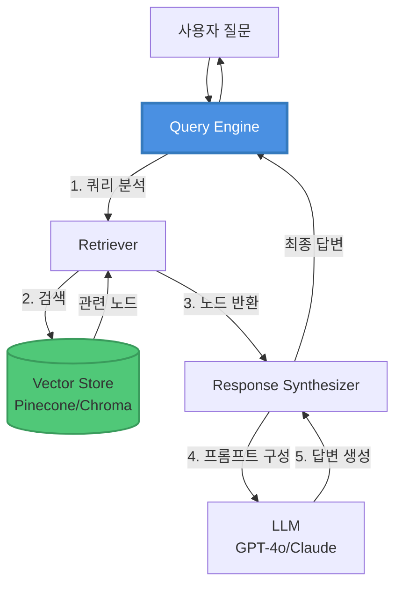
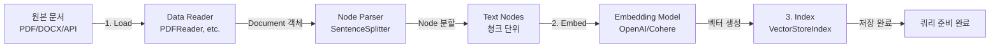

# LlamaIndex를 활용한 RAG 시스템 구축 가이드

> 한국어 개발자를 위한 LlamaIndex 기반 RAG(Retrieval-Augmented Generation) 시스템 완벽 구축 가이드

## 📋 목차

- [프로젝트 소개](#-프로젝트-소개)
- [왜 LlamaIndex인가?](#-왜-llamaindex인가)
- [주요 사양](#-주요-사양-specs)
- [시스템 아키텍처](#-시스템-아키텍처)
- [환경 구축](#-환경-구축)
- [빠른 시작](#-빠른-시작)
- [상세 가이드](#-상세-가이드)
- [벡터 스토어 통합](#-벡터-스토어-통합)
- [고급 RAG 패턴](#-고급-rag-패턴)
- [성능 최적화](#-성능-최적화)
- [프로덕션 배포](#-프로덕션-배포)
- [실무 가이드](#-실무-가이드)
- [트러블슈팅](#-트러블슈팅)
- [FAQ](#-faq)
- [참고 자료](#-참고-자료)

---

## 🎯 프로젝트 소개

이 프로젝트는 **LlamaIndex 프레임워크**를 활용하여 프로덕션급 RAG(Retrieval-Augmented Generation) 시스템을 구축하는 실전 가이드입니다.

### LlamaIndex란?

**LlamaIndex**(구 GPT Index)는 LLM과 외부 데이터를 연결하는 데이터 프레임워크입니다. RAG 애플리케이션 구축에 특화되어 있습니다.

- **개발사**: LlamaIndex (Jerry Liu, CEO)
- **출시**: 2022년 11월 (GPT Index로 시작)
- **GitHub Stars**: 35,000+ (2024년 12월 기준)
- **지원 언어**: Python, TypeScript
- **라이선스**: MIT License

### 주요 특징

- ✅ **RAG 특화**: 문서 인덱싱, 검색, 생성에 최적화된 설계
- ✅ **데이터 커넥터**: 100+ 데이터 소스 (PDF, API, DB, SaaS 등) 기본 지원
- ✅ **인덱스 구조**: VectorStoreIndex, TreeIndex, KeywordTableIndex 등 다양한 인덱스
- ✅ **쿼리 엔진**: 고급 쿼리 처리 및 멀티스텝 추론
- ✅ **에이전트**: 도구 사용 및 복잡한 워크플로우 지원
- ✅ **평가 도구**: RAG 성능 측정 및 개선 도구 내장
- ✅ **LlamaHub**: 커뮤니티 기여 데이터 로더 및 도구 저장소

### 학습 목표

이 가이드를 완료하면 다음을 할 수 있습니다:

1. LlamaIndex 핵심 개념 및 인덱스 구조 이해
2. 다양한 데이터 소스에서 문서 로딩 및 인덱싱
3. VectorStoreIndex, SummaryIndex, TreeIndex 활용
4. 고급 쿼리 엔진 및 Retriever 구현
5. Sub-Question Query, Citation Query, Recursive Retrieval 등 고급 패턴 구현
6. LlamaIndex 에이전트로 복잡한 RAG 워크플로우 구축
7. 평가 및 최적화 도구로 RAG 성능 개선
8. 프로덕션 환경 배포 및 모니터링

### 실제 활용 사례

LlamaIndex 기반 RAG는 다음과 같은 시나리오에서 효과적입니다:

- **📚 문서 Q&A 시스템**: 기술 문서, 매뉴얼 기반 질의응답
- **🔍 엔터프라이즈 검색**: 사내 지식베이스 통합 검색
- **💼 고객 지원**: FAQ, 티켓 히스토리 기반 자동 응답
- **📊 데이터 분석**: 구조화/비구조화 데이터 통합 분석
- **🏛️ 리서치 도구**: 논문, 보고서 검색 및 요약
- **🤖 대화형 AI**: 컨텍스트 인식 챗봇
- **📈 비즈니스 인텔리전스**: 보고서, 메트릭 기반 인사이트 생성

---

## 🤔 왜 LlamaIndex인가?

### LangChain vs LlamaIndex

| 기능 | LangChain | LlamaIndex |
|------|-----------|------------|
| **주요 목적** | 범용 LLM 애플리케이션 | **RAG 특화** |
| **강점** | 에이전트, 체인, 다양한 유스케이스 | **문서 인덱싱 및 검색** |
| **인덱스 구조** | 기본적 | **다양하고 고급 (Tree, List, Keyword 등)** |
| **데이터 커넥터** | 100+ | **100+ (LlamaHub 포함)** |
| **쿼리 엔진** | 기본적 | **고급 (Sub-Question, Citation, Router 등)** |
| **RAG 평가** | 별도 도구 필요 | **내장 평가 도구** |
| **학습 곡선** | 보통 | **쉬움 (RAG 중심)** |
| **사용 시나리오** | 챗봇, 에이전트, 워크플로우 | **문서 검색, Q&A, 지식베이스** |

### RAG에 최적인 이유

1. **RAG 전용 설계**: 문서 인덱싱과 검색에 최적화된 아키텍처
2. **다양한 인덱스**: VectorStore, Tree, List, Keyword 등 상황별 최적 인덱스
3. **고급 쿼리**: Sub-Question, Multi-Document, Recursive Retrieval 기본 제공
4. **데이터 커넥터**: 100+ 데이터 소스 즉시 사용 가능
5. **평가 도구**: Faithfulness, Relevancy, Correctness 자동 측정
6. **간결한 API**: 몇 줄로 프로덕션급 RAG 구축 가능
7. **LlamaHub**: 커뮤니티 기여 로더 및 도구 활용

---

## 📋 주요 사양 (Specs)

### 지원하는 LLM

| 제공사 | 모델 예시 | LlamaIndex 클래스 |
|--------|----------|-------------------|
| **OpenAI** | GPT-4o, GPT-4o-mini, GPT-3.5-turbo | `OpenAI` |
| **Anthropic** | Claude 3.5 Sonnet, Claude 3 Opus/Haiku | `Anthropic` |
| **Google** | Gemini 2.5 Flash, Gemini 2.5 Pro | `Gemini` |
| **AWS Bedrock** | Claude, Llama 3.1, Titan | `Bedrock` |
| **Azure OpenAI** | GPT-4o (Azure) | `AzureOpenAI` |
| **Ollama** | Llama 3.1, Mistral, Qwen | `Ollama` |
| **Cohere** | Command R+, Command Light | `Cohere` |
| **Hugging Face** | 모든 text-generation 모델 | `HuggingFaceLLM` |

### 지원하는 임베딩 모델

| 제공사 | 모델 | 차원 | LlamaIndex 클래스 |
|--------|------|------|-------------------|
| **OpenAI** | text-embedding-3-small | 1536 | `OpenAIEmbedding` |
| **OpenAI** | text-embedding-3-large | 3072 | `OpenAIEmbedding` |
| **Cohere** | embed-multilingual-v3 | 1024 | `CohereEmbedding` |
| **Google** | text-embedding-004 | 768 | `GeminiEmbedding` |
| **AWS Bedrock** | amazon.titan-embed-text-v1 | 1024 | `BedrockEmbedding` |
| **Hugging Face** | BAAI/bge-large-en-v1.5 | 1024 | `HuggingFaceEmbedding` |
| **Ollama** | nomic-embed-text | 768 | `OllamaEmbedding` |
| **Voyage AI** | voyage-2 | 1024 | `VoyageEmbedding` |

### 지원하는 벡터 스토어

| 벡터 스토어 | 타입 | 특징 | LlamaIndex 클래스 |
|------------|------|------|-------------------|
| **SimpleVectorStore** | 로컬 (JSON) | 간단, 프로토타입용 | `SimpleVectorStore` |
| **FAISS** | 로컬 | 빠른 검색, 메모리 기반 | `FaissVectorStore` |
| **Chroma** | 로컬/클라우드 | 경량, 임베딩 관리 | `ChromaVectorStore` |
| **Pinecone** | 클라우드 | 완전 관리형, 고성능 | `PineconeVectorStore` |
| **Weaviate** | 클라우드/자체호스팅 | GraphQL, 하이브리드 검색 | `WeaviateVectorStore` |
| **Qdrant** | 클라우드/자체호스팅 | Rust 기반, 고성능 | `QdrantVectorStore` |
| **Milvus** | 클라우드/자체호스팅 | 엔터프라이즈급 | `MilvusVectorStore` |
| **MongoDB Atlas** | 클라우드 | 통합 DB, 메타데이터 필터 | `MongoDBAtlasVectorSearch` |
| **Supabase** | 클라우드 | PostgreSQL + pgvector | `SupabaseVectorStore` |
| **Redis** | 클라우드/자체호스팅 | 인메모리, 초고속 | `RedisVectorStore` |

### 지원하는 인덱스 타입

| 인덱스 타입 | 설명 | 사용 시나리오 |
|------------|------|--------------|
| **VectorStoreIndex** | 벡터 기반 유사도 검색 | **일반적인 RAG (가장 많이 사용)** |
| **SummaryIndex** | 모든 노드 순차 처리 | 문서 요약, 전체 컨텍스트 필요 시 |
| **TreeIndex** | 계층적 트리 구조 | 대용량 문서, 단계별 요약 |
| **KeywordTableIndex** | 키워드 기반 검색 | 정확한 용어 매칭 필요 시 |
| **KnowledgeGraphIndex** | 그래프 구조 | 엔티티 관계 파악 |
| **DocumentSummaryIndex** | 문서별 요약 | 멀티 문서 비교 |

### 지원하는 데이터 로더 (LlamaHub)

| 카테고리 | 로더 예시 | 용도 |
|---------|----------|------|
| **파일** | PDFReader, DocxReader, CSVReader | 로컬 문서 로딩 |
| **웹** | SimpleWebPageReader, BeautifulSoupWebReader | 웹 크롤링 |
| **데이터베이스** | DatabaseReader, SQLDatabase | SQL/NoSQL DB |
| **API** | NotionReader, SlackReader, GoogleDocsReader | SaaS 도구 |
| **클라우드** | S3Reader, GCSReader, AzureBlobStorageReader | 클라우드 스토리지 |
| **코드** | GithubRepositoryReader | GitHub 레포 |

### 예상 비용 (2025년 기준)

#### 소규모 프로젝트 (개발/테스트)
```
✅ LlamaIndex 프레임워크
- LlamaIndex Core: 무료 (오픈소스)
- LlamaIndex Cloud: 무료 티어 (1,000 쿼리/월)

✅ 벡터 스토어
- SimpleVectorStore (로컬): $0/월
- Chroma (로컬): $0/월
- Pinecone Starter: $0/월 (100,000 벡터)

✅ LLM API
- OpenAI GPT-4o-mini: ~$5-10/월 (월 1,000 쿼리)
- Ollama (로컬): $0/월

✅ 임베딩 API
- OpenAI text-embedding-3-small: ~$0.20/월
- Ollama (로컬): $0/월

📊 총 예상 비용: $0-10/월
```

#### 중규모 프로젝트 (프로덕션)
```
✅ LlamaIndex Cloud
- Pro Plan: $49/월 (50,000 쿼리)

✅ 벡터 스토어
- Pinecone Standard: $70/월 (1M 벡터)
- Qdrant Cloud: $50/월
- Chroma Cloud: $29/월

✅ LLM API
- OpenAI GPT-4o: ~$100-200/월 (월 10,000 쿼리)
- Anthropic Claude 3.5 Sonnet: ~$150/월

✅ 임베딩 API
- OpenAI embeddings: ~$2-5/월

📊 총 예상 비용: $200-400/월
```

#### 대규모 엔터프라이즈
```
✅ LlamaIndex Cloud
- Enterprise: Custom pricing (1M+ 쿼리)

✅ 벡터 스토어
- Pinecone Enterprise: $500-2,000/월
- Weaviate Enterprise: Custom
- Milvus Enterprise: Custom

✅ LLM API
- OpenAI GPT-4o: $1,000-5,000/월 (대량 트래픽)
- Azure OpenAI: Custom pricing

✅ 인프라
- AWS/GCP/Azure: $500-2,000/월

📊 총 예상 비용: $2,000-10,000+/월
```

**비용 최적화 팁:**
- **SimpleVectorStore 활용**: 소규모 프로젝트는 로컬 저장소 사용
- **Ollama 사용**: 로컬 LLM으로 API 비용 제로화
- **배치 임베딩**: 대량 문서 처리 시 배치로 비용 절감
- **캐싱**: 동일 쿼리 재사용으로 API 호출 감소
- **무료 티어**: Pinecone, Chroma 무료 플랜 활용

---

## 🏗 시스템 아키텍처

### LlamaIndex RAG 워크플로우



### 문서 인덱싱 파이프라인



### LlamaIndex 핵심 컴포넌트 아키텍처

```
                    LlamaIndex RAG 시스템
                            |
        +-------------------+-------------------+
        |                   |                   |
    Documents            Indexes            Query Engine
        |                   |                   |
   +----+----+         +----+----+         +----+----+
   |         |         |         |         |         |
 Readers  Parsers   Vector   Summary   Retriever  Synthesizer
                    Store
        |                   |                   |
        +-------------------+-------------------+
                            |
              LlamaIndex Core Framework
                            |
        +-------------------+-------------------+
        |                   |                   |
     LLMs              Embeddings          Evaluators
   (OpenAI,          (OpenAI,              (Faithfulness,
  Anthropic)          Cohere)               Relevancy)
```

### 상세 쿼리 처리 흐름

```python
# LlamaIndex 쿼리 처리 구조

# 1. 인덱스 생성
index = VectorStoreIndex.from_documents(documents)

# 2. 쿼리 엔진 생성
query_engine = index.as_query_engine(
    similarity_top_k=5,           # 상위 5개 노드 검색
    response_mode="compact"       # 응답 합성 모드
)

# 3. 쿼리 실행
response = query_engine.query("질문")

# 내부 프로세스:
# - 질문 임베딩 생성
# - 벡터 유사도 검색
# - 관련 노드 추출
# - 프롬프트 구성
# - LLM 호출
# - 답변 합성
```

### 프로덕션 아키텍처

```
[클라이언트 계층]
웹 애플리케이션 (React/Vue) | 모바일 앱 | API 클라이언트
                    |
              HTTPS/REST API
                    |
                    v
[API 계층]
FastAPI/Flask Server
├─ 인증/인가 (JWT)
├─ Rate Limiting
├─ Request Validation
└─ LlamaIndex Query Engine
                    |
                    v
[LlamaIndex 계층]
├─ VectorStoreIndex
├─ Query Engine (Retriever + Synthesizer)
├─ Chat Engine (Memory)
└─ Agent (Tools)
                    |
        +-----------+-----------+
        |           |           |
        v           v           v
   [Vector DB]   [LLM API]  [Embeddings]
   - Pinecone    - OpenAI    - OpenAI
   - Chroma      - Anthropic - Cohere
   - Qdrant      - Gemini    - Voyage AI
                    |
                    v
[모니터링 계층]
├─ LlamaIndex Cloud (쿼리 추적)
├─ Prometheus/Grafana (메트릭)
├─ LangFuse (LLM 옵저버빌리티)
└─ Sentry (에러 추적)
```

---

## 🚀 환경 구축

### 시스템 요구사항

- **Python**: 3.8 이상 (3.10+ 권장)
- **메모리**: 최소 4GB RAM (8GB+ 권장)
- **운영체제**: Windows 10+, macOS 11+, Ubuntu 20.04+
- **패키지 관리자**: pip 또는 poetry

### 1. LlamaIndex 설치

#### 핵심 패키지 설치

```bash
# 기본 LlamaIndex 설치
pip install llama-index

# 또는 개별 패키지 설치
pip install llama-index-core           # 핵심 기능
pip install llama-index-llms-openai    # OpenAI LLM
pip install llama-index-embeddings-openai  # OpenAI Embeddings
```

#### LLM 통합 패키지

```bash
# OpenAI
pip install llama-index-llms-openai

# Anthropic (Claude)
pip install llama-index-llms-anthropic

# Google (Gemini)
pip install llama-index-llms-gemini

# AWS Bedrock
pip install llama-index-llms-bedrock

# Ollama (로컬)
pip install llama-index-llms-ollama

# Cohere
pip install llama-index-llms-cohere
```

#### 벡터 스토어 패키지

```bash
# Chroma
pip install llama-index-vector-stores-chroma chromadb

# Pinecone
pip install llama-index-vector-stores-pinecone pinecone-client

# Qdrant
pip install llama-index-vector-stores-qdrant qdrant-client

# Weaviate
pip install llama-index-vector-stores-weaviate weaviate-client

# MongoDB Atlas
pip install llama-index-vector-stores-mongodb pymongo

# Supabase
pip install llama-index-vector-stores-supabase supabase
```

#### 데이터 리더 패키지

```bash
# PDF 리더
pip install llama-index-readers-file pypdf

# 웹 리더
pip install llama-index-readers-web beautifulsoup4

# 데이터베이스 리더
pip install llama-index-readers-database sqlalchemy

# Notion 리더
pip install llama-index-readers-notion

# GitHub 리더
pip install llama-index-readers-github
```

#### 전체 requirements.txt

```txt
# LlamaIndex 핵심
llama-index==0.10.0
llama-index-core==0.10.0

# LLM 통합
llama-index-llms-openai==0.1.5
llama-index-llms-anthropic==0.1.4
llama-index-llms-gemini==0.1.3

# 임베딩
llama-index-embeddings-openai==0.1.5
llama-index-embeddings-cohere==0.1.2

# 벡터 스토어
llama-index-vector-stores-chroma==0.1.4
llama-index-vector-stores-pinecone==0.1.3
chromadb==0.4.22
pinecone-client==3.0.0

# 리더
llama-index-readers-file==0.1.5
llama-index-readers-web==0.1.4
pypdf==3.17.4
beautifulsoup4==4.12.2

# 유틸리티
python-dotenv==1.0.0
tiktoken==0.5.2
```

### 2. 환경 변수 설정

`.env` 파일 생성:

```env
# LLM API 키
OPENAI_API_KEY=sk-your-openai-key
ANTHROPIC_API_KEY=sk-ant-your-anthropic-key
GOOGLE_API_KEY=your-google-api-key
COHERE_API_KEY=your-cohere-key

# 벡터 스토어
PINECONE_API_KEY=your-pinecone-key
PINECONE_ENVIRONMENT=us-east-1-aws

# Qdrant
QDRANT_URL=http://localhost:6333
QDRANT_API_KEY=your-qdrant-key

# LlamaIndex Cloud (선택)
LLAMA_CLOUD_API_KEY=your-llamacloud-key

# Ollama (로컬 LLM, 선택)
OLLAMA_BASE_URL=http://localhost:11434
```

### 3. 설치 확인

```python
# test_setup.py
import os
from dotenv import load_dotenv

load_dotenv()

def test_imports():
    """패키지 import 테스트"""
    print("1️⃣ 패키지 import 테스트...\n")

    try:
        import llama_index
        print(f"✅ LlamaIndex 버전: {llama_index.__version__}")

        from llama_index.core import VectorStoreIndex, SimpleDirectoryReader
        print("✅ LlamaIndex Core")

        from llama_index.llms.openai import OpenAI
        print("✅ OpenAI LLM")

        from llama_index.embeddings.openai import OpenAIEmbedding
        print("✅ OpenAI Embeddings")

        from llama_index.vector_stores.chroma import ChromaVectorStore
        print("✅ Chroma Vector Store")

        return True
    except ImportError as e:
        print(f"❌ Import 실패: {e}")
        return False

def test_openai_connection():
    """OpenAI API 연결 테스트"""
    print("\n2️⃣ OpenAI API 연결 테스트...\n")

    try:
        from llama_index.llms.openai import OpenAI
        from llama_index.embeddings.openai import OpenAIEmbedding

        # LLM 테스트
        llm = OpenAI(model="gpt-4o-mini", temperature=0)
        response = llm.complete("안녕하세요!")
        print(f"✅ LLM 응답: {response.text[:50]}...")

        # 임베딩 테스트
        embed_model = OpenAIEmbedding(model="text-embedding-3-small")
        embedding = embed_model.get_text_embedding("테스트")
        print(f"✅ 임베딩 차원: {len(embedding)}")

        return True
    except Exception as e:
        print(f"❌ OpenAI 연결 실패: {e}")
        return False

def test_index_creation():
    """인덱스 생성 테스트"""
    print("\n3️⃣ 인덱스 생성 테스트...\n")

    try:
        from llama_index.core import VectorStoreIndex, Document
        from llama_index.embeddings.openai import OpenAIEmbedding

        # 샘플 문서
        documents = [
            Document(text="LlamaIndex는 RAG 전용 프레임워크입니다."),
            Document(text="VectorStoreIndex는 벡터 기반 검색을 제공합니다."),
        ]

        # 인덱스 생성
        index = VectorStoreIndex.from_documents(
            documents,
            embed_model=OpenAIEmbedding(model="text-embedding-3-small")
        )
        print("✅ VectorStoreIndex 생성 성공")

        # 쿼리 테스트
        query_engine = index.as_query_engine()
        response = query_engine.query("LlamaIndex란?")
        print(f"✅ 쿼리 응답: {response.response[:100]}...")

        return True
    except Exception as e:
        print(f"❌ 인덱스 생성 실패: {e}")
        return False

def main():
    print("=" * 60)
    print("  LlamaIndex RAG 환경 설정 확인")
    print("=" * 60 + "\n")

    imports_ok = test_imports()
    openai_ok = test_openai_connection()
    index_ok = test_index_creation()

    print("\n" + "=" * 60)
    if imports_ok and openai_ok and index_ok:
        print("🎉 모든 설정이 완료되었습니다!")
        print("   이제 LlamaIndex RAG 시스템을 구축할 준비가 되었습니다.")
    else:
        print("⚠️  일부 설정이 완료되지 않았습니다.")
        print("   위의 오류 메시지를 확인하고 문제를 해결하세요.")
    print("=" * 60)

if __name__ == "__main__":
    main()
```

**실행:**
```bash
python test_setup.py
```

**예상 출력:**
```
============================================================
  LlamaIndex RAG 환경 설정 확인
============================================================

1️⃣ 패키지 import 테스트...

✅ LlamaIndex 버전: 0.10.0
✅ LlamaIndex Core
✅ OpenAI LLM
✅ OpenAI Embeddings
✅ Chroma Vector Store

2️⃣ OpenAI API 연결 테스트...

✅ LLM 응답: 안녕하세요! 무엇을 도와드릴까요?...
✅ 임베딩 차원: 1536

3️⃣ 인덱스 생성 테스트...

✅ VectorStoreIndex 생성 성공
✅ 쿼리 응답: LlamaIndex는 LLM과 외부 데이터를 연결하는 RAG 전용 프레임워크입니다...

============================================================
🎉 모든 설정이 완료되었습니다!
   이제 LlamaIndex RAG 시스템을 구축할 준비가 되었습니다.
============================================================
```

---

## ⚡ 빠른 시작

### 기본 RAG 시스템 (3분 만에 구현)

```python
# quick_start.py
import os
from dotenv import load_dotenv

from llama_index.core import VectorStoreIndex, SimpleDirectoryReader, Settings
from llama_index.llms.openai import OpenAI
from llama_index.embeddings.openai import OpenAIEmbedding

# 환경 변수 로드
load_dotenv()

# 1. 전역 설정 (한 번만)
Settings.llm = OpenAI(model="gpt-4o-mini", temperature=0)
Settings.embed_model = OpenAIEmbedding(model="text-embedding-3-small")

# 2. 문서 로딩
print("📂 문서 로딩 중...")
documents = SimpleDirectoryReader("./data").load_data()
print(f"✅ {len(documents)}개 문서 로드 완료\n")

# 3. 인덱스 생성 (자동으로 청킹, 임베딩, 저장)
print("🔄 인덱스 생성 중...")
index = VectorStoreIndex.from_documents(documents)
print("✅ 인덱스 생성 완료\n")

# 4. 쿼리 엔진 생성
query_engine = index.as_query_engine(
    similarity_top_k=3,      # 상위 3개 노드 검색
    response_mode="compact"  # 간결한 응답
)

# 5. 질문하기
print("=" * 70)
print("  LlamaIndex RAG 빠른 시작")
print("=" * 70 + "\n")

question = "문서의 주요 내용은 무엇인가요?"
print(f"❓ 질문: {question}\n")

response = query_engine.query(question)

print(f"💡 답변:\n{response.response}\n")
print(f"📚 참고한 노드: {len(response.source_nodes)}개\n")

# 출처 표시
for i, node in enumerate(response.source_nodes, 1):
    print(f"  {i}. {node.metadata.get('file_name', 'Unknown')}")
    print(f"     유사도: {node.score:.4f}")
    print(f"     내용: {node.text[:100]}...\n")
```

**디렉토리 구조:**
```
project/
├── quick_start.py
├── data/                # 문서 저장
│   ├── guide.txt
│   ├── manual.pdf
│   └── faq.md
└── .env
```

**실행:**
```bash
python quick_start.py
```

### 메모리 저장 및 재사용

```python
# quick_start_persist.py
from llama_index.core import VectorStoreIndex, SimpleDirectoryReader, StorageContext, load_index_from_storage
from llama_index.core import Settings
from llama_index.llms.openai import OpenAI
from llama_index.embeddings.openai import OpenAIEmbedding

# 설정
Settings.llm = OpenAI(model="gpt-4o-mini")
Settings.embed_model = OpenAIEmbedding()

PERSIST_DIR = "./storage"

# 인덱스 생성 또는 로드
import os
if not os.path.exists(PERSIST_DIR):
    # 처음 실행: 인덱스 생성
    documents = SimpleDirectoryReader("./data").load_data()
    index = VectorStoreIndex.from_documents(documents)

    # 저장
    index.storage_context.persist(persist_dir=PERSIST_DIR)
    print("✅ 인덱스 생성 및 저장 완료")
else:
    # 이미 존재: 인덱스 로드 (빠름)
    storage_context = StorageContext.from_defaults(persist_dir=PERSIST_DIR)
    index = load_index_from_storage(storage_context)
    print("✅ 기존 인덱스 로드 완료")

# 쿼리
query_engine = index.as_query_engine()
response = query_engine.query("LlamaIndex란?")
print(f"\n답변: {response.response}")
```

### Chat Engine (대화형 RAG)

```python
# quick_start_chat.py
from llama_index.core import VectorStoreIndex, SimpleDirectoryReader, Settings
from llama_index.llms.openai import OpenAI

Settings.llm = OpenAI(model="gpt-4o-mini")

# 인덱스 생성
documents = SimpleDirectoryReader("./data").load_data()
index = VectorStoreIndex.from_documents(documents)

# Chat Engine 생성 (대화 기록 유지)
chat_engine = index.as_chat_engine(
    chat_mode="condense_question",  # 대화 맥락 유지
    verbose=True
)

# 대화
print("💬 Chat Engine (종료: 'quit')\n")

while True:
    user_input = input("You: ").strip()
    if user_input.lower() in ["quit", "exit", "종료"]:
        break

    response = chat_engine.chat(user_input)
    print(f"Bot: {response.response}\n")
```

---

## 📚 상세 가이드

### 1. Document Readers: 다양한 데이터 소스 로딩

#### 1.1 로컬 파일 로딩

```python
from llama_index.core import SimpleDirectoryReader

# 기본 사용
reader = SimpleDirectoryReader("./documents")
documents = reader.load_data()
print(f"로드된 문서: {len(documents)}개")

# 특정 확장자만
reader = SimpleDirectoryReader(
    input_dir="./documents",
    required_exts=[".pdf", ".docx"]
)
documents = reader.load_data()

# 재귀적으로 하위 디렉토리 포함
reader = SimpleDirectoryReader(
    input_dir="./documents",
    recursive=True
)
documents = reader.load_data()

# 파일별 메타데이터 확인
for doc in documents:
    print(f"파일: {doc.metadata['file_name']}")
    print(f"크기: {doc.metadata['file_size']} bytes")
    print(f"내용 길이: {len(doc.text)} 글자\n")
```

#### 1.2 PDF 문서 로딩

```python
from llama_index.readers.file import PDFReader

# PDF 리더
reader = PDFReader()
documents = reader.load_data(file="./document.pdf")

# 페이지별 처리
for i, doc in enumerate(documents):
    print(f"페이지 {i+1}: {doc.text[:100]}...")
```

#### 1.3 웹 페이지 로딩

```python
from llama_index.readers.web import SimpleWebPageReader

# 단일 URL
reader = SimpleWebPageReader()
documents = reader.load_data(urls=["https://example.com/docs"])

# 여러 URL
urls = [
    "https://docs.llamaindex.ai/en/stable/",
    "https://docs.llamaindex.ai/en/stable/getting_started/",
]
documents = reader.load_data(urls=urls)
```

#### 1.4 데이터베이스 로딩

```python
from llama_index.readers.database import DatabaseReader

# SQL 데이터베이스
reader = DatabaseReader(
    sql_database="sqlite:///company.db"
)

# SQL 쿼리로 로딩
documents = reader.load_data(
    query="SELECT * FROM products WHERE category='AI'"
)
```

#### 1.5 Notion 페이지 로딩

```python
from llama_index.readers.notion import NotionPageReader

# Notion API 키 필요
reader = NotionPageReader(integration_token="your-notion-token")

# 특정 페이지 ID
page_ids = ["page-id-1", "page-id-2"]
documents = reader.load_data(page_ids=page_ids)
```

#### 1.6 GitHub 레포지토리 로딩

```python
from llama_index.readers.github import GithubRepositoryReader, GithubClient

# GitHub 클라이언트
github_client = GithubClient(github_token="your-github-token")

# 레포지토리 로딩
reader = GithubRepositoryReader(
    github_client=github_client,
    owner="owner-name",
    repo="repo-name",
    use_parser=True,
    verbose=True
)

documents = reader.load_data(branch="main")
```

### 2. Node Parsing: 문서 청킹

#### 2.1 SentenceSplitter (기본 권장)

```python
from llama_index.core.node_parser import SentenceSplitter

# 기본 설정
parser = SentenceSplitter(
    chunk_size=1024,        # 청크 크기 (글자)
    chunk_overlap=200,      # 오버랩
    paragraph_separator="\n\n",
    secondary_chunking_regex="[^,.;。]+[,.;。]?"
)

# 문서를 노드로 분할
nodes = parser.get_nodes_from_documents(documents)
print(f"생성된 노드: {len(nodes)}개")

# 노드 정보 확인
for node in nodes[:3]:
    print(f"텍스트: {node.text[:100]}...")
    print(f"메타데이터: {node.metadata}\n")
```

#### 2.2 TokenTextSplitter (토큰 기반)

```python
from llama_index.core.node_parser import TokenTextSplitter

# OpenAI 토큰 기준
parser = TokenTextSplitter(
    chunk_size=512,         # 512 토큰
    chunk_overlap=50,
    separator=" "
)

nodes = parser.get_nodes_from_documents(documents)
```

#### 2.3 SemanticSplitter (의미 기반)

```python
from llama_index.core.node_parser import SemanticSplitterNodeParser
from llama_index.embeddings.openai import OpenAIEmbedding

# 의미 유사도 기반 분할
embed_model = OpenAIEmbedding()
parser = SemanticSplitterNodeParser(
    buffer_size=1,
    breakpoint_percentile_threshold=95,
    embed_model=embed_model
)

nodes = parser.get_nodes_from_documents(documents)
```

#### 2.4 HierarchicalNodeParser (계층적)

```python
from llama_index.core.node_parser import HierarchicalNodeParser

# 여러 크기의 청크 생성
parser = HierarchicalNodeParser.from_defaults(
    chunk_sizes=[2048, 512, 128]  # 큰 청크 → 작은 청크
)

nodes = parser.get_nodes_from_documents(documents)
```

### 3. Indexes: 다양한 인덱스 타입

#### 3.1 VectorStoreIndex (가장 일반적)

```python
from llama_index.core import VectorStoreIndex, Document

# 문서 준비
documents = [
    Document(text="LlamaIndex는 RAG 프레임워크입니다."),
    Document(text="VectorStoreIndex는 벡터 검색을 제공합니다."),
]

# 인덱스 생성
index = VectorStoreIndex.from_documents(documents)

# 쿼리
query_engine = index.as_query_engine(similarity_top_k=2)
response = query_engine.query("LlamaIndex란?")
print(response.response)
```

#### 3.2 SummaryIndex (순차 처리)

```python
from llama_index.core import SummaryIndex

# 모든 노드를 순차적으로 LLM에 전달
index = SummaryIndex.from_documents(documents)

# 요약 쿼리
query_engine = index.as_query_engine(response_mode="tree_summarize")
response = query_engine.query("문서 전체를 요약해주세요")
print(response.response)
```

#### 3.3 TreeIndex (계층적 요약)

```python
from llama_index.core import TreeIndex

# 트리 구조로 계층적 요약
index = TreeIndex.from_documents(documents)

# 쿼리
query_engine = index.as_query_engine()
response = query_engine.query("주요 내용은?")
print(response.response)
```

#### 3.4 KeywordTableIndex (키워드 기반)

```python
from llama_index.core import KeywordTableIndex

# 키워드 추출 및 인덱싱
index = KeywordTableIndex.from_documents(documents)

# 키워드 기반 검색
query_engine = index.as_query_engine()
response = query_engine.query("RAG 프레임워크")
print(response.response)
```

#### 3.5 KnowledgeGraphIndex (그래프)

```python
from llama_index.core import KnowledgeGraphIndex
from llama_index.core.graph_stores import SimpleGraphStore

# 지식 그래프 생성
graph_store = SimpleGraphStore()
index = KnowledgeGraphIndex.from_documents(
    documents,
    storage_context=StorageContext.from_defaults(graph_store=graph_store),
    max_triplets_per_chunk=2
)

# 그래프 쿼리
query_engine = index.as_query_engine()
response = query_engine.query("LlamaIndex와 관련된 엔티티는?")
print(response.response)
```

### 4. Query Engines: 고급 쿼리 처리

#### 4.1 기본 Query Engine

```python
from llama_index.core import VectorStoreIndex

index = VectorStoreIndex.from_documents(documents)

# 기본 쿼리 엔진
query_engine = index.as_query_engine(
    similarity_top_k=5,             # 상위 5개 노드
    response_mode="compact"         # 응답 모드
)

response = query_engine.query("질문")
```

**Response Modes:**
```python
# compact: 텍스트를 합쳐서 한 번에 LLM 호출 (기본)
# refine: 반복적으로 답변 개선
# tree_summarize: 트리 구조로 요약
# simple_summarize: 간단한 요약
# no_text: 텍스트 없이 메타데이터만
# accumulate: 각 청크별로 별도 답변 생성
```

#### 4.2 Sub Question Query Engine (복잡한 질문 분해)

```python
from llama_index.core.query_engine import SubQuestionQueryEngine
from llama_index.core.tools import QueryEngineTool, ToolMetadata

# 여러 인덱스 (다른 데이터 소스)
index1 = VectorStoreIndex.from_documents(docs_sales)
index2 = VectorStoreIndex.from_documents(docs_marketing)

# 도구 정의
query_engine_tools = [
    QueryEngineTool(
        query_engine=index1.as_query_engine(),
        metadata=ToolMetadata(
            name="sales_docs",
            description="영업 관련 문서 (매출, 계약 등)"
        )
    ),
    QueryEngineTool(
        query_engine=index2.as_query_engine(),
        metadata=ToolMetadata(
            name="marketing_docs",
            description="마케팅 관련 문서 (캠페인, 광고 등)"
        )
    )
]

# Sub Question Query Engine
query_engine = SubQuestionQueryEngine.from_defaults(
    query_engine_tools=query_engine_tools
)

# 복잡한 질문 → 자동으로 하위 질문 생성
response = query_engine.query(
    "2024년 영업 실적과 마케팅 캠페인 효과를 비교해주세요"
)
print(response.response)
```

#### 4.3 Router Query Engine (쿼리 라우팅)

```python
from llama_index.core.query_engine import RouterQueryEngine
from llama_index.core.selectors import LLMSingleSelector

# 여러 쿼리 엔진
summary_query_engine = summary_index.as_query_engine(response_mode="tree_summarize")
vector_query_engine = vector_index.as_query_engine()

# 라우터
query_engine = RouterQueryEngine(
    selector=LLMSingleSelector.from_defaults(),
    query_engine_tools=[
        QueryEngineTool(
            query_engine=summary_query_engine,
            metadata=ToolMetadata(
                name="summary",
                description="전체 문서 요약에 사용"
            )
        ),
        QueryEngineTool(
            query_engine=vector_query_engine,
            metadata=ToolMetadata(
                name="vector_search",
                description="특정 정보 검색에 사용"
            )
        )
    ]
)

# 질문 유형에 따라 자동 라우팅
response = query_engine.query("문서 전체를 요약해주세요")
```

#### 4.4 RetrieverQueryEngine (커스텀 Retriever)

```python
from llama_index.core.query_engine import RetrieverQueryEngine
from llama_index.core.retrievers import VectorIndexRetriever

# Retriever 생성
retriever = VectorIndexRetriever(
    index=index,
    similarity_top_k=10,
    vector_store_query_mode="default"
)

# Query Engine
query_engine = RetrieverQueryEngine.from_args(
    retriever=retriever,
    response_mode="compact"
)

response = query_engine.query("질문")
```

### 5. Retrievers: 고급 검색 전략

#### 5.1 Vector Retriever

```python
from llama_index.core.retrievers import VectorIndexRetriever

retriever = VectorIndexRetriever(
    index=index,
    similarity_top_k=5
)

# 검색
nodes = retriever.retrieve("LlamaIndex")
for node in nodes:
    print(f"점수: {node.score:.4f}")
    print(f"텍스트: {node.text[:100]}...\n")
```

#### 5.2 Keyword Table Retriever

```python
from llama_index.core.retrievers import KeywordTableSimpleRetriever

retriever = KeywordTableSimpleRetriever(
    index=keyword_index
)

nodes = retriever.retrieve("RAG 프레임워크")
```

#### 5.3 BM25 Retriever (키워드 검색)

```python
from llama_index.core.retrievers import BM25Retriever

# 노드 리스트 필요
retriever = BM25Retriever.from_defaults(
    nodes=nodes,
    similarity_top_k=5
)

results = retriever.retrieve("LlamaIndex")
```

#### 5.4 Hybrid Retriever (벡터 + 키워드)

```python
from llama_index.core.retrievers import QueryFusionRetriever

# 여러 retriever 결합
vector_retriever = VectorIndexRetriever(index=vector_index, similarity_top_k=5)
bm25_retriever = BM25Retriever.from_defaults(nodes=nodes, similarity_top_k=5)

# Fusion Retriever
retriever = QueryFusionRetriever(
    retrievers=[vector_retriever, bm25_retriever],
    similarity_top_k=5,
    num_queries=1,  # 쿼리 변형 수
    mode="reciprocal_rerank"  # 재순위화 방식
)

results = retriever.retrieve("LlamaIndex RAG")
```

#### 5.5 Auto Merging Retriever (자동 병합)

```python
from llama_index.core.retrievers import AutoMergingRetriever
from llama_index.core.node_parser import HierarchicalNodeParser

# 계층적 노드 파서
node_parser = HierarchicalNodeParser.from_defaults(chunk_sizes=[2048, 512, 128])
nodes = node_parser.get_nodes_from_documents(documents)

# 인덱스
index = VectorStoreIndex(nodes)

# Auto Merging Retriever
retriever = AutoMergingRetriever(
    vector_retriever=index.as_retriever(similarity_top_k=12),
    storage_context=index.storage_context,
    simple_ratio_thresh=0.5
)

results = retriever.retrieve("질문")
```

---

## 🔗 벡터 스토어 통합

### SimpleVectorStore (로컬, 프로토타입)

```python
from llama_index.core import VectorStoreIndex, SimpleDirectoryReader, StorageContext
from llama_index.core.vector_stores import SimpleVectorStore

# 문서 로딩
documents = SimpleDirectoryReader("./data").load_data()

# SimpleVectorStore (JSON 파일로 저장)
vector_store = SimpleVectorStore()
storage_context = StorageContext.from_defaults(vector_store=vector_store)

# 인덱스 생성
index = VectorStoreIndex.from_documents(
    documents,
    storage_context=storage_context
)

# 저장
index.storage_context.persist(persist_dir="./storage")

# 로드
from llama_index.core import load_index_from_storage
storage_context = StorageContext.from_defaults(persist_dir="./storage")
index = load_index_from_storage(storage_context)
```

### Chroma (로컬/클라우드)

```python
from llama_index.core import VectorStoreIndex, SimpleDirectoryReader, StorageContext
from llama_index.vector_stores.chroma import ChromaVectorStore
import chromadb

# Chroma 클라이언트
chroma_client = chromadb.PersistentClient(path="./chroma_db")
chroma_collection = chroma_client.get_or_create_collection("my_collection")

# Vector Store
vector_store = ChromaVectorStore(chroma_collection=chroma_collection)
storage_context = StorageContext.from_defaults(vector_store=vector_store)

# 인덱스
documents = SimpleDirectoryReader("./data").load_data()
index = VectorStoreIndex.from_documents(
    documents,
    storage_context=storage_context
)

# 쿼리
query_engine = index.as_query_engine()
response = query_engine.query("LlamaIndex란?")
print(response.response)

# 기존 인덱스 로드
vector_store = ChromaVectorStore(chroma_collection=chroma_collection)
index = VectorStoreIndex.from_vector_store(vector_store)
```

### Pinecone (클라우드, 프로덕션)

```python
from llama_index.core import VectorStoreIndex, SimpleDirectoryReader, StorageContext
from llama_index.vector_stores.pinecone import PineconeVectorStore
from pinecone import Pinecone, ServerlessSpec
import os

# Pinecone 초기화
pc = Pinecone(api_key=os.getenv("PINECONE_API_KEY"))

# 인덱스 생성 (처음 한 번)
index_name = "llamaindex-demo"
if index_name not in pc.list_indexes().names():
    pc.create_index(
        name=index_name,
        dimension=1536,  # OpenAI embedding 차원
        metric="cosine",
        spec=ServerlessSpec(cloud="aws", region="us-east-1")
    )

# Pinecone 인덱스
pinecone_index = pc.Index(index_name)

# Vector Store
vector_store = PineconeVectorStore(pinecone_index=pinecone_index)
storage_context = StorageContext.from_defaults(vector_store=vector_store)

# LlamaIndex 인덱스
documents = SimpleDirectoryReader("./data").load_data()
index = VectorStoreIndex.from_documents(
    documents,
    storage_context=storage_context
)

# 쿼리
query_engine = index.as_query_engine(similarity_top_k=5)
response = query_engine.query("LlamaIndex의 주요 기능은?")
print(response.response)
```

### Qdrant (클라우드/자체호스팅)

```python
from llama_index.core import VectorStoreIndex, SimpleDirectoryReader, StorageContext
from llama_index.vector_stores.qdrant import QdrantVectorStore
import qdrant_client

# Qdrant 클라이언트
client = qdrant_client.QdrantClient(
    url="http://localhost:6333",
    # api_key="your-api-key"  # Qdrant Cloud 사용 시
)

# Vector Store
vector_store = QdrantVectorStore(
    client=client,
    collection_name="my_documents"
)
storage_context = StorageContext.from_defaults(vector_store=vector_store)

# 인덱스
documents = SimpleDirectoryReader("./data").load_data()
index = VectorStoreIndex.from_documents(
    documents,
    storage_context=storage_context
)

# 쿼리
query_engine = index.as_query_engine()
response = query_engine.query("문서 내용 요약")
print(response.response)
```

---

## 🚀 고급 RAG 패턴

### 1. Citation Query Engine (출처 명시)

```python
from llama_index.core.query_engine import CitationQueryEngine

# Citation Query Engine
query_engine = CitationQueryEngine.from_args(
    index=index,
    similarity_top_k=3,
    citation_chunk_size=512
)

response = query_engine.query("LlamaIndex의 주요 기능은?")

# 답변과 출처
print(f"답변: {response.response}\n")
print("출처:")
for i, node in enumerate(response.source_nodes, 1):
    print(f"  [{i}] {node.text[:100]}...")
```

### 2. Multi-Document Agents (여러 문서 처리)

```python
from llama_index.core.agent import ReActAgent
from llama_index.core.tools import QueryEngineTool

# 문서별 인덱스
sales_index = VectorStoreIndex.from_documents(sales_docs)
marketing_index = VectorStoreIndex.from_documents(marketing_docs)

# 도구 정의
query_engine_tools = [
    QueryEngineTool(
        query_engine=sales_index.as_query_engine(),
        metadata=ToolMetadata(
            name="sales_data",
            description="2024년 영업 데이터 및 실적"
        )
    ),
    QueryEngineTool(
        query_engine=marketing_index.as_query_engine(),
        metadata=ToolMetadata(
            name="marketing_data",
            description="2024년 마케팅 캠페인 데이터"
        )
    )
]

# ReAct Agent
agent = ReActAgent.from_tools(
    query_engine_tools,
    verbose=True
)

# 복잡한 질문
response = agent.chat(
    "2024년 Q3 영업 실적과 마케팅 캠페인 ROI를 비교 분석해주세요"
)
print(response.response)
```

### 3. Recursive Retrieval (재귀 검색)

```python
from llama_index.core.retrievers import RecursiveRetriever
from llama_index.core.query_engine import RetrieverQueryEngine
from llama_index.core.node_parser import SentenceSplitter

# 문서 요약 노드 생성
from llama_index.core.schema import IndexNode

# 각 문서를 요약
doc_summaries = []
for doc in documents:
    summary = llm.complete(f"다음 문서를 요약하세요:\n\n{doc.text}")

    # 요약 노드 생성
    summary_node = IndexNode(
        text=summary.text,
        index_id=doc.doc_id
    )
    doc_summaries.append(summary_node)

# 요약 인덱스
summary_index = VectorStoreIndex(doc_summaries)

# 원본 문서 인덱스
doc_index = VectorStoreIndex.from_documents(documents)

# Recursive Retriever
retriever = RecursiveRetriever(
    root_id="root",
    retriever_dict={
        "root": summary_index.as_retriever(similarity_top_k=3),
        **{doc.doc_id: doc_index.as_retriever() for doc in documents}
    }
)

query_engine = RetrieverQueryEngine.from_args(retriever)
response = query_engine.query("주요 내용은?")
```

### 4. Sentence Window Retrieval (문장 윈도우)

```python
from llama_index.core.node_parser import SentenceWindowNodeParser
from llama_index.core.postprocessor import MetadataReplacementPostProcessor

# Sentence Window Parser
node_parser = SentenceWindowNodeParser.from_defaults(
    window_size=3,          # 앞뒤 3문장 포함
    window_metadata_key="window",
    original_text_metadata_key="original_text"
)

# 노드 생성
nodes = node_parser.get_nodes_from_documents(documents)

# 인덱스
index = VectorStoreIndex(nodes)

# Post-processor (검색 후 윈도우 확장)
postprocessor = MetadataReplacementPostProcessor(
    target_metadata_key="window"
)

# 쿼리 엔진
query_engine = index.as_query_engine(
    similarity_top_k=2,
    node_postprocessors=[postprocessor]
)

response = query_engine.query("LlamaIndex란?")
```

### 5. Query Transformations (쿼리 변환)

```python
from llama_index.core.indices.query.query_transform import HyDEQueryTransform
from llama_index.core.query_engine import TransformQueryEngine

# HyDE (Hypothetical Document Embeddings)
hyde = HyDEQueryTransform(include_original=True)

# 기본 쿼리 엔진
base_query_engine = index.as_query_engine()

# Transform Query Engine
query_engine = TransformQueryEngine(
    base_query_engine,
    query_transform=hyde
)

# 쿼리 시 가상 답변 생성 후 검색
response = query_engine.query("LlamaIndex의 장점은?")
```

---

## ⚡ 성능 최적화

### 1. 배치 임베딩

```python
from llama_index.embeddings.openai import OpenAIEmbedding

# 배치 크기 설정
embed_model = OpenAIEmbedding(
    model="text-embedding-3-small",
    embed_batch_size=100  # 100개씩 배치 처리
)

# Settings에 적용
from llama_index.core import Settings
Settings.embed_model = embed_model
```

### 2. 청크 크기 최적화

```python
from llama_index.core.node_parser import SentenceSplitter

# 실험을 통해 최적 크기 찾기
chunk_sizes = [256, 512, 1024, 2048]

for chunk_size in chunk_sizes:
    parser = SentenceSplitter(chunk_size=chunk_size, chunk_overlap=50)
    nodes = parser.get_nodes_from_documents(documents)

    index = VectorStoreIndex(nodes)
    query_engine = index.as_query_engine()

    # 평가 (후술)
    # ...
```

### 3. 인덱스 캐싱

```python
# 인덱스 저장
index.storage_context.persist(persist_dir="./storage")

# 빠른 로드
from llama_index.core import load_index_from_storage, StorageContext

storage_context = StorageContext.from_defaults(persist_dir="./storage")
index = load_index_from_storage(storage_context)
```

### 4. Retriever 개수 조정

```python
# top_k 최적화
query_engine = index.as_query_engine(
    similarity_top_k=3  # 5 → 3으로 줄여서 속도 향상
)

# Response Mode 최적화
query_engine = index.as_query_engine(
    response_mode="compact"  # refine보다 빠름
)
```

### 5. 스트리밍 응답

```python
from llama_index.core import VectorStoreIndex

index = VectorStoreIndex.from_documents(documents)
query_engine = index.as_query_engine(streaming=True)

# 스트리밍
streaming_response = query_engine.query("LlamaIndex란?")
for text in streaming_response.response_gen:
    print(text, end="", flush=True)
```

---

## 🌐 프로덕션 배포

### 1. FastAPI 서버

```python
# app.py
from fastapi import FastAPI, HTTPException
from pydantic import BaseModel
from llama_index.core import VectorStoreIndex, StorageContext, load_index_from_storage
from llama_index.core import Settings
from llama_index.llms.openai import OpenAI
from llama_index.embeddings.openai import OpenAIEmbedding

app = FastAPI(title="LlamaIndex RAG API")

# 전역 변수
index = None

class QueryRequest(BaseModel):
    question: str
    top_k: int = 3

class QueryResponse(BaseModel):
    answer: str
    sources: list[dict]

@app.on_event("startup")
async def startup_event():
    """서버 시작 시 인덱스 로드"""
    global index

    print("Loading index...")

    # 설정
    Settings.llm = OpenAI(model="gpt-4o-mini", temperature=0)
    Settings.embed_model = OpenAIEmbedding(model="text-embedding-3-small")

    # 인덱스 로드
    storage_context = StorageContext.from_defaults(persist_dir="./storage")
    index = load_index_from_storage(storage_context)

    print("Server ready!")

@app.post("/query", response_model=QueryResponse)
async def query(request: QueryRequest):
    """RAG 쿼리 엔드포인트"""
    try:
        query_engine = index.as_query_engine(similarity_top_k=request.top_k)
        response = query_engine.query(request.question)

        return QueryResponse(
            answer=response.response,
            sources=[
                {
                    "text": node.text[:200],
                    "score": node.score,
                    "metadata": node.metadata
                }
                for node in response.source_nodes
            ]
        )
    except Exception as e:
        raise HTTPException(status_code=500, detail=str(e))

@app.get("/health")
async def health():
    """헬스 체크"""
    return {"status": "healthy", "index_loaded": index is not None}

if __name__ == "__main__":
    import uvicorn
    uvicorn.run(app, host="0.0.0.0", port=8000)
```

**실행:**
```bash
pip install fastapi uvicorn
python app.py
```

**테스트:**
```bash
curl -X POST "http://localhost:8000/query" \
  -H "Content-Type: application/json" \
  -d '{"question": "LlamaIndex란?"}'
```

### 2. Docker 배포

```dockerfile
# Dockerfile
FROM python:3.10-slim

WORKDIR /app

# 의존성
COPY requirements.txt .
RUN pip install --no-cache-dir -r requirements.txt

# 앱 및 데이터
COPY . .

EXPOSE 8000

CMD ["uvicorn", "app:app", "--host", "0.0.0.0", "--port", "8000"]
```

```bash
docker build -t llamaindex-rag .
docker run -p 8000:8000 \
  -e OPENAI_API_KEY=sk-... \
  -v $(pwd)/storage:/app/storage \
  llamaindex-rag
```

### 3. 평가 및 모니터링

```python
from llama_index.core.evaluation import (
    FaithfulnessEvaluator,
    RelevancyEvaluator,
    CorrectnessEvaluator
)
from llama_index.llms.openai import OpenAI

# LLM (평가용)
llm = OpenAI(model="gpt-4o-mini")

# 평가자
faithfulness_evaluator = FaithfulnessEvaluator(llm=llm)
relevancy_evaluator = RelevancyEvaluator(llm=llm)
correctness_evaluator = CorrectnessEvaluator(llm=llm)

# 쿼리
query = "LlamaIndex의 주요 기능은?"
response = query_engine.query(query)

# 평가
faithfulness_result = faithfulness_evaluator.evaluate_response(response=response)
print(f"Faithfulness: {faithfulness_result.passing}")

relevancy_result = relevancy_evaluator.evaluate_response(
    query=query,
    response=response
)
print(f"Relevancy: {relevancy_result.passing}")

# 정답과 비교
reference_answer = "LlamaIndex는 데이터 커넥터, 인덱스, 쿼리 엔진을 제공합니다."
correctness_result = correctness_evaluator.evaluate(
    query=query,
    response=response.response,
    reference=reference_answer
)
print(f"Correctness Score: {correctness_result.score}")
```

---

## 💼 실무 가이드

### 1. PDF 문서 Q&A 시스템 (완전 예제)

```python
# production_pdf_qa.py
import os
from pathlib import Path
from dotenv import load_dotenv

from llama_index.core import (
    VectorStoreIndex,
    SimpleDirectoryReader,
    StorageContext,
    load_index_from_storage,
    Settings
)
from llama_index.llms.openai import OpenAI
from llama_index.embeddings.openai import OpenAIEmbedding
from llama_index.core.node_parser import SentenceSplitter

load_dotenv()

class ProductionPDFQA:
    """프로덕션급 PDF Q&A 시스템"""

    def __init__(self, docs_path: str = "./documents", storage_path: str = "./storage"):
        self.docs_path = docs_path
        self.storage_path = storage_path
        self.index = None

        # 설정
        Settings.llm = OpenAI(model="gpt-4o-mini", temperature=0)
        Settings.embed_model = OpenAIEmbedding(model="text-embedding-3-small")
        Settings.node_parser = SentenceSplitter(chunk_size=1024, chunk_overlap=200)

    def build_index(self):
        """인덱스 구축"""
        print(f"📂 Loading documents from {self.docs_path}...")

        documents = SimpleDirectoryReader(
            self.docs_path,
            required_exts=[".pdf"]
        ).load_data()

        print(f"✅ Loaded {len(documents)} documents")
        print("🔄 Building index...")

        self.index = VectorStoreIndex.from_documents(documents)

        # 저장
        self.index.storage_context.persist(persist_dir=self.storage_path)
        print(f"✅ Index saved to {self.storage_path}")

    def load_index(self):
        """기존 인덱스 로드"""
        print(f"📥 Loading index from {self.storage_path}...")

        storage_context = StorageContext.from_defaults(persist_dir=self.storage_path)
        self.index = load_index_from_storage(storage_context)

        print("✅ Index loaded")

    def initialize(self, rebuild=False):
        """초기화"""
        if rebuild or not Path(self.storage_path).exists():
            self.build_index()
        else:
            self.load_index()

    def query(self, question: str, top_k: int = 3):
        """질문 처리"""
        query_engine = self.index.as_query_engine(
            similarity_top_k=top_k,
            response_mode="compact"
        )

        response = query_engine.query(question)

        return {
            "answer": response.response,
            "sources": [
                {
                    "text": node.text[:200],
                    "score": node.score,
                    "page": node.metadata.get("page_label", "N/A"),
                    "file": node.metadata.get("file_name", "Unknown")
                }
                for node in response.source_nodes
            ]
        }

    def chat(self):
        """대화형 인터페이스"""
        print("=" * 70)
        print("  LlamaIndex PDF Q&A System")
        print("=" * 70)
        print("종료: 'quit', 'exit', '종료'\n")

        chat_engine = self.index.as_chat_engine(
            chat_mode="condense_question",
            verbose=False
        )

        while True:
            question = input("❓ 질문: ").strip()

            if question.lower() in ["quit", "exit", "종료", ""]:
                print("\n👋 종료합니다.")
                break

            try:
                response = chat_engine.chat(question)
                print(f"\n💡 답변:\n{response.response}\n")
                print("-" * 70 + "\n")
            except Exception as e:
                print(f"\n❌ 오류: {e}\n")

# 실행
if __name__ == "__main__":
    qa_system = ProductionPDFQA(
        docs_path="./documents",
        storage_path="./storage"
    )

    qa_system.initialize(rebuild=False)
    qa_system.chat()
```

### 2. 웹사이트 크롤링 + RAG

```python
# web_rag.py
from llama_index.core import VectorStoreIndex, Settings
from llama_index.readers.web import SimpleWebPageReader
from llama_index.llms.openai import OpenAI

Settings.llm = OpenAI(model="gpt-4o-mini")

# 웹 크롤링
urls = [
    "https://docs.llamaindex.ai/en/stable/",
    "https://docs.llamaindex.ai/en/stable/getting_started/",
]

documents = SimpleWebPageReader(html_to_text=True).load_data(urls)

# 인덱스
index = VectorStoreIndex.from_documents(documents)

# 쿼리
query_engine = index.as_query_engine()
response = query_engine.query("LlamaIndex의 주요 개념은?")
print(response.response)
```

### 3. SQL 데이터베이스 + RAG

```python
# sql_rag.py
from llama_index.core import SQLDatabase, VectorStoreIndex
from llama_index.core.query_engine import NLSQLTableQueryEngine
from sqlalchemy import create_engine

# DB 연결
engine = create_engine("sqlite:///company.db")
sql_database = SQLDatabase(engine, include_tables=["products", "sales"])

# SQL Query Engine
query_engine = NLSQLTableQueryEngine(
    sql_database=sql_database,
    tables=["products", "sales"]
)

# 자연어 질문 → SQL 쿼리 자동 생성 및 실행
response = query_engine.query("2024년 매출 상위 5개 제품은?")
print(f"답변: {response.response}")
print(f"SQL: {response.metadata['sql_query']}")
```

---

## 🐛 트러블슈팅

### 1. "Module not found" 에러

```bash
# LlamaIndex 0.10+ 버전은 패키지 분리됨
pip install llama-index-core
pip install llama-index-llms-openai
pip install llama-index-embeddings-openai

# 또는 전체 설치
pip install llama-index
```

### 2. OpenAI API 키 오류

```python
# Settings에 명시적으로 설정
from llama_index.core import Settings
from llama_index.llms.openai import OpenAI

Settings.llm = OpenAI(api_key="sk-your-key")
```

### 3. 메모리 부족

```python
# 배치 크기 줄이기
from llama_index.embeddings.openai import OpenAIEmbedding

embed_model = OpenAIEmbedding(embed_batch_size=10)  # 기본 100
Settings.embed_model = embed_model
```

### 4. 토큰 제한 초과

```python
# 청크 크기 줄이기
from llama_index.core.node_parser import SentenceSplitter

parser = SentenceSplitter(chunk_size=512)  # 기본 1024
Settings.node_parser = parser

# top_k 줄이기
query_engine = index.as_query_engine(similarity_top_k=2)  # 기본 5
```

---

## ❓ FAQ

### Q1: LlamaIndex vs LangChain, 어떤 것을 선택해야 하나요?

**A:**
- **LlamaIndex**: RAG, 문서 Q&A, 검색 중심 애플리케이션
- **LangChain**: 에이전트, 복잡한 워크플로우, 범용 LLM 앱

RAG가 주 목적이면 LlamaIndex 추천.

### Q2: 어떤 인덱스를 사용해야 하나요?

**A:**
- **VectorStoreIndex**: 일반적인 RAG (90% 케이스)
- **SummaryIndex**: 문서 전체 요약
- **TreeIndex**: 대용량 문서, 계층적 요약
- **KeywordTableIndex**: 정확한 키워드 매칭

### Q3: 벡터 스토어 선택 기준은?

**A:**
- **프로토타입**: SimpleVectorStore (로컬 JSON)
- **개발/테스트**: Chroma (로컬)
- **프로덕션 (소규모)**: Chroma Cloud, Qdrant
- **프로덕션 (대규모)**: Pinecone, Weaviate

### Q4: 청크 크기 권장값은?

**A:**
- **일반 문서**: 1024자, 오버랩 200자
- **기술 문서**: 512-768자
- **대화형**: 256-512자

도메인별로 실험 필요.

### Q5: LlamaIndex 학습 리소스는?

**A:**
- 공식 문서: https://docs.llamaindex.ai
- LlamaHub: https://llamahub.ai
- Discord: https://discord.gg/llamaindex
- YouTube: LlamaIndex 공식 채널

---

## 📚 참고 자료

### 공식 문서
- [LlamaIndex 공식 문서](https://docs.llamaindex.ai/)
- [LlamaIndex API Reference](https://docs.llamaindex.ai/en/stable/api_reference/)
- [LlamaHub (Data Loaders)](https://llamahub.ai/)
- [LlamaIndex GitHub](https://github.com/run-llama/llama_index)

### 튜토리얼
- [Getting Started](https://docs.llamaindex.ai/en/stable/getting_started/)
- [Understanding LlamaIndex](https://docs.llamaindex.ai/en/stable/understanding/)
- [Community Guides](https://docs.llamaindex.ai/en/stable/community/)

### 커뮤니티
- [LlamaIndex Discord](https://discord.gg/llamaindex)
- [LlamaIndex Twitter](https://twitter.com/llama_index)

### 관련 프로젝트
- [LlamaCloud](https://www.llamaindex.ai/): 관리형 인덱싱 및 검색
- [LlamaParse](https://github.com/run-llama/llama_parse): 고급 문서 파싱

### 한국어 자료
- LlamaIndex 한국 사용자 커뮤니티 (Discord)

---

## 📝 라이선스

LlamaIndex 프레임워크는 MIT 라이선스를 따릅니다.

---

**🎉 이제 LlamaIndex로 강력한 RAG 시스템을 구축할 준비가 되었습니다!**
