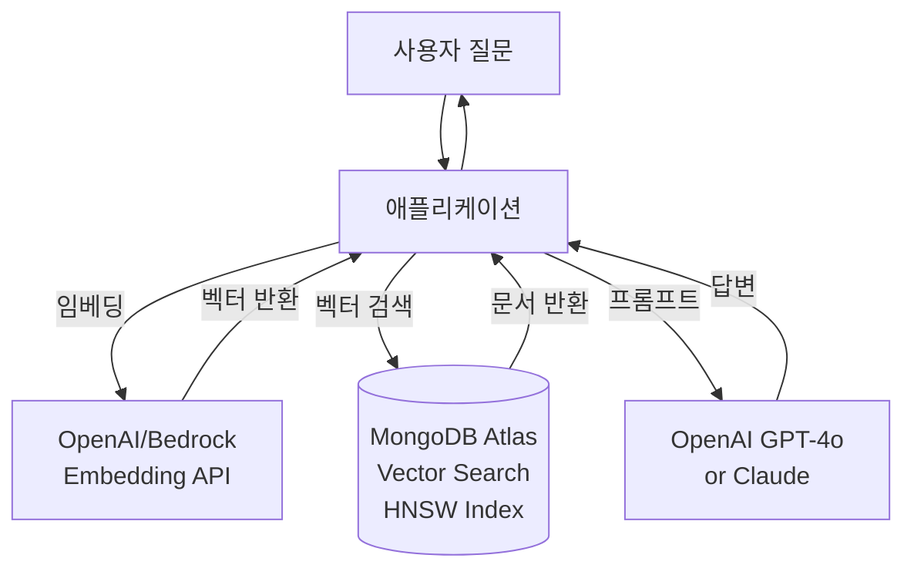
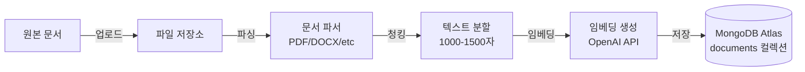

# MongoDB Atlas Vector Search를 활용한 RAG 시스템 구축 가이드

> 한국어 개발자를 위한 MongoDB Atlas Vector Search 기반 RAG(Retrieval-Augmented Generation) 시스템 완벽 구축 가이드

## 📋 목차

- [프로젝트 소개](#-프로젝트-소개)
- [왜 MongoDB Atlas Vector Search인가?](#-왜-mongodb-atlas-vector-search인가)
- [시스템 아키텍처](#-시스템-아키텍처)
- [환경 구축](#-환경-구축)
- [빠른 시작](#-빠른-시작)
- [상세 가이드](#-상세-가이드)
- [성능 최적화](#-성능-최적화)
- [프로덕션 배포](#-프로덕션-배포)
- [트러블슈팅](#-트러블슈팅)
- [FAQ](#-faq)
- [참고 자료](#-참고-자료)

---

## 🎯 프로젝트 소개

이 프로젝트는 **MongoDB Atlas Vector Search**를 활용하여 고성능 RAG(Retrieval-Augmented Generation) 시스템을 구축하는 실전 가이드입니다.

### 주요 특징

- ✅ **통합 데이터베이스**: 벡터 검색과 일반 데이터를 하나의 DB에서 관리
- ✅ **자동 스케일링**: Atlas의 자동 스케일링으로 트래픽 변화에 유연하게 대응
- ✅ **하이브리드 검색**: 벡터 검색 + 전통적 쿼리 결합
- ✅ **글로벌 배포**: 멀티 리전 클러스터로 전 세계 저지연 서비스
- ✅ **Change Streams**: 실시간 데이터 동기화

### 학습 목표

이 가이드를 완료하면 다음을 할 수 있습니다:

1. MongoDB Atlas 클러스터 생성 및 Vector Search 인덱스 설정
2. 벡터 임베딩 생성 및 저장
3. 의미론적 검색(Semantic Search)과 메타데이터 필터링 구현
4. RAG 파이프라인 구축 및 프로덕션 배포
5. 성능 최적화 및 모니터링

### 실제 활용 사례

MongoDB Atlas Vector Search 기반 RAG는 다음과 같은 시나리오에서 효과적입니다:

- **📚 전자상거래 상품 검색**: 텍스트 + 이미지 기반 상품 추천
- **🏢 고객 지원 챗봇**: 고객 히스토리와 지식베이스 통합 검색
- **📊 금융 문서 분석**: 규정, 보고서, 거래 내역 통합 검색
- **🔍 개인화 추천 시스템**: 사용자 프로필 + 콘텐츠 벡터 기반 추천
- **💼 기업 지식 검색**: 문서, 코드, 이메일 통합 검색

---

## 📋 주요 사양 (Specs)

### 지원하는 임베딩 모델

| 모델 | 차원 | 제공사 | 특징 |
|------|------|--------|------|
| **text-embedding-3-small** | 1536 | OpenAI | 빠른 속도, 낮은 비용 |
| **text-embedding-3-large** | 3072 | OpenAI | 높은 정확도 |
| **text-embedding-ada-002** | 1536 | OpenAI | 안정적인 레거시 모델 |
| **amazon.titan-embed-text-v1** | 1024 | AWS Bedrock | 다국어 지원 |
| **cohere.embed-multilingual-v3** | 1024 | Cohere | 100+ 언어 지원 |

### 벡터 검색 알고리즘

| 알고리즘 | 설명 | 성능 | 정확도 |
|----------|------|------|--------|
| **Approximate kNN (HNSW)** | 근사 최근접 이웃 검색 | 빠름 (10-50ms) | 99%+ |
| **Hierarchical Navigable Small World** | 계층적 그래프 기반 | 초고속 | 매우 높음 |

### 예상 비용 (2025년 기준)

#### 소규모 프로젝트 (개발/테스트)
```
✅ MongoDB Atlas M0 (Free Tier)
- 저장 용량: 512MB
- RAM: 공유 메모리
- 벡터 검색: 지원 (제한적)
- 비용: $0/월

💡 무료 티어로 RAG 프로토타입 개발 가능!
```

#### 중규모 프로젝트 (프로덕션)
```
✅ MongoDB Atlas M10
- 저장 용량: 10GB
- RAM: 2GB
- vCPU: 2 코어
- 비용: ~$57/월

✅ OpenAI API (월 10,000 쿼리)
- text-embedding-3-small: $0.20
- GPT-4o-mini: ~$10
- 총 예상: ~$10/월

📊 총 예상 비용: $67/월
```

#### 대규모 엔터프라이즈
```
✅ MongoDB Atlas M30 (Multi-region)
- 저장 용량: 60GB
- RAM: 8GB
- vCPU: 4 코어
- 비용: ~$440/월

✅ OpenAI API (월 100,000+ 쿼리)
- Embeddings + LLM: ~$200-500/월

📊 총 예상 비용: $640-940/월
```

**비용 최적화 팁:**
- **M0 Free Tier**: 개발/테스트 환경에 활용
- **Reserved Capacity**: 1년 약정 시 최대 30% 할인
- **Compression**: 문서 압축으로 저장 공간 절약
- **Index Optimization**: 필요한 필드만 인덱싱

---

## 🤔 왜 MongoDB Atlas Vector Search인가?

### 기존 솔루션 vs MongoDB Atlas

| 기능 | 전용 벡터 DB<br/>(Pinecone, Weaviate) | MongoDB Atlas |
|------|--------------------------------------|---------------|
| **벡터 검색** | ✅ 전문화됨 | ✅ 내장 지원 |
| **일반 데이터** | ❌ 별도 DB 필요 | ✅ 통합 관리 |
| **트랜잭션** | ❌ 제한적 | ✅ ACID 보장 |
| **메타데이터 필터** | 제한적 | ✅ 강력한 쿼리 |
| **스케일링** | 수동 | ✅ 자동 |
| **학습 곡선** | 가파름 | ✅ MongoDB 지식 활용 |
| **비용** | 높음 | ✅ 합리적 |

### RAG에 최적인 이유

1. **단일 데이터베이스**: 사용자 정보, 문서, 벡터를 한곳에서 관리
2. **강력한 필터링**: 복잡한 메타데이터 쿼리와 벡터 검색 결합
3. **Change Streams**: 문서 변경 시 자동으로 임베딩 업데이트
4. **글로벌 배포**: 멀티 리전 클러스터로 전 세계 저지연
5. **엔터프라이즈급**: 백업, 보안, 모니터링 기본 제공
6. **개발자 친화적**: 친숙한 MongoDB 쿼리 문법 사용

---

## 🏗 시스템 아키텍처

### RAG 워크플로우



### 문서 인덱싱 파이프라인



### 아키텍처 상세 (프로덕션)

```
클라이언트 계층
├─ 웹 애플리케이션 (React/Vue/Next.js)
└─ 모바일 앱 (iOS/Android)
    ↓
API 계층
├─ FastAPI/Express Server
│  ├─ 인증/인가 (JWT)
│  ├─ Rate Limiting
│  └─ Request Validation
└─ Redis Cache
   ├─ 임베딩 캐시 (쿼리 재사용)
   └─ 세션 관리
    ↓
데이터베이스 계층
├─ MongoDB Atlas (Seoul Region)
│  ├─ Vector Search Index (HNSW)
│  ├─ Change Streams (실시간 동기화)
│  ├─ documents 컬렉션
│  └─ Row Level Security
    ↓
ML 서비스 계층
├─ OpenAI API
│  ├─ text-embedding-3-small (임베딩)
│  └─ gpt-4o-mini (답변 생성)
└─ AWS Bedrock (대안)
```

### 핵심 컴포넌트

#### 1. MongoDB Collections

**documents 컬렉션:**
```javascript
{
  _id: ObjectId("..."),
  content: "회사의 연차 휴가는 15일입니다.",
  embedding: [0.123, -0.456, ...],  // 1536차원 벡터
  metadata: {
    source: "employee_handbook.pdf",
    page: 5,
    category: "HR",
    created_at: ISODate("2024-12-10T...")
  },
  user_id: ObjectId("..."),
  created_at: ISODate("2024-12-10T...")
}
```

#### 2. Vector Search Index

```javascript
{
  "mappings": {
    "dynamic": true,
    "fields": {
      "embedding": {
        "type": "knnVector",
        "dimensions": 1536,
        "similarity": "cosine"
      },
      "metadata.category": {
        "type": "string"
      }
    }
  }
}
```

---

## 🚀 환경 구축

### 시스템 요구사항

- **MongoDB Atlas 계정**: [mongodb.com/cloud/atlas](https://www.mongodb.com/cloud/atlas) 무료 가입
- **Python**: 3.8 이상 또는 **Node.js**: 16 이상
- **OpenAI API Key** (선택): 임베딩/LLM 사용 시
- **Git**: 코드 관리

### 1. MongoDB Atlas 클러스터 생성 (웹 대시보드)

#### 단계 1: 회원가입 및 로그인

1. [MongoDB Atlas](https://www.mongodb.com/cloud/atlas) 접속
2. **"Try Free"** 버튼 클릭
3. Google, GitHub, 또는 이메일로 회원가입/로그인

#### 단계 2: 조직(Organization) 생성

처음 로그인하면 조직 생성을 요구합니다:

1. **Organization Name**: 개인 또는 회사 이름 입력 (예: `my-company`)
2. **Create Organization** 클릭

#### 단계 3: 프로젝트 생성

1. **"New Project"** 버튼 클릭
2. **Project Name**: `rag-project` (프로젝트 이름)
3. **Next** 클릭
4. 멤버 추가는 건너뛰고 **"Create Project"** 클릭

#### 단계 4: 클러스터 생성

1. **"Build a Database"** 버튼 클릭
2. 배포 유형 선택:

   **무료 티어 (개발/테스트):**
   - **M0 FREE** 선택
   - Provider: **AWS**
   - Region: **Seoul (ap-northeast-2)** (한국 사용자 권장)
   - Cluster Name: `rag-cluster`
   - **Create** 클릭

   **프로덕션 환경:**
   - **M10** 이상 선택 (Vector Search 최적화)
   - Multi-region 설정 가능
   - 자동 백업 활성화

3. ⏳ 클러스터 생성 대기 (약 3-5분 소요)

#### 단계 5: 데이터베이스 사용자 생성

1. **Security → Database Access** 클릭
2. **"Add New Database User"** 클릭
3. 정보 입력:
   - **Username**: `rag_user`
   - **Password**: 강력한 비밀번호 생성 (예: `RAGp@ssw0rd2024!`)
   - ⚠️ **반드시 안전한 곳에 저장하세요!**
   - **Database User Privileges**: `Read and write to any database`
4. **"Add User"** 클릭

#### 단계 6: 네트워크 액세스 설정

1. **Security → Network Access** 클릭
2. **"Add IP Address"** 클릭
3. 옵션 선택:
   - **개발 환경**: `Allow Access from Anywhere` (0.0.0.0/0)
   - **프로덕션**: 특정 IP 또는 VPC 설정
4. **"Confirm"** 클릭

#### 단계 7: 연결 문자열 복사

1. **Database → Clusters** 클릭
2. 클러스터에서 **"Connect"** 버튼 클릭
3. **"Drivers"** 선택
4. **Driver**: Python (또는 사용 언어)
5. **Connection String** 복사:

```
mongodb+srv://rag_user:<password>@rag-cluster.xxxxx.mongodb.net/?retryWrites=true&w=majority
```

6. `<password>`를 실제 비밀번호로 교체하여 안전한 곳에 저장

### 2. Python 패키지 설치

```bash
# 가상 환경 생성 (권장)
python -m venv venv
source venv/bin/activate  # macOS/Linux
# venv\Scripts\activate   # Windows

# 필수 패키지 설치
pip install pymongo openai python-dotenv

# 선택적 패키지 (문서 처리)
pip install pypdf langchain-text-splitters
```

**requirements.txt:**
```txt
pymongo>=4.6.0
openai>=1.10.0
python-dotenv>=1.0.0
pypdf>=3.17.0
langchain-text-splitters>=0.0.1
```

### 3. 환경 변수 설정

`.env` 파일 생성:

```env
# MongoDB Atlas 연결 정보
MONGODB_URI=mongodb+srv://rag_user:<password>@rag-cluster.xxxxx.mongodb.net/?retryWrites=true&w=majority
MONGODB_DB=rag_database
MONGODB_COLLECTION=documents

# OpenAI API (임베딩 및 LLM)
OPENAI_API_KEY=sk-...

# 애플리케이션 설정
EMBEDDING_MODEL=text-embedding-3-small
EMBEDDING_DIMENSIONS=1536
LLM_MODEL=gpt-4o-mini
```

**MongoDB 연결 문자열 찾기:**
1. Atlas Dashboard → Database → Connect
2. Drivers 선택
3. Connection String 복사
4. `<password>`를 실제 비밀번호로 교체

### 4. 설치 확인

```python
# test_setup.py
import os
from pymongo import MongoClient
from openai import OpenAI
from dotenv import load_dotenv

load_dotenv()

def test_mongodb():
    """MongoDB Atlas 연결 테스트"""
    print("1️⃣ MongoDB Atlas 연결 테스트...\n")

    try:
        client = MongoClient(os.getenv('MONGODB_URI'))
        # 연결 테스트
        client.admin.command('ping')
        print("✅ MongoDB Atlas 연결 성공!")

        # 데이터베이스 정보
        db_name = os.getenv('MONGODB_DB', 'rag_database')
        db = client[db_name]
        print(f"✅ 데이터베이스: {db_name}")

        # 컬렉션 목록
        collections = db.list_collection_names()
        print(f"✅ 컬렉션 수: {len(collections)}")

        client.close()
        return True
    except Exception as e:
        print(f"❌ MongoDB 연결 실패: {e}")
        return False

def test_openai():
    """OpenAI API 연결 테스트"""
    print("\n2️⃣ OpenAI API 연결 테스트...\n")

    try:
        client = OpenAI(api_key=os.getenv('OPENAI_API_KEY'))

        # 간단한 임베딩 테스트
        response = client.embeddings.create(
            model="text-embedding-3-small",
            input="테스트"
        )

        print("✅ OpenAI API 연결 성공!")
        print(f"✅ 임베딩 차원: {len(response.data[0].embedding)}")
        return True
    except Exception as e:
        print(f"❌ OpenAI 연결 실패: {e}")
        return False

def main():
    print("=" * 60)
    print("  MongoDB Atlas RAG 환경 설정 확인")
    print("=" * 60 + "\n")

    mongodb_ok = test_mongodb()
    openai_ok = test_openai()

    print("\n" + "=" * 60)
    if mongodb_ok and openai_ok:
        print("🎉 모든 설정이 완료되었습니다!")
        print("   이제 RAG 시스템을 구축할 준비가 되었습니다.")
    else:
        print("⚠️  일부 설정이 완료되지 않았습니다.")
        print("   위의 오류 메시지를 확인하고 문제를 해결하세요.")
    print("=" * 60)

if __name__ == "__main__":
    main()
```

**실행:**
```bash
python test_setup.py
```

**예상 출력:**
```
============================================================
  MongoDB Atlas RAG 환경 설정 확인
============================================================

1️⃣ MongoDB Atlas 연결 테스트...

✅ MongoDB Atlas 연결 성공!
✅ 데이터베이스: rag_database
✅ 컬렉션 수: 0

2️⃣ OpenAI API 연결 테스트...

✅ OpenAI API 연결 성공!
✅ 임베딩 차원: 1536

============================================================
🎉 모든 설정이 완료되었습니다!
   이제 RAG 시스템을 구축할 준비가 되었습니다.
============================================================
```

### 5. Vector Search Index 생성 (웹 대시보드에서)

벡터 검색을 위한 인덱스를 생성합니다.

#### 방법 1: Atlas UI 사용 (권장)

1. **Database → Clusters** 클릭
2. 클러스터에서 **"Browse Collections"** 클릭
3. **"Create Database"** 버튼 클릭:
   - Database name: `rag_database`
   - Collection name: `documents`
   - **Create** 클릭

4. **Atlas Search** 탭 클릭
5. **"Create Search Index"** 클릭
6. **"JSON Editor"** 선택
7. 다음 설정 입력:

```json
{
  "mappings": {
    "dynamic": true,
    "fields": {
      "embedding": {
        "type": "knnVector",
        "dimensions": 1536,
        "similarity": "cosine"
      },
      "metadata": {
        "type": "document",
        "fields": {
          "category": {
            "type": "string"
          },
          "source": {
            "type": "string"
          }
        }
      }
    }
  }
}
```

8. **Index Name**: `vector_index`
9. **Database**: `rag_database`
10. **Collection**: `documents`
11. **"Create Search Index"** 클릭
12. ⏳ 인덱스 생성 대기 (약 1-2분)

#### 방법 2: Python으로 생성

```python
# create_index.py
import os
from pymongo import MongoClient
from dotenv import load_dotenv

load_dotenv()

client = MongoClient(os.getenv('MONGODB_URI'))
db = client[os.getenv('MONGODB_DB')]
collection = db[os.getenv('MONGODB_COLLECTION')]

# Vector Search Index 정의
index_definition = {
    "mappings": {
        "dynamic": True,
        "fields": {
            "embedding": {
                "type": "knnVector",
                "dimensions": 1536,
                "similarity": "cosine"
            },
            "metadata.category": {
                "type": "string"
            },
            "metadata.source": {
                "type": "string"
            }
        }
    }
}

print("Vector Search Index를 생성하려면 Atlas UI를 사용하세요.")
print("위의 index_definition을 Atlas Search JSON Editor에 붙여넣으세요.")
```

**주의**: Vector Search Index는 Atlas UI에서 생성해야 합니다. Python API로는 직접 생성할 수 없습니다.

---

## ⚡ 빠른 시작

### 1. 첫 RAG 스크립트 작성

`simple_rag.py` 파일 생성:

```python
import os
from pymongo import MongoClient
from openai import OpenAI
from dotenv import load_dotenv

load_dotenv()

# 클라이언트 초기화
mongo_client = MongoClient(os.getenv('MONGODB_URI'))
db = mongo_client[os.getenv('MONGODB_DB')]
collection = db[os.getenv('MONGODB_COLLECTION')]
openai_client = OpenAI()

# 1. 문서 저장
print("1️⃣ 문서 저장 중...")
text = "회사의 연차 휴가는 15일입니다."

# 임베딩 생성
embedding_response = openai_client.embeddings.create(
    model="text-embedding-3-small",
    input=text
)
embedding = embedding_response.data[0].embedding

# MongoDB에 저장
document = {
    'content': text,
    'embedding': embedding,
    'metadata': {
        'source': 'test',
        'category': 'HR'
    }
}
result = collection.insert_one(document)
print(f"✅ 저장 완료: {result.inserted_id}")

# 2. 벡터 검색
print("\n2️⃣ 검색 중...")
query = "연차는 몇 일?"

# 쿼리 임베딩
query_embedding = openai_client.embeddings.create(
    model="text-embedding-3-small",
    input=query
).data[0].embedding

# Vector Search 쿼리
pipeline = [
    {
        "$vectorSearch": {
            "index": "vector_index",
            "path": "embedding",
            "queryVector": query_embedding,
            "numCandidates": 100,
            "limit": 3
        }
    },
    {
        "$project": {
            "content": 1,
            "metadata": 1,
            "score": {"$meta": "vectorSearchScore"}
        }
    }
]

docs = list(collection.aggregate(pipeline))

print(f"\n✅ 검색 결과 ({len(docs)}개):")
for doc in docs:
    print(f"  - {doc['content']} (점수: {doc['score']:.3f})")

# 3. LLM으로 답변 생성
print("\n3️⃣ 답변 생성 중...")
context = "\n".join([doc['content'] for doc in docs])

response = openai_client.chat.completions.create(
    model="gpt-4o-mini",
    messages=[
        {"role": "system", "content": "당신은 회사 규정 전문가입니다."},
        {"role": "user", "content": f"문서:\n{context}\n\n질문: {query}"}
    ],
    temperature=0.3
)

answer = response.choices[0].message.content
print(f"\n💡 답변: {answer}")

mongo_client.close()
```

### 2. 실행

```bash
python simple_rag.py
```

### 3. 예상 출력

```
1️⃣ 문서 저장 중...
✅ 저장 완료: 675820a1b2c3d4e5f6g7h8i9

2️⃣ 검색 중...

✅ 검색 결과 (1개):
  - 회사의 연차 휴가는 15일입니다. (점수: 0.985)

3️⃣ 답변 생성 중...

💡 답변: 회사의 연차 휴가는 15일입니다.
```

### 4. Atlas UI에서 확인

1. **Database → Browse Collections** 클릭
2. **rag_database → documents** 선택
3. 방금 저장한 문서 확인:

```json
{
  "_id": ObjectId("675820a1b2c3d4e5f6g7h8i9"),
  "content": "회사의 연차 휴가는 15일입니다.",
  "embedding": [0.123, -0.456, ...],
  "metadata": {
    "source": "test",
    "category": "HR"
  }
}
```

🎉 **축하합니다!** 첫 MongoDB RAG 시스템이 작동했습니다!

---

## 📚 상세 가이드

### 1. 여러 문서 저장 (배치 업로드)

`upload_docs.py` 생성:

```python
import os
from pymongo import MongoClient
from openai import OpenAI
from dotenv import load_dotenv
from typing import List, Dict

load_dotenv()

mongo_client = MongoClient(os.getenv('MONGODB_URI'))
db = mongo_client[os.getenv('MONGODB_DB')]
collection = db[os.getenv('MONGODB_COLLECTION')]
openai_client = OpenAI()

def create_embeddings_batch(texts: List[str]) -> List[List[float]]:
    """배치로 임베딩 생성 (비용 최적화)"""
    response = openai_client.embeddings.create(
        model="text-embedding-3-small",
        input=texts
    )
    return [data.embedding for data in response.data]

def upload_documents(texts: List[str], metadata_list: List[Dict]):
    """여러 문서를 배치로 업로드"""
    print(f"📚 {len(texts)}개 문서 업로드 중...\n")

    # 배치로 임베딩 생성 (API 호출 최소화)
    embeddings = create_embeddings_batch(texts)

    # 문서 준비
    documents = []
    for text, embedding, metadata in zip(texts, embeddings, metadata_list):
        documents.append({
            'content': text,
            'embedding': embedding,
            'metadata': metadata
        })

    # MongoDB에 배치 삽입
    result = collection.insert_many(documents)

    print(f"✅ {len(result.inserted_ids)}개 문서 저장 완료!")
    return result.inserted_ids

# 사용 예시
if __name__ == "__main__":
    # 회사 규정 문서들
    documents = [
        "회사의 연차 휴가는 입사 1년마다 15일이 제공됩니다.",
        "재택근무는 주 2회까지 가능하며, 사전 승인이 필요합니다.",
        "점심시간은 12시부터 1시까지이며, 자율적으로 조정 가능합니다.",
        "야근 수당은 시간당 기본급의 1.5배로 지급됩니다.",
        "육아휴직은 최대 1년까지 사용 가능합니다."
    ]

    metadata_list = [
        {'source': 'employee_handbook.pdf', 'category': 'HR', 'page': 5},
        {'source': 'employee_handbook.pdf', 'category': 'Work', 'page': 12},
        {'source': 'employee_handbook.pdf', 'category': 'Work', 'page': 8},
        {'source': 'employee_handbook.pdf', 'category': 'HR', 'page': 15},
        {'source': 'employee_handbook.pdf', 'category': 'HR', 'page': 20}
    ]

    upload_documents(documents, metadata_list)

    # 통계 확인
    total = collection.count_documents({})
    print(f"\n📊 총 문서 수: {total}개")

    mongo_client.close()
```

**실행:**
```bash
python upload_docs.py
```

### 2. 하이브리드 검색 (벡터 + 메타데이터 필터)

```python
# hybrid_search.py
import os
from pymongo import MongoClient
from openai import OpenAI
from dotenv import load_dotenv

load_dotenv()

mongo_client = MongoClient(os.getenv('MONGODB_URI'))
db = mongo_client[os.getenv('MONGODB_DB')]
collection = db[os.getenv('MONGODB_COLLECTION')]
openai_client = OpenAI()

def hybrid_search(query: str, category_filter: str = None, limit: int = 5):
    """
    하이브리드 검색: 벡터 검색 + 메타데이터 필터

    Args:
        query: 검색 질문
        category_filter: 카테고리 필터 (예: "HR", "Work")
        limit: 반환할 결과 수
    """
    # 쿼리 임베딩
    query_embedding = openai_client.embeddings.create(
        model="text-embedding-3-small",
        input=query
    ).data[0].embedding

    # Vector Search 파이프라인 구성
    pipeline = [
        {
            "$vectorSearch": {
                "index": "vector_index",
                "path": "embedding",
                "queryVector": query_embedding,
                "numCandidates": 100,
                "limit": limit
            }
        }
    ]

    # 메타데이터 필터 추가
    if category_filter:
        pipeline.append({
            "$match": {
                "metadata.category": category_filter
            }
        })

    # 프로젝션 추가
    pipeline.append({
        "$project": {
            "content": 1,
            "metadata": 1,
            "score": {"$meta": "vectorSearchScore"}
        }
    })

    # 검색 실행
    results = list(collection.aggregate(pipeline))

    return results

# 사용 예시
if __name__ == "__main__":
    # 1. 일반 벡터 검색
    print("1️⃣ 일반 검색: 연차 관련")
    results = hybrid_search("연차는 몇 일이야?")
    for doc in results:
        print(f"  - [{doc['metadata']['category']}] {doc['content']} (점수: {doc['score']:.3f})")

    # 2. 카테고리 필터링
    print("\n2️⃣ HR 카테고리만 검색")
    results = hybrid_search("휴가 규정", category_filter="HR")
    for doc in results:
        print(f"  - [{doc['metadata']['category']}] {doc['content']} (점수: {doc['score']:.3f})")

    mongo_client.close()
```

### 3. PDF 문서 업로드

```python
# upload_pdf.py
import os
from pymongo import MongoClient
from openai import OpenAI
from dotenv import load_dotenv
import pypdf
from langchain_text_splitters import RecursiveCharacterTextSplitter

load_dotenv()

mongo_client = MongoClient(os.getenv('MONGODB_URI'))
db = mongo_client[os.getenv('MONGODB_DB')]
collection = db[os.getenv('MONGODB_COLLECTION')]
openai_client = OpenAI()

def upload_pdf(pdf_path: str):
    """PDF를 청킹하여 MongoDB에 업로드"""
    print(f"📄 PDF 읽는 중: {pdf_path}")

    # 1. PDF 읽기
    reader = pypdf.PdfReader(pdf_path)
    full_text = ""
    for page in reader.pages:
        full_text += page.extract_text()

    print(f"  총 {len(reader.pages)}페이지, {len(full_text)}자")

    # 2. 청킹
    splitter = RecursiveCharacterTextSplitter(
        chunk_size=1000,
        chunk_overlap=200,
        separators=["\n\n", "\n", ". ", " "]
    )
    chunks = splitter.split_text(full_text)
    print(f"  {len(chunks)}개 청크로 분할")

    # 3. 배치로 임베딩 생성
    print(f"\n💾 임베딩 생성 중...")
    embeddings = []
    batch_size = 100  # OpenAI API 제한

    for i in range(0, len(chunks), batch_size):
        batch = chunks[i:i+batch_size]
        response = openai_client.embeddings.create(
            model="text-embedding-3-small",
            input=batch
        )
        embeddings.extend([data.embedding for data in response.data])
        print(f"  [{i+len(batch)}/{len(chunks)}] 완료")

    # 4. MongoDB에 저장
    print(f"\n💾 MongoDB에 업로드 중...")
    documents = []
    for i, (chunk, embedding) in enumerate(zip(chunks, embeddings)):
        documents.append({
            'content': chunk,
            'embedding': embedding,
            'metadata': {
                'source': pdf_path,
                'chunk_index': i,
                'total_chunks': len(chunks)
            }
        })

    result = collection.insert_many(documents)
    print(f"\n✅ {len(result.inserted_ids)}개 청크 업로드 완료!")

# 사용
if __name__ == "__main__":
    # PDF 파일 경로 (본인의 파일로 변경하세요)
    upload_pdf("company_handbook.pdf")

    mongo_client.close()
```

### 4. RAG 챗봇 구현

```python
# chatbot.py
import os
from pymongo import MongoClient
from openai import OpenAI
from dotenv import load_dotenv

load_dotenv()

mongo_client = MongoClient(os.getenv('MONGODB_URI'))
db = mongo_client[os.getenv('MONGODB_DB')]
collection = db[os.getenv('MONGODB_COLLECTION')]
openai_client = OpenAI()

def ask(question: str, category_filter: str = None):
    """RAG 기반 질의응답"""
    print(f"\n❓ 질문: {question}")

    # 1. 질문 임베딩
    query_embedding = openai_client.embeddings.create(
        model="text-embedding-3-small",
        input=question
    ).data[0].embedding

    # 2. 유사 문서 검색
    pipeline = [
        {
            "$vectorSearch": {
                "index": "vector_index",
                "path": "embedding",
                "queryVector": query_embedding,
                "numCandidates": 100,
                "limit": 3
            }
        },
        {
            "$project": {
                "content": 1,
                "metadata": 1,
                "score": {"$meta": "vectorSearchScore"}
            }
        }
    ]

    docs = list(collection.aggregate(pipeline))

    if not docs:
        return "관련 정보를 찾을 수 없습니다."

    # 3. 컨텍스트 구성
    context = "\n".join([doc['content'] for doc in docs])

    # 4. LLM으로 답변 생성
    response = openai_client.chat.completions.create(
        model="gpt-4o-mini",
        messages=[
            {"role": "system", "content": "당신은 회사 규정 전문가입니다. 제공된 문서를 바탕으로 정확하게 답변하세요."},
            {"role": "user", "content": f"문서:\n{context}\n\n질문: {question}"}
        ],
        temperature=0.3
    )

    answer = response.choices[0].message.content

    # 결과 출력
    print(f"💡 답변: {answer}\n")
    print("📚 참고 문서:")
    for i, doc in enumerate(docs, 1):
        source = doc['metadata'].get('source', 'Unknown')
        print(f"  {i}. {doc['content'][:50]}... (출처: {source}, 점수: {doc['score']:.3f})")

    return answer

# 사용 예시
if __name__ == "__main__":
    print("=" * 60)
    print("🤖 회사 규정 챗봇")
    print("=" * 60)

    questions = [
        "연차는 몇 일이야?",
        "재택근무 가능해?",
        "점심시간이 언제야?",
        "육아휴직은 얼마나 쓸 수 있어?"
    ]

    for q in questions:
        ask(q)
        print("\n" + "-" * 60)

    mongo_client.close()
```

**실행:**
```bash
python chatbot.py
```

### 5. Change Streams로 실시간 동기화

문서가 변경될 때 자동으로 임베딩을 업데이트합니다.

```python
# watch_changes.py
import os
from pymongo import MongoClient
from openai import OpenAI
from dotenv import load_dotenv
import threading

load_dotenv()

mongo_client = MongoClient(os.getenv('MONGODB_URI'))
db = mongo_client[os.getenv('MONGODB_DB')]
collection = db[os.getenv('MONGODB_COLLECTION')]
openai_client = OpenAI()

def update_embedding(doc_id, content):
    """문서 내용이 변경되면 임베딩 재생성"""
    print(f"🔄 임베딩 업데이트 중: {doc_id}")

    # 새 임베딩 생성
    embedding = openai_client.embeddings.create(
        model="text-embedding-3-small",
        input=content
    ).data[0].embedding

    # MongoDB 업데이트
    collection.update_one(
        {'_id': doc_id},
        {'$set': {'embedding': embedding}}
    )

    print(f"✅ 임베딩 업데이트 완료: {doc_id}")

def watch_collection():
    """Change Streams로 컬렉션 변경 감지"""
    print("👀 Change Streams 시작...")
    print("문서가 변경되면 자동으로 임베딩을 업데이트합니다.\n")

    # Change Stream 생성
    with collection.watch() as stream:
        for change in stream:
            operation = change['operationType']

            # INSERT 또는 UPDATE 작업 감지
            if operation in ['insert', 'update', 'replace']:
                doc_id = change['documentKey']['_id']

                # 전체 문서 가져오기
                doc = collection.find_one({'_id': doc_id})

                if doc and 'content' in doc:
                    content = doc['content']

                    # 임베딩이 없거나 content가 변경된 경우
                    if 'embedding' not in doc or operation in ['update', 'replace']:
                        # 별도 스레드에서 임베딩 업데이트
                        thread = threading.Thread(
                            target=update_embedding,
                            args=(doc_id, content)
                        )
                        thread.start()

# 사용 예시
if __name__ == "__main__":
    try:
        watch_collection()
    except KeyboardInterrupt:
        print("\n⛔ Change Streams 종료")
        mongo_client.close()
```

**백그라운드 실행:**
```bash
# 별도 터미널에서 실행
python watch_changes.py &
```

---

## 🔧 성능 최적화

### 1. 인덱스 최적화

```python
# optimize_indexes.py
from pymongo import MongoClient, ASCENDING
import os
from dotenv import load_dotenv

load_dotenv()

client = MongoClient(os.getenv('MONGODB_URI'))
db = client[os.getenv('MONGODB_DB')]
collection = db[os.getenv('MONGODB_COLLECTION')]

# 1. 메타데이터 필드 인덱스 (빠른 필터링)
collection.create_index([
    ("metadata.category", ASCENDING),
    ("metadata.source", ASCENDING)
])

# 2. 생성일 인덱스 (시간 기반 쿼리)
collection.create_index([("created_at", ASCENDING)])

# 3. 복합 인덱스 (카테고리 + 생성일)
collection.create_index([
    ("metadata.category", ASCENDING),
    ("created_at", ASCENDING)
])

print("✅ 인덱스 생성 완료!")

# 인덱스 확인
indexes = collection.list_indexes()
print("\n📊 인덱스 목록:")
for idx in indexes:
    print(f"  - {idx['name']}: {idx.get('key', {})}")

client.close()
```

### 2. 배치 처리 최적화

```python
def bulk_upsert_documents(documents: list, batch_size: int = 100):
    """
    대량 문서 업로드 최적화
    - 배치 임베딩 생성
    - Bulk Write 사용
    """
    from pymongo import UpdateOne

    print(f"📦 {len(documents)}개 문서 배치 처리 중...")

    # 1. 배치로 임베딩 생성
    texts = [doc['content'] for doc in documents]
    all_embeddings = []

    for i in range(0, len(texts), batch_size):
        batch = texts[i:i+batch_size]
        response = openai_client.embeddings.create(
            model="text-embedding-3-small",
            input=batch
        )
        all_embeddings.extend([data.embedding for data in response.data])
        print(f"  임베딩: [{i+len(batch)}/{len(texts)}]")

    # 2. Bulk Write 준비
    operations = []
    for doc, embedding in zip(documents, all_embeddings):
        doc['embedding'] = embedding
        operations.append(
            UpdateOne(
                {'content': doc['content']},  # 중복 체크
                {'$set': doc},
                upsert=True
            )
        )

    # 3. Bulk Write 실행
    result = collection.bulk_write(operations)

    print(f"✅ 삽입: {result.upserted_count}, 업데이트: {result.modified_count}")
    return result
```

### 3. 쿼리 성능 측정

```python
import time
from pymongo import MongoClient
from openai import OpenAI

def benchmark_search(query: str, num_runs: int = 10):
    """벡터 검색 성능 측정"""

    # 쿼리 임베딩 (한 번만)
    query_embedding = openai_client.embeddings.create(
        model="text-embedding-3-small",
        input=query
    ).data[0].embedding

    # 검색 반복 측정
    times = []
    for _ in range(num_runs):
        start = time.time()

        pipeline = [
            {
                "$vectorSearch": {
                    "index": "vector_index",
                    "path": "embedding",
                    "queryVector": query_embedding,
                    "numCandidates": 100,
                    "limit": 5
                }
            }
        ]

        results = list(collection.aggregate(pipeline))

        elapsed = time.time() - start
        times.append(elapsed)

    # 통계 출력
    avg_time = sum(times) / len(times)
    min_time = min(times)
    max_time = max(times)

    print(f"\n📊 검색 성능 ({num_runs}회 평균):")
    print(f"  평균: {avg_time*1000:.2f}ms")
    print(f"  최소: {min_time*1000:.2f}ms")
    print(f"  최대: {max_time*1000:.2f}ms")
    print(f"  결과 수: {len(results)}개")
```

### 4. 캐싱 전략

```python
from functools import lru_cache
import hashlib

@lru_cache(maxsize=1000)
def get_query_embedding_cached(query: str):
    """쿼리 임베딩 캐싱 (동일 질문 반복 시)"""
    return openai_client.embeddings.create(
        model="text-embedding-3-small",
        input=query
    ).data[0].embedding

def search_with_cache(query: str):
    """캐싱된 임베딩 사용"""
    query_embedding = get_query_embedding_cached(query)

    pipeline = [
        {
            "$vectorSearch": {
                "index": "vector_index",
                "path": "embedding",
                "queryVector": query_embedding,
                "numCandidates": 100,
                "limit": 5
            }
        }
    ]

    return list(collection.aggregate(pipeline))
```

---

## 🚀 프로덕션 배포

### 1. FastAPI 서버 구현

```python
# api_server.py
from fastapi import FastAPI, HTTPException
from pydantic import BaseModel
from pymongo import MongoClient
from openai import OpenAI
import os
from dotenv import load_dotenv
from typing import List, Optional

load_dotenv()

app = FastAPI(title="MongoDB RAG API")

# 클라이언트 초기화
mongo_client = MongoClient(os.getenv('MONGODB_URI'))
db = mongo_client[os.getenv('MONGODB_DB')]
collection = db[os.getenv('MONGODB_COLLECTION')]
openai_client = OpenAI()

class QueryRequest(BaseModel):
    question: str
    category_filter: Optional[str] = None
    limit: int = 5

class QueryResponse(BaseModel):
    answer: str
    sources: List[dict]

@app.post("/ask", response_model=QueryResponse)
async def ask_question(request: QueryRequest):
    """RAG 질의응답 API"""
    try:
        # 1. 쿼리 임베딩
        query_embedding = openai_client.embeddings.create(
            model="text-embedding-3-small",
            input=request.question
        ).data[0].embedding

        # 2. 벡터 검색
        pipeline = [
            {
                "$vectorSearch": {
                    "index": "vector_index",
                    "path": "embedding",
                    "queryVector": query_embedding,
                    "numCandidates": 100,
                    "limit": request.limit
                }
            },
            {
                "$project": {
                    "content": 1,
                    "metadata": 1,
                    "score": {"$meta": "vectorSearchScore"}
                }
            }
        ]

        docs = list(collection.aggregate(pipeline))

        if not docs:
            raise HTTPException(status_code=404, detail="관련 정보를 찾을 수 없습니다.")

        # 3. 컨텍스트 구성
        context = "\n".join([doc['content'] for doc in docs])

        # 4. LLM 답변 생성
        response = openai_client.chat.completions.create(
            model="gpt-4o-mini",
            messages=[
                {"role": "system", "content": "당신은 회사 규정 전문가입니다."},
                {"role": "user", "content": f"문서:\n{context}\n\n질문: {request.question}"}
            ],
            temperature=0.3
        )

        answer = response.choices[0].message.content

        # 5. 응답 반환
        return QueryResponse(
            answer=answer,
            sources=[
                {
                    "content": doc['content'][:100] + "...",
                    "metadata": doc['metadata'],
                    "score": doc['score']
                }
                for doc in docs
            ]
        )

    except Exception as e:
        raise HTTPException(status_code=500, detail=str(e))

@app.get("/health")
async def health_check():
    """헬스 체크"""
    try:
        mongo_client.admin.command('ping')
        return {"status": "healthy", "database": "connected"}
    except Exception as e:
        return {"status": "unhealthy", "error": str(e)}

@app.get("/stats")
async def get_stats():
    """통계 정보"""
    total_docs = collection.count_documents({})
    categories = collection.distinct("metadata.category")

    return {
        "total_documents": total_docs,
        "categories": categories
    }

if __name__ == "__main__":
    import uvicorn
    uvicorn.run(app, host="0.0.0.0", port=8000)
```

**실행:**
```bash
pip install fastapi uvicorn
python api_server.py
```

**API 테스트:**
```bash
# cURL로 테스트
curl -X POST "http://localhost:8000/ask" \
  -H "Content-Type: application/json" \
  -d '{"question": "연차는 몇 일이야?"}'

# 헬스 체크
curl "http://localhost:8000/health"

# 통계 확인
curl "http://localhost:8000/stats"
```

### 2. Docker 배포

**Dockerfile:**
```dockerfile
FROM python:3.11-slim

WORKDIR /app

# 패키지 설치
COPY requirements.txt .
RUN pip install --no-cache-dir -r requirements.txt

# 애플리케이션 코드 복사
COPY . .

# 포트 노출
EXPOSE 8000

# 서버 실행
CMD ["uvicorn", "api_server:app", "--host", "0.0.0.0", "--port", "8000"]
```

**docker-compose.yml:**
```yaml
version: '3.8'

services:
  api:
    build: .
    ports:
      - "8000:8000"
    environment:
      - MONGODB_URI=${MONGODB_URI}
      - MONGODB_DB=${MONGODB_DB}
      - MONGODB_COLLECTION=${MONGODB_COLLECTION}
      - OPENAI_API_KEY=${OPENAI_API_KEY}
    env_file:
      - .env
    restart: unless-stopped
```

**실행:**
```bash
docker-compose up -d
```

### 3. 환경 변수 관리 (프로덕션)

**.env.production:**
```env
# MongoDB Atlas (프로덕션)
MONGODB_URI=mongodb+srv://prod_user:<password>@prod-cluster.xxxxx.mongodb.net/?retryWrites=true&w=majority
MONGODB_DB=rag_production
MONGODB_COLLECTION=documents

# OpenAI API
OPENAI_API_KEY=sk-...

# 애플리케이션 설정
EMBEDDING_MODEL=text-embedding-3-small
EMBEDDING_DIMENSIONS=1536
LLM_MODEL=gpt-4o-mini

# 성능 설정
MAX_POOL_SIZE=50
MIN_POOL_SIZE=10
```

---

## 🐛 트러블슈팅

### 1. `pymongo.errors.ServerSelectionTimeoutError`

**원인**: MongoDB Atlas 네트워크 액세스 문제

**해결책**:
```bash
# 1. Atlas UI에서 Network Access 확인
# - Security → Network Access
# - 현재 IP가 허용 목록에 있는지 확인

# 2. 연결 문자열 확인
# - <password> 부분이 URL 인코딩되었는지 확인
# - 특수문자가 있으면 인코딩 필요 (예: @ → %40)

# 3. 방화벽 확인
# - 27017 포트가 차단되지 않았는지 확인
```

### 2. Vector Search 결과가 없음

**원인**: 인덱스가 생성되지 않았거나 잘못 설정됨

**해결책**:
```python
# 1. 인덱스 상태 확인
# Atlas UI → Atlas Search → Indexes
# 상태가 "Active"인지 확인

# 2. 인덱스 이름 확인
pipeline = [
    {
        "$vectorSearch": {
            "index": "vector_index",  # 정확한 인덱스 이름 사용
            "path": "embedding",
            "queryVector": query_embedding,
            "numCandidates": 100,
            "limit": 5
        }
    }
]

# 3. 임베딩 필드 확인
sample_doc = collection.find_one()
print("임베딩 존재:", "embedding" in sample_doc)
print("임베딩 차원:", len(sample_doc.get("embedding", [])))
```

### 3. 느린 검색 속도

**원인**: 인덱스 최적화 부족 또는 너무 많은 후보

**해결책**:
```python
# numCandidates 조정 (너무 크면 느림)
pipeline = [
    {
        "$vectorSearch": {
            "index": "vector_index",
            "path": "embedding",
            "queryVector": query_embedding,
            "numCandidates": 50,  # 100에서 50으로 감소
            "limit": 5
        }
    }
]

# M10 이상 클러스터 사용 (프로덕션)
# Free Tier (M0)는 벡터 검색 성능 제한
```

### 4. 임베딩 차원 불일치

**원인**: 인덱스 차원과 임베딩 차원이 다름

**해결책**:
```python
# 1. 임베딩 모델 확인
response = openai_client.embeddings.create(
    model="text-embedding-3-small",  # 1536차원
    input="test"
)
print("차원:", len(response.data[0].embedding))

# 2. 인덱스 차원 확인
# Atlas UI → Atlas Search → vector_index
# dimensions: 1536으로 설정되어 있는지 확인

# 3. 차원이 다르면 인덱스 재생성
# - 기존 인덱스 삭제
# - 올바른 차원으로 재생성
# - 모든 문서 임베딩 재생성
```

---

## ❓ FAQ (자주 묻는 질문)

### Q1. MongoDB Atlas Free Tier로 RAG 시스템을 만들 수 있나요?

**A:** 네, 가능합니다! M0 Free Tier에서도 Vector Search를 사용할 수 있습니다.

**제한 사항:**
- 저장 용량: 512MB
- 공유 RAM (성능 제한)
- 벡터 검색 속도가 느릴 수 있음

**권장 사용처:**
- 프로토타입 개발
- 학습 및 실험
- 소규모 데모 (<1000 문서)

**프로덕션 전환:** M10 이상 권장 (전용 리소스, 더 빠른 검색)

### Q2. 벡터 임베딩 모델을 변경하려면?

**A:** 모델 변경 시 모든 문서의 임베딩을 재생성해야 합니다.

```python
# 1. 새 모델로 임베딩 재생성
def re_embed_all_documents(new_model: str, new_dimensions: int):
    """모든 문서 임베딩 재생성"""
    docs = collection.find({})

    for doc in docs:
        # 새 임베딩 생성
        embedding = openai_client.embeddings.create(
            model=new_model,
            input=doc['content']
        ).data[0].embedding

        # 업데이트
        collection.update_one(
            {'_id': doc['_id']},
            {'$set': {'embedding': embedding}}
        )

# 2. Vector Search Index 차원 변경
# Atlas UI에서 인덱스 삭제 후 재생성
# dimensions: 1536 → 3072 (예: text-embedding-3-large)

# 3. 환경 변수 업데이트
EMBEDDING_MODEL=text-embedding-3-large
EMBEDDING_DIMENSIONS=3072
```

### Q3. 한국어 검색 품질을 높이려면?

**A:** 다국어 임베딩 모델과 메타데이터 활용이 핵심입니다.

```python
# 1. 다국어 임베딩 모델 사용
# - OpenAI text-embedding-3-small/large (다국어 지원)
# - Cohere embed-multilingual-v3

# 2. 메타데이터에 언어 정보 추가
document = {
    'content': "회사의 연차 휴가는 15일입니다.",
    'embedding': embedding,
    'metadata': {
        'language': 'ko',
        'source': 'handbook.pdf'
    }
}

# 3. 하이브리드 검색 (벡터 + 키워드)
# MongoDB의 텍스트 검색과 벡터 검색 결합
collection.create_index([("content", "text")])

# 4. 동의어 처리
# 질문 전처리: "연차" → "연차 휴가", "휴가"
```

### Q4. 대용량 문서 처리는 어떻게 하나요?

**A:** 청킹, 배치 처리, 비동기 작업을 활용하세요.

```python
# 1. 효율적인 청킹
splitter = RecursiveCharacterTextSplitter(
    chunk_size=1000,      # 적당한 크기
    chunk_overlap=200,    # 컨텍스트 유지
    separators=["\n\n", "\n", ". ", " "]
)

# 2. 배치 임베딩 (비용 및 속도 최적화)
batch_size = 100
for i in range(0, len(chunks), batch_size):
    batch = chunks[i:i+batch_size]
    embeddings = create_embeddings_batch(batch)
    # 배치 저장
    collection.insert_many(documents)

# 3. 비동기 처리 (대용량 파일)
import asyncio
from motor.motor_asyncio import AsyncIOMotorClient

async def process_large_file(file_path):
    # 비동기로 문서 처리
    pass
```

### Q5. 검색 결과가 부정확한데 어떻게 개선하나요?

**A:** 여러 전략을 조합하여 정확도를 높일 수 있습니다.

```python
# 1. numCandidates 증가 (더 많은 후보 검색)
"numCandidates": 200,  # 기본 100에서 증가
"limit": 5

# 2. 메타데이터 필터링 (관련성 높은 문서만)
{
    "$vectorSearch": {
        "index": "vector_index",
        "path": "embedding",
        "queryVector": query_embedding,
        "filter": {
            "metadata.category": {"$eq": "HR"}
        },
        "numCandidates": 100,
        "limit": 5
    }
}

# 3. 리랭킹 (Cross-encoder 사용)
# 1차 벡터 검색 → 2차 정확도 평가
from sentence_transformers import CrossEncoder
model = CrossEncoder('cross-encoder/ms-marco-MiniLM-L-6-v2')
scores = model.predict([(query, doc['content']) for doc in results])

# 4. 하이브리드 검색 (벡터 + 키워드)
# 두 검색 결과를 가중치로 결합
```

### Q6. 비용을 절감하려면?

**A:** 캐싱, 배치 처리, 모델 선택으로 비용을 크게 줄일 수 있습니다.

```python
# 1. 임베딩 캐싱 (동일 쿼리 재사용)
from functools import lru_cache

@lru_cache(maxsize=1000)
def get_cached_embedding(text: str):
    return openai_client.embeddings.create(
        model="text-embedding-3-small",
        input=text
    ).data[0].embedding

# 2. 배치 임베딩 (API 호출 최소화)
# 100개 텍스트를 1번 호출로 처리

# 3. 저렴한 모델 사용
# - Embedding: text-embedding-3-small (ada-002보다 저렴)
# - LLM: gpt-4o-mini (gpt-4 대비 80% 절감)

# 4. MongoDB 최적화
# - M0 Free Tier로 시작
# - 필요 시 M10으로 업그레이드
# - Reserved Capacity 1년 약정 (30% 할인)
```

### Q7. 멀티 테넌트 시스템을 구축하려면?

**A:** user_id 필드와 메타데이터 필터링으로 구현하세요.

```python
# 1. 문서에 user_id 추가
document = {
    'content': "...",
    'embedding': [...],
    'user_id': "user123",  # 사용자 ID
    'metadata': {
        'team_id': "team456",  # 팀 ID (선택)
        'access_level': "private"
    }
}

# 2. 사용자별 검색
pipeline = [
    {
        "$vectorSearch": {
            "index": "vector_index",
            "path": "embedding",
            "queryVector": query_embedding,
            "filter": {
                "user_id": {"$eq": current_user_id}
            },
            "numCandidates": 100,
            "limit": 5
        }
    }
]

# 3. RLS (Row Level Security) 대신 애플리케이션 레벨에서 관리
# MongoDB는 PostgreSQL의 RLS가 없으므로 코드에서 필터링
```

### Q8. 실시간 업데이트는 어떻게 구현하나요?

**A:** Change Streams를 활용하세요.

```python
# 1. Change Streams로 실시간 감지
with collection.watch() as stream:
    for change in stream:
        if change['operationType'] == 'insert':
            doc_id = change['documentKey']['_id']
            # 새 문서 임베딩 생성
            update_embedding(doc_id)

# 2. 트리거 함수 (MongoDB Atlas Functions)
# Atlas UI에서 함수 생성:
exports = async function(changeEvent) {
    const doc = changeEvent.fullDocument;
    // 임베딩 API 호출
    // 문서 업데이트
}

# 3. WebSocket으로 클라이언트 알림
# 문서 변경 → 클라이언트에 실시간 푸시
```

### Q9. 이미지나 멀티모달 검색도 가능한가요?

**A:** 네, 멀티모달 임베딩 모델을 사용하면 가능합니다.

```python
# 1. OpenAI CLIP 또는 Multimodal Embeddings 사용
# (현재 OpenAI는 별도 API 제공하지 않음, 대안 사용)

# 2. Cohere Embed v3 (텍스트 + 이미지)
import cohere
co = cohere.Client(api_key="...")

# 이미지 임베딩
image_embedding = co.embed(
    texts=[""],
    images=["path/to/image.jpg"],
    model="embed-english-v3.0",
    input_type="image"
).embeddings[0]

# 3. MongoDB에 저장 (동일 필드)
collection.insert_one({
    'type': 'image',
    'image_url': 'https://...',
    'embedding': image_embedding,
    'metadata': {'tags': ['car', 'red']}
})

# 4. 통합 검색 (텍스트 쿼리 → 이미지 결과)
query_embedding = co.embed(texts=["red car"], ...)
# 벡터 검색으로 이미지 찾기
```

### Q10. 프로덕션 모니터링은 어떻게 하나요?

**A:** MongoDB Atlas 모니터링 + 애플리케이션 로깅을 결합하세요.

```python
# 1. Atlas 모니터링 (무료 제공)
# - Atlas UI → Metrics
# - CPU, Memory, Disk, Network 확인
# - Query Performance 분석

# 2. 애플리케이션 로깅
import logging
import time

logging.basicConfig(level=logging.INFO)
logger = logging.getLogger(__name__)

def monitored_search(query: str):
    start = time.time()

    # 검색 실행
    results = search(query)

    elapsed = time.time() - start
    logger.info(f"Search completed: query={query}, time={elapsed:.3f}s, results={len(results)}")

    return results

# 3. Prometheus + Grafana (엔터프라이즈)
from prometheus_client import Counter, Histogram

search_requests = Counter('rag_search_requests_total', 'Total search requests')
search_duration = Histogram('rag_search_duration_seconds', 'Search duration')

@search_duration.time()
def search_with_metrics(query):
    search_requests.inc()
    return search(query)

# 4. 알림 설정 (Atlas Alerts)
# - 느린 쿼리 감지 (>1초)
# - CPU 사용률 80% 이상
# - 디스크 공간 90% 이상
```

---

## 🔗 참고 자료

### 공식 문서

- **[MongoDB Atlas](https://www.mongodb.com/cloud/atlas)**: 공식 제품 페이지
- **[Atlas Vector Search Documentation](https://www.mongodb.com/docs/atlas/atlas-vector-search/vector-search-overview/)**: Vector Search 공식 문서
- **[PyMongo Documentation](https://pymongo.readthedocs.io/)**: Python MongoDB 드라이버
- **[MongoDB University](https://learn.mongodb.com/)**: 무료 교육 과정

### 블로그 및 튜토리얼

- **[Building AI Applications with MongoDB](https://www.mongodb.com/developer/products/atlas/building-ai-applications-mongodb/)**: AI 애플리케이션 구축 가이드
- **[RAG with MongoDB Atlas Vector Search](https://www.mongodb.com/developer/products/atlas/rag-with-atlas-vector-search-langchain-openai/)**: LangChain 통합 예제
- **[Vector Search Best Practices](https://www.mongodb.com/docs/atlas/atlas-vector-search/vector-search-best-practices/)**: 성능 최적화 팁

### GitHub 저장소

- **[mongodb-labs/pymongo-ai](https://github.com/mongodb-labs/pymongo-ai)**: MongoDB AI 통합 도구
- **[MongoDB Developer Hub](https://github.com/mongodb-developer)**: 공식 샘플 코드 및 튜토리얼

### 커뮤니티

- **[MongoDB Community Forums](https://www.mongodb.com/community/forums/)**: 개발자 커뮤니티
- **[MongoDB Developer Hub](https://www.mongodb.com/developer/)**: 기술 블로그 및 리소스
- **[Stack Overflow - mongodb](https://stackoverflow.com/questions/tagged/mongodb)**: Q&A 커뮤니티

### 추가 리소스

- **[Vector Search Pricing](https://www.mongodb.com/pricing)**: 최신 가격 정보
- **[MongoDB Atlas Free Tier](https://www.mongodb.com/cloud/atlas/register)**: 무료 계정 시작
- **[OpenAI Embeddings Guide](https://platform.openai.com/docs/guides/embeddings)**: 임베딩 모델 가이드
