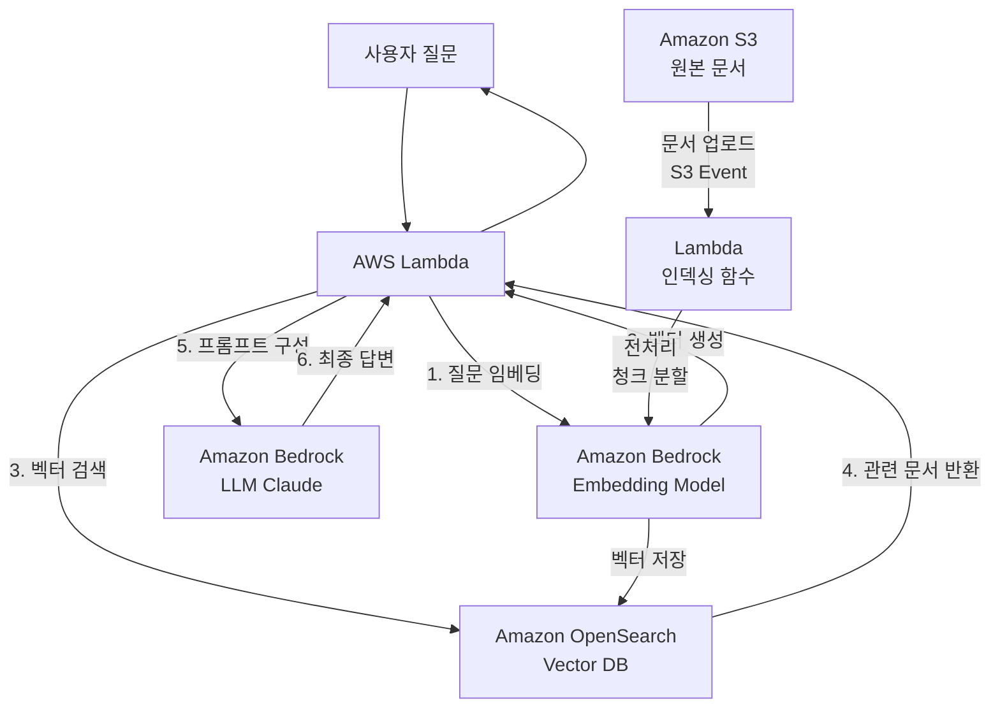
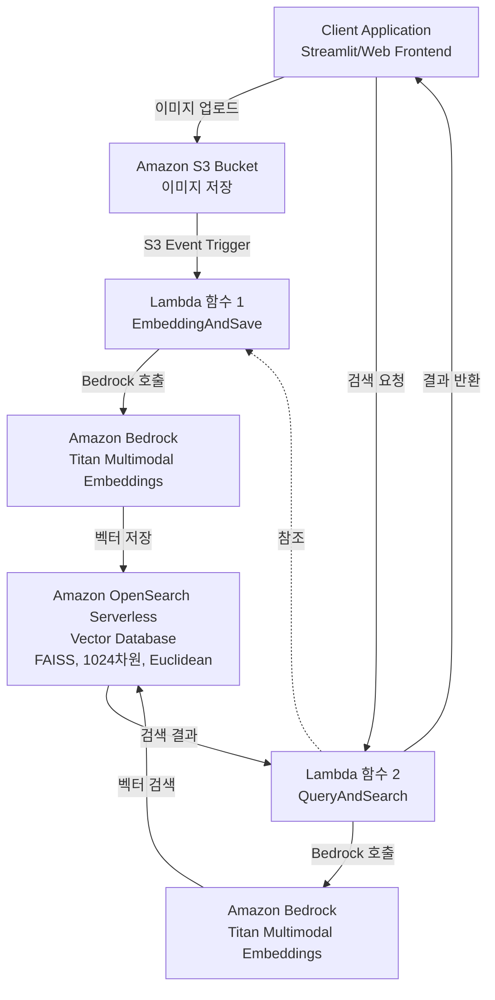
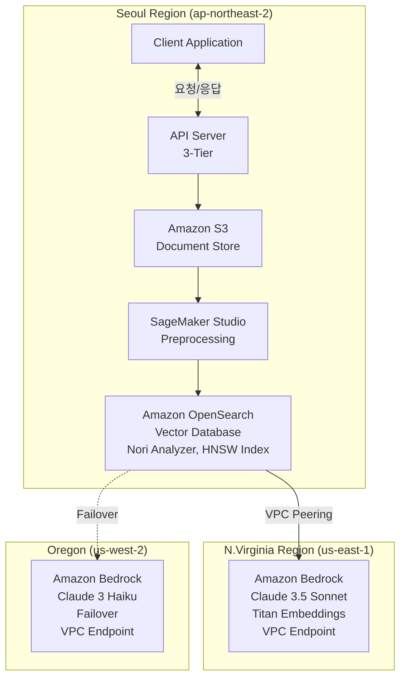

# Amazon OpenSearch를 활용한 RAG 시스템 구축 가이드

> 한국어 개발자를 위한 Amazon OpenSearch 기반 RAG(Retrieval-Augmented Generation) 시스템 완벽 구축 가이드

## 📋 목차

- [프로젝트 소개](#-프로젝트-소개)
- [왜 Amazon OpenSearch인가?](#-왜-amazon-opensearch인가)
- [시스템 아키텍처](#-시스템-아키텍처)
- [환경 구축](#-환경-구축)
- [OpenSearch 인덱스 생성](#-opensearch-인덱스-생성)
- [Lambda 기반 RAG 구현](#-lambda-기반-rag-구현)
- [빠른 시작](#-빠른-시작)
- [상세 가이드](#-상세-가이드)
- [성능 최적화](#-성능-최적화)
- [트러블슈팅](#-트러블슈팅)
- [참고 자료](#-참고-자료)

---

## 🎯 프로젝트 소개

이 프로젝트는 **Amazon OpenSearch Service**와 **Amazon Bedrock**을 활용하여 엔터프라이즈급 RAG(Retrieval-Augmented Generation) 시스템을 구축하는 실전 가이드입니다.

### 주요 특징

- ✅ **엔터프라이즈급 확장성**: 최대 1000개 노드, 25PB까지 스케일링 가능
- ✅ **완전 관리형**: AWS의 완전 관리형 서비스로 운영 부담 최소화
- ✅ **고성능 벡터 검색**: HNSW 알고리즘 기반 빠르고 정확한 검색
- ✅ **한국어 최적화**: Nori 분석기 기반 한글 형태소 분석
- ✅ **다양한 검색 방식**: Semantic Search, Lexical Search, Hybrid Search 지원
- ✅ **멀티모달 지원**: 텍스트, 이미지 통합 검색 가능
- ✅ **비용 최적화**: Serverless, OR1 인스턴스, Disk-based vector search 옵션

### 학습 목표

이 가이드를 완료하면 다음을 할 수 있습니다:

1. Amazon OpenSearch Service 환경 구축 및 인덱스 설정
2. 한국어 Nori 분석기 설정 및 최적화
3. Amazon Bedrock을 활용한 임베딩 및 LLM 연동
4. Lambda 기반 서버리스 RAG 파이프라인 구축
5. 벡터 검색 엔진 구현 (k-NN, HNSW 알고리즘)
6. 성능 최적화 및 모니터링

### 실제 활용 사례

OpenSearch 기반 RAG는 다음과 같은 시나리오에서 효과적입니다:

- **📚 기업 지식 검색 시스템**: 문서 질의 챗봇 사례 
- **🏭 제조업 데이터 분석**: 대규모 기술 문서 검색 및 분석
- **🖼️ 멀티모달 검색**: 텍스트와 이미지 통합 검색 시스템 (이미지 검색 사례)
- **🔍 상품 검색 챗봇**: 대화형 상품 추천 및 검색 시스템
- **📊 로그 분석 및 모니터링**: 실시간 시스템 로그 분석 및 이상 탐지

---

## 📋 주요 사양 (Specs)

### Amazon OpenSearch Service 2024 주요 기능

| 기능 | 설명 | 비고 |
|------|------|------|
| **JWT 인증/인가** | JSON Web Token 기반 인증 | API 보안 강화 |
| **Zero-ETL 통합** | DynamoDB, DocumentDB, Security Lake 직접 연동 | ETL 파이프라인 불필요 |
| **디스크 최적화 벡터 엔진** | Binary quantization (32배 압축) | 메모리 사용량 대폭 감소 |
| **OR1 인스턴스** | 가격 대비 성능 30% 향상 | S3 기반 99.999999999% 내구성 |
| **Coordinator Node** | 전용 조정 노드 | 클러스터 효율성 개선 |
| **최대 1000개 노드** | 단일 클러스터 25PB까지 확장 | 엔터프라이즈급 확장성 |
| **Custom Plugin** | 사용자 정의 플러그인 지원 | 기능 확장 가능 |
| **Serverless 개선** | 0.5 OCU (50% 비용 절감), Binary Vector, FP16 압축 | 최대 30TB 확장 |

### 지원하는 Amazon Bedrock 모델

| 모델명 | 특징 | 권장 사용처 |
|--------|------|------------|
| **Claude 3.5 Sonnet** | 최고 성능, 긴 컨텍스트(200K) | 복잡한 문서 분석, 전문가 수준 답변 |
| **Claude 3 Haiku** | 빠른 속도, 저렴한 비용 | 실시간 챗봇, 대량 처리 |
| **Titan Embeddings G1** | 텍스트 임베딩 (1024 차원) | 한국어 포함 다국어 지원 |
| **Titan Multimodal Embeddings** | 텍스트 + 이미지 임베딩 (1024 차원) | 멀티모달 검색 |
| **Llama 3.1** | 오픈소스, 커스터마이징 가능 | 자체 호스팅, 비용 최적화 |

### 벡터 검색 알고리즘 비교

| 알고리즘 | Response Time | Accuracy/Recall | 비용 | 메모리 사용량 |
|---------|---------------|-----------------|------|--------------|
| **Exact kNN** | 100-300ms | 1.00 (100%) | $$$ | 최대 |
| **HNSW (Memory-optimized)** | 5-20ms | > 0.95 (95%+) | $$ | 중간 |
| **Disk-optimized** | < 50-100ms | > 0.95 (95%+) | $ | 32배 절감 |

### 검색 방식 비교

| 검색 방식 | 설명 | 알고리즘 | 사용 시나리오 |
|----------|------|----------|--------------|
| **Semantic Search** | 벡터 기반 의미 검색 | k-NN, HNSW | 자연어 질문, 의도 파악 |
| **Lexical Search** | 키워드 기반 검색 | BM25 | 정확한 용어 검색 |
| **Hybrid Search** | Semantic + Lexical 결합 | k-NN + BM25 | 최고의 검색 정확도 |
| **Multi-Modal Search** | 텍스트 + 이미지 통합 | Multimodal Embeddings | 제품 검색, 이미지 유사도 |

### 예상 비용 (2024년 12월 기준)

#### 소규모 프로젝트 (개발/테스트)
```
✅ OpenSearch Serverless
- 비용: OCU 기반 (0.5 OCU ~ 시작)
- 예상: $50-100/월
- 용도: 소규모 문서 (<10GB), 낮은 쿼리량

✅ Amazon Bedrock
- Titan Embeddings: $0.0001/1000 토큰
- Claude 3 Haiku: $0.25/1M 입력 토큰, $1.25/1M 출력 토큰
- 예상 (월 1000 쿼리): $10-20/월

📊 총 예상 비용: $60-120/월
```

#### 중규모 프로젝트 (프로덕션)
```
✅ OpenSearch (m6g.large.search 2대)
- 인스턴스: $0.114/시간 × 2 = $0.228/시간
- 스토리지 (100GB): $0.135/GB = $13.5/월
- 월 비용: ~$165 (인스턴스) + $14 (스토리지) = $179/월

✅ Amazon Bedrock
- 월 10,000 쿼리 예상
- Embeddings + LLM: ~$100/월

📊 총 예상 비용: $279/월
```

#### 대규모 엔터프라이즈 
```
✅ OpenSearch (r6g.xlarge.search 3 AZ × 3대)
- 인스턴스: $0.312/시간 × 3 = $0.936/시간
- 월 비용: ~$679/월
- 스토리지 (1TB): $135/월

✅ Amazon Bedrock
- 월 100,000+ 쿼리
- 멀티 리전 (us-east-1 + us-west-2)
- Provisioned Throughput 고려
- 예상: $1,000-2,000/월

✅ Lambda + S3 + CloudWatch: ~$50/월

📊 총 예상 비용: $1,864-2,864/월
```

**비용 최적화 팁:**
- **Disk-based Vector Search**: 메모리 비용 32배 절감
- **OR1 인스턴스**: 기존 대비 30% 가격 절감
- **Serverless**: 사용량에 따라 자동 스케일 (개발 환경 추천)
- **Reserved Instances**: 1년 약정 시 최대 40% 할인
- **Claude Haiku**: Sonnet 대비 80% 비용 절감

---

## 🤔 왜 Amazon OpenSearch인가?

### 기존 RAG 솔루션 vs Amazon OpenSearch

| 기능 | 오픈소스 (Self-managed) | Amazon OpenSearch |
|------|------------------------|-------------------|
| **인프라 관리** | 직접 설치, 운영, 패치 | **완전 관리형** |
| **확장성** | 수동 스케일링 | **자동 스케일링 (최대 1000노드, 25PB)** |
| **가용성** | 직접 구성 필요 | **Multi-AZ 자동 복제, 99.99% SLA** |
| **보안** | 직접 설정 | **VPC, IAM, 암호화 기본 제공** |
| **백업** | 직접 관리 | **자동 스냅샷** |
| **모니터링** | 별도 도구 필요 | **CloudWatch 통합** |
| **비용** | 인프라 + 운영 인력 | **사용량 기반** |
| **한국어 지원** | 직접 설정 | **Nori 분석기 내장** |

### RAG에 최적인 이유

1. **검증된 성능**: 대기업에서 프로덕션 사용 중
2. **빠른 검색 속도**: HNSW 알고리즘으로 5-20ms 응답
3. **한국어 최적화**: Nori 형태소 분석기 내장
4. **다양한 검색 옵션**: Semantic, Lexical, Hybrid, Multi-modal
5. **AWS 생태계 통합**: Bedrock, Lambda, SageMaker 완벽 연동
6. **제로 ETL**: DynamoDB, DocumentDB 직접 연결
7. **비용 최적화**: Disk-based vector search로 메모리 비용 32배 절감

---

## 🏗 시스템 아키텍처

### RAG 워크플로우



### Lambda 기반 이미지 검색 아키텍처 (실전 사례)



**워크플로우 설명:**

🟩 **Lambda 함수 1: EmbeddingImageAndSaveToOpensearch**
1. S3에 이미지 업로드 → Lambda 자동 트리거
2. 이미지를 Base64로 변환
3. Bedrock Titan Multimodal로 임베딩 (1024차원 벡터)
4. OpenSearch에 벡터 + 메타데이터 저장

🟦 **Lambda 함수 2: EmbeddingQueryAndQueryToOpensearch**
1. 사용자가 이미지 또는 텍스트로 검색 요청
2. 쿼리를 Bedrock으로 임베딩
3. OpenSearch에서 k-NN 유사도 검색
4. 상위 N개 결과 반환

### 아키텍처 상세 



### 핵심 컴포넌트

#### 1. 데이터 전처리
- **PDF/HWP 파싱**: PyPDF, PyMuPDF, HWP 라이브러리
- **OCR 처리**: Upstage Document OCR 또는 Claude Vision
- **청킹 전략**: 의미 단위 분할 (1000-1500 토큰)
- **메타데이터 추출**: 문서 제목, 페이지, 카테고리 등

#### 2. 임베딩
- **모델**: Titan Embeddings G1 (1024차원) 또는 Cohere Embed
- **배치 처리**: Lambda 또는 SageMaker Endpoint
- **비용 최적화**: 캐싱 및 중복 제거

#### 3. 벡터 데이터베이스
- **인덱스 설정**: k-NN, HNSW 알고리즘
- **한국어 분석기**: Nori Tokenizer (형태소 분석)
- **샤드 구성**: 데이터 크기에 따라 최적화
- **레플리카**: Multi-AZ 가용성 확보

#### 4. LLM
- **모델 선택**: Claude 3.5 Sonnet (고품질), Haiku (속도)
- **멀티 리전**: us-east-1 (주), us-west-2 (백업)
- **프롬프트 엔지니어링**: RAG 최적화 템플릿

---

## 🚀 환경 구축

### 시스템 요구사항

- **AWS 계정**: 활성화된 AWS 계정
- **권한**: OpenSearch, Bedrock, S3, Lambda, IAM 접근 권한
- **Python**: 3.8 이상
- **리전**: us-east-1 (Bedrock 지원 리전)

### 1. AWS CLI 설정

```bash
# AWS CLI 설치
pip install awscli

# AWS 인증 정보 설정
aws configure
# AWS Access Key ID: YOUR_ACCESS_KEY
# AWS Secret Access Key: YOUR_SECRET_KEY
# Default region name: us-east-1
# Default output format: json

# 설치 확인
aws sts get-caller-identity
```

### 2. Python 패키지 설치

```bash
# 가상 환경 생성 (권장)
python -m venv venv
source venv/bin/activate  # macOS/Linux
# venv\Scripts\activate   # Windows

# 필수 패키지 설치
pip install boto3 opensearch-py python-dotenv
pip install PyPDF2 python-docx pandas numpy
pip install requests-aws4auth  # OpenSearch 인증용

# 선택 패키지 (멀티모달)
pip install Pillow
```

### 3. 환경 변수 설정

`.env` 파일 생성:

```env
# AWS 설정
AWS_REGION=us-east-1
AWS_ACCESS_KEY_ID=your_access_key
AWS_SECRET_ACCESS_KEY=your_secret_key

# OpenSearch 설정
OPENSEARCH_ENDPOINT=your-domain.us-east-1.es.amazonaws.com
OPENSEARCH_INDEX=mi_content_rag_dev_index
OPENSEARCH_USER=admin
OPENSEARCH_PASSWORD=your_password

# Bedrock 설정
BEDROCK_EMBED_MODEL=amazon.titan-embed-text-v1
BEDROCK_LLM_MODEL=anthropic.claude-3-5-sonnet-20240620-v1:0
```

### 4. 설치 확인

환경이 올바르게 설정되었는지 확인합니다:

```python
# test_setup.py
import sys

def check_dependencies():
    """필수 패키지 설치 확인"""
    print("📦 패키지 설치 확인 중...\n")

    required_packages = {
        'boto3': 'AWS SDK',
        'opensearchpy': 'OpenSearch 클라이언트',
        'requests_aws4auth': 'AWS 인증',
        'dotenv': '환경 변수'
    }

    missing_packages = []

    for package, description in required_packages.items():
        try:
            __import__(package.replace('-', '_'))
            print(f"✅ {description} ({package})")
        except ImportError:
            print(f"❌ {description} ({package}) - 설치 필요")
            missing_packages.append(package)

    if missing_packages:
        print(f"\n⚠️  다음 패키지를 설치하세요:")
        print(f"pip install {' '.join(missing_packages)}")
        return False

    print("\n✅ 모든 패키지 설치 완료")
    return True

def check_aws_credentials():
    """AWS 인증 정보 확인"""
    import boto3
    print("\n🔑 AWS 인증 정보 확인 중...\n")

    try:
        sts = boto3.client('sts')
        identity = sts.get_caller_identity()
        print(f"✅ AWS 계정 ID: {identity['Account']}")
        print(f"✅ User ARN: {identity['Arn']}")
        return True
    except Exception as e:
        print(f"❌ AWS 인증 실패: {e}")
        print("\n💡 aws configure 명령어로 인증 정보를 설정하세요")
        return False

def check_bedrock_access():
    """Bedrock 접근 확인"""
    import boto3
    import json
    print("\n🤖 Bedrock 접근 확인 중...\n")

    try:
        bedrock = boto3.client('bedrock-runtime', region_name='us-east-1')

        # 간단한 임베딩 테스트
        response = bedrock.invoke_model(
            modelId='amazon.titan-embed-text-v1',
            body=json.dumps({"inputText": "test"})
        )

        result = json.loads(response['body'].read())
        print(f"✅ Bedrock 연결 성공")
        print(f"✅ Titan Embeddings 사용 가능 ({len(result['embedding'])}차원)")
        return True
    except Exception as e:
        print(f"❌ Bedrock 접근 실패: {e}")
        print("\n💡 us-east-1 리전에서 Bedrock 모델 접근 권한을 확인하세요")
        return False

def check_opensearch_connection():
    """OpenSearch 연결 확인"""
    import boto3
    import os
    from dotenv import load_dotenv
    from opensearchpy import OpenSearch, RequestsHttpConnection
    from requests_aws4auth import AWS4Auth

    print("\n🔍 OpenSearch 연결 확인 중...\n")

    load_dotenv()

    endpoint = os.getenv('OPENSEARCH_ENDPOINT')
    if not endpoint:
        print("❌ OPENSEARCH_ENDPOINT 환경 변수가 설정되지 않았습니다")
        print("💡 .env 파일을 생성하고 OpenSearch 엔드포인트를 설정하세요")
        return False

    try:
        region = os.getenv('AWS_REGION', 'us-east-1')
        service = 'es'
        credentials = boto3.Session().get_credentials()
        awsauth = AWS4Auth(
            credentials.access_key,
            credentials.secret_key,
            region,
            service,
            session_token=credentials.token
        )

        client = OpenSearch(
            hosts=[{'host': endpoint, 'port': 443}],
            http_auth=awsauth,
            use_ssl=True,
            verify_certs=True,
            connection_class=RequestsHttpConnection,
            timeout=10
        )

        info = client.info()
        print(f"✅ OpenSearch 연결 성공")
        print(f"✅ 버전: {info['version']['number']}")
        print(f"✅ 클러스터: {info['cluster_name']}")

        # 인덱스 확인
        index_name = os.getenv('OPENSEARCH_INDEX')
        if index_name:
            if client.indices.exists(index=index_name):
                print(f"✅ 인덱스 '{index_name}' 존재")
            else:
                print(f"⚠️  인덱스 '{index_name}'가 없습니다 (생성 필요)")

        return True
    except Exception as e:
        print(f"❌ OpenSearch 연결 실패: {e}")
        print("\n💡 OpenSearch 엔드포인트와 보안 그룹 설정을 확인하세요")
        return False

def main():
    print("=" * 60)
    print("  Amazon OpenSearch RAG 환경 설정 확인")
    print("=" * 60)

    checks = [
        check_dependencies(),
        check_aws_credentials(),
        check_bedrock_access(),
        check_opensearch_connection()
    ]

    print("\n" + "=" * 60)
    if all(checks):
        print("🎉 모든 설정이 완료되었습니다!")
        print("   이제 RAG 시스템을 구축할 준비가 되었습니다.")
    else:
        print("⚠️  일부 설정이 완료되지 않았습니다.")
        print("   위의 오류 메시지를 확인하고 문제를 해결하세요.")
    print("=" * 60)

if __name__ == "__main__":
    main()
```

**실행:**
```bash
python test_setup.py
```

**예상 출력:**
```
============================================================
  Amazon OpenSearch RAG 환경 설정 확인
============================================================
📦 패키지 설치 확인 중...

✅ AWS SDK (boto3)
✅ OpenSearch 클라이언트 (opensearchpy)
✅ AWS 인증 (requests_aws4auth)
✅ 환경 변수 (dotenv)

✅ 모든 패키지 설치 완료

🔑 AWS 인증 정보 확인 중...

✅ AWS 계정 ID: 123456789012
✅ User ARN: arn:aws:iam::123456789012:user/your-user

🤖 Bedrock 접근 확인 중...

✅ Bedrock 연결 성공
✅ Titan Embeddings 사용 가능 (1024차원)

🔍 OpenSearch 연결 확인 중...

✅ OpenSearch 연결 성공
✅ 버전: 2.17.0
✅ 클러스터: your-cluster-name
✅ 인덱스 'mi_content_rag_dev_index' 존재

============================================================
🎉 모든 설정이 완료되었습니다!
   이제 RAG 시스템을 구축할 준비가 되었습니다.
============================================================
```

---

## 📝 OpenSearch 인덱스 생성

### 실전 인덱스 설정 (한국어 최적화)

이 설정은 실제 프로덕션 환경에서 사용되는 인덱스 구성입니다.

**핵심 특징:**
- ✅ **Nori 형태소 분석기**: 한국어 토큰화 및 검색 최적화
- ✅ **HNSW 벡터 검색**: 1024차원 벡터, cosine 유사도
- ✅ **다층 메타데이터**: 카테고리, 파일명, 페이지 번호 등
- ✅ **Hybrid Search 지원**: 텍스트 + 벡터 동시 검색


#### 인덱스 생성 스크립트 (opensearch_create_index.py)

```python
"""
OpenSearch 인덱스 생성 스크립트
- Nori 한국어 분석기 설정
- HNSW 벡터 검색 설정
- 다층 메타데이터 구조
"""
from opensearchpy import OpenSearch, RequestsHttpConnection
from requests_aws4auth import AWS4Auth
import boto3
import os
from dotenv import load_dotenv

load_dotenv()

# AWS 인증
region = os.getenv('AWS_REGION')
service = 'es'
credentials = boto3.Session().get_credentials()
awsauth = AWS4Auth(
    credentials.access_key, 
    credentials.secret_key,
    region, 
    service,
    session_token=credentials.token
)

# OpenSearch 클라이언트 생성
client = OpenSearch(
    hosts=[{'host': os.getenv('OPENSEARCH_ENDPOINT'), 'port': 443}],
    http_auth=awsauth,
    use_ssl=True,
    verify_certs=True,
    connection_class=RequestsHttpConnection
)

# 실전 인덱스 매핑 (프로덕션 레벨)
index_body = {
    "mappings": {
        "properties": {
            "metadata": {
                "properties": {
                    "content_category1_id": {"type": "long"},
                    "content_category1_name": {
                        "type": "text",
                        "fields": {
                            "keyword": {
                                "type": "keyword",
                                "ignore_above": 256
                            }
                        }
                    },
                    "content_category2_id": {"type": "long"},
                    "content_category2_name": {
                        "type": "text",
                        "fields": {
                            "keyword": {
                                "type": "keyword",
                                "ignore_above": 256
                            }
                        }
                    },
                    "content_category3_id": {
                        "type": "text",
                        "fields": {
                            "keyword": {
                                "type": "keyword",
                                "ignore_above": 256
                            }
                        }
                    },
                    "content_category3_name": {
                        "type": "text",
                        "fields": {
                            "keyword": {
                                "type": "keyword",
                                "ignore_above": 256
                            }
                        }
                    },
                    "content_file_name": {
                        "type": "text",
                        "fields": {
                            "keyword": {
                                "type": "keyword",
                                "ignore_above": 256
                            }
                        }
                    },
                    "content_id": {"type": "long"},
                    "content_page_no": {"type": "long"},
                    "content_total_pages": {"type": "long"},
                    "content_subject": {
                        "type": "text",
                        "fields": {
                            "keyword": {
                                "type": "keyword",
                                "ignore_above": 256
                            }
                        }
                    },
                    "content_type": {
                        "type": "text",
                        "fields": {
                            "keyword": {
                                "type": "keyword",
                                "ignore_above": 256
                            }
                        }
                    },
                    "content_url": {
                        "type": "text",
                        "fields": {
                            "keyword": {
                                "type": "keyword",
                                "ignore_above": 256
                            }
                        }
                    }
                }
            },
            # 텍스트 필드 (Nori 분석기 적용)
            "text": {
                "type": "text",
                "fields": {
                    "keyword": {
                        "type": "keyword",
                        "ignore_above": 256
                    }
                },
                "analyzer": "nori_custom_analyzer"
            },
            # 벡터 필드 (HNSW 검색)
            "vector_field": {
                "type": "knn_vector",
                "dimension": 1024,  # Titan Embeddings 차원
                "method": {
                    "engine": "nmslib",
                    "space_type": "l2",  # 유클리드 거리
                    "name": "hnsw",
                    "parameters": {
                        "ef_construction": 1024,  # 인덱스 구축 품질
                        "m": 32  # 그래프 연결 수
                    }
                }
            }
        }
    },
    "settings": {
        "index": {
            "replication": {
                "type": "DOCUMENT"
            },
            "number_of_shards": "5",
            "number_of_replicas": "1",
            "knn.algo_param": {
                "ef_search": "1024"  # 검색 시 정확도
            },
            "knn": "true",
            # 한국어 형태소 분석기 설정
            "analysis": {
                "analyzer": {
                    "nori_custom_analyzer": {
                        "filter": [
                            "nori_number",
                            "nori_readingform",
                            "lowercase"
                        ],
                        "char_filter": [
                            "html_strip"
                        ],
                        "type": "custom",
                        "tokenizer": "nori"
                    }
                },
                "tokenizer": {
                    "nori": {
                        "type": "nori_tokenizer",
                        "decompound_mode": "mixed",  # 복합어 분해 모드
                        "discard_punctuation": "true"
                    }
                }
            }
        }
    }
}

# 인덱스 생성
index_name = os.getenv('OPENSEARCH_INDEX')

try:
    if client.indices.exists(index=index_name):
        print(f"⚠️ 인덱스가 이미 존재합니다: {index_name}")
        response = input("기존 인덱스를 삭제하고 다시 생성하시겠습니까? (y/n): ")
        if response.lower() == 'y':
            client.indices.delete(index=index_name)
            print(f"🗑️ 기존 인덱스 삭제 완료")
    
    client.indices.create(index=index_name, body=index_body)
    print(f"✅ 인덱스 생성 완료: {index_name}")
    
    # 인덱스 정보 확인
    info = client.indices.get(index=index_name)
    print(f"\n📊 인덱스 설정:")
    print(f"  - Shards: {info[index_name]['settings']['index']['number_of_shards']}")
    print(f"  - Replicas: {info[index_name]['settings']['index']['number_of_replicas']}")
    print(f"  - Vector Dimension: 1024")
    print(f"  - Analyzer: nori_custom_analyzer")
    print(f"  - Algorithm: HNSW")
    
except Exception as e:
    print(f"❌ 인덱스 생성 실패: {e}")
```

**실행:**
```bash
python opensearch_create_index.py
```

### Nori 분석기 테스트

생성한 인덱스의 Nori 분석기가 제대로 작동하는지 테스트:

```python
# test_nori_analyzer.py
from opensearchpy import OpenSearch, RequestsHttpConnection
from requests_aws4auth import AWS4Auth
import boto3
import os

# OpenSearch 클라이언트 생성 (위와 동일)
# ...

# 한국어 분석 테스트
test_text = "Amazon OpenSearch를 활용한 RAG 시스템 구축"

result = client.indices.analyze(
    index=os.getenv('OPENSEARCH_INDEX'),
    body={
        "analyzer": "nori_custom_analyzer",
        "text": test_text
    }
)

print(f"원문: {test_text}")
print(f"\n토큰화 결과:")
for token in result['tokens']:
    print(f"  - {token['token']} (위치: {token['position']})")

# 예상 출력:
# 원문: Amazon OpenSearch를 활용한 RAG 시스템 구축
# 토큰화 결과:
#   - amazon (위치: 0)
#   - opensearch (위치: 1)
#   - 를 (위치: 2)
#   - 활용 (위치: 3)
#   - 한 (위치: 4)
#   - rag (위치: 5)
#   - 시스템 (위치: 6)
#   - 구축 (위치: 7)
```

---

## 🔧 Lambda 기반 RAG 구현

### Lambda 계층 생성 (opensearch-py)

Lambda에서 OpenSearch를 사용하기 위한 계층 준비:

```bash
# 1. 계층을 위한 디렉토리 생성
mkdir -p opensearch-layer/python

# 2. Python 가상환경 생성 및 활성화
python3 -m venv opensearch-layer/venv
source opensearch-layer/venv/bin/activate

# 3. 필요한 라이브러리 설치
pip install opensearch-py requests-aws4auth

# 4. site-packages 폴더를 python 디렉토리로 복사
cp -r opensearch-layer/venv/lib/python3.*/site-packages/* opensearch-layer/python/

# 5. 계층 패키징
cd opensearch-layer
zip -r opensearch-layer.zip python

# 6. 압축 파일 생성 후, 가상환경 비활성화
deactivate

# 7. AWS Lambda 계층으로 업로드
aws lambda publish-layer-version \
    --layer-name opensearch-layer \
    --zip-file fileb://opensearch-layer.zip \
    --compatible-runtimes python3.12
```

### IAM 역할 생성

Lambda 함수가 OpenSearch, Bedrock, S3에 접근하기 위한 IAM 역할:

```json
{
  "Version": "2012-10-17",
  "Statement": [
    {
      "Sid": "BedrockAccess",
      "Effect": "Allow",
      "Action": [
        "bedrock:InvokeModel"
      ],
      "Resource": [
        "arn:aws:bedrock:*::foundation-model/amazon.titan-embed-text-v1",
        "arn:aws:bedrock:*::foundation-model/amazon.titan-embed-image-v1",
        "arn:aws:bedrock:*::foundation-model/anthropic.claude-3-5-sonnet-20240620-v1:0"
      ]
    },
    {
      "Sid": "S3Access",
      "Effect": "Allow",
      "Action": [
        "s3:GetObject",
        "s3:PutObject"
      ],
      "Resource": [
        "arn:aws:s3:::your-bucket-name/*"
      ]
    },
    {
      "Sid": "OpenSearchAccess",
      "Effect": "Allow",
      "Action": [
        "es:ESHttpGet",
        "es:ESHttpPut",
        "es:ESHttpPost",
        "es:ESHttpDelete"
      ],
      "Resource": [
        "arn:aws:es:*:*:domain/your-domain-name/*"
      ]
    },
    {
      "Sid": "CloudWatchLogs",
      "Effect": "Allow",
      "Action": [
        "logs:CreateLogGroup",
        "logs:CreateLogStream",
        "logs:PutLogEvents"
      ],
      "Resource": "arn:aws:logs:*:*:*"
    }
  ]
}
```

### Lambda 함수 1: 문서 인덱싱

S3에 문서가 업로드되면 자동으로 임베딩하여 OpenSearch에 저장:

```python
# lambda_indexing.py
import os
import json
import boto3
import base64
from opensearchpy import OpenSearch, RequestsHttpConnection
from requests_aws4auth import AWS4Auth

def lambda_handler(event, context):
    """
    S3 이벤트 트리거로 문서 인덱싱
    """
    # 환경 변수
    opensearch_region = os.getenv('OPENSEARCH_REGION')
    opensearch_host = os.getenv('OPENSEARCH_HOST')
    opensearch_index = os.getenv('OPENSEARCH_INDEX')
    
    # S3 이벤트에서 정보 추출
    bucket = event['Records'][0]['s3']['bucket']['name']
    key = event['Records'][0]['s3']['object']['key']
    
    print(f"Processing: s3://{bucket}/{key}")
    
    # S3에서 파일 가져오기
    s3 = boto3.client('s3')
    response = s3.get_object(Bucket=bucket, Key=key)
    
    # 파일 타입에 따라 처리
    if key.lower().endswith(('.png', '.jpg', '.jpeg', '.gif', '.webp')):
        # 이미지 파일
        image_content = response['Body'].read()
        vector = embed_image(image_content)
        text = f"Image: {key}"
    else:
        # 텍스트 파일
        text_content = response['Body'].read().decode('utf-8')
        vector = embed_text(text_content)
        text = text_content
    
    # OpenSearch에 저장
    save_to_opensearch(
        opensearch_host,
        opensearch_index,
        opensearch_region,
        vector,
        text,
        {
            's3_bucket': bucket,
            's3_key': key,
            'content_type': key.split('.')[-1]
        }
    )
    
    return {
        'statusCode': 200,
        'body': json.dumps(f'Successfully indexed: {key}')
    }

def embed_image(image_bytes):
    """이미지를 벡터로 임베딩"""
    bedrock = boto3.client('bedrock-runtime', region_name='us-east-1')
    
    image_base64 = base64.b64encode(image_bytes).decode('utf-8')
    
    response = bedrock.invoke_model(
        modelId="amazon.titan-embed-image-v1",
        contentType="application/json",
        accept="application/json",
        body=json.dumps({
            "inputImage": image_base64
        })
    )
    
    result = json.loads(response['body'].read())
    return result['embedding']

def embed_text(text):
    """텍스트를 벡터로 임베딩"""
    bedrock = boto3.client('bedrock-runtime', region_name='us-east-1')
    
    response = bedrock.invoke_model(
        modelId='amazon.titan-embed-text-v1',
        body=json.dumps({"inputText": text})
    )
    
    result = json.loads(response['body'].read())
    return result['embedding']

def save_to_opensearch(host, index, region, vector, text, metadata):
    """OpenSearch에 벡터 저장"""
    # AWS 인증
    service = 'es'
    credentials = boto3.Session().get_credentials()
    awsauth = AWS4Auth(
        credentials.access_key,
        credentials.secret_key,
        region,
        service,
        session_token=credentials.token
    )
    
    # OpenSearch 클라이언트
    client = OpenSearch(
        hosts=[{'host': host, 'port': 443}],
        http_auth=awsauth,
        use_ssl=True,
        verify_certs=True,
        connection_class=RequestsHttpConnection
    )
    
    # 문서 저장
    document = {
        'vector_field': vector,
        'text': text,
        'metadata': metadata
    }
    
    client.index(index=index, body=document)
    print(f"✅ Saved to OpenSearch: {metadata['s3_key']}")
```

### Lambda 함수 2: 검색 및 답변 생성

사용자 질문을 받아 OpenSearch 검색 후 Claude로 답변 생성:

```python
# lambda_query.py
import os
import json
import boto3
from opensearchpy import OpenSearch, RequestsHttpConnection
from requests_aws4auth import AWS4Auth

def lambda_handler(event, context):
    """
    RAG 파이프라인: 검색 → 답변 생성
    """
    # 환경 변수
    opensearch_region = os.getenv('OPENSEARCH_REGION')
    opensearch_host = os.getenv('OPENSEARCH_HOST')
    opensearch_index = os.getenv('OPENSEARCH_INDEX')
    
    # 사용자 질문
    query = event.get('query', '')
    search_type = event.get('type', 'text')  # text 또는 image
    top_k = event.get('top_k', 5)
    
    print(f"Query: {query}, Type: {search_type}")
    
    # 1. 질문 임베딩
    if search_type == 'image':
        # 이미지 검색 (S3 경로로 이미지 가져오기)
        image_bucket = event.get('s3_bucket')
        image_key = event.get('s3_key')
        s3 = boto3.client('s3')
        response = s3.get_object(Bucket=image_bucket, Key=image_key)
        image_content = response['Body'].read()
        query_vector = embed_image(image_content)
    else:
        # 텍스트 검색
        query_vector = embed_text(query)
    
    # 2. OpenSearch 검색
    search_results = search_opensearch(
        opensearch_host,
        opensearch_index,
        opensearch_region,
        query_vector,
        top_k
    )
    
    # 3. Claude로 답변 생성
    if search_type == 'text':
        answer = generate_answer(query, search_results)
        
        return {
            'statusCode': 200,
            'body': json.dumps({
                'answer': answer,
                'sources': [
                    {
                        'text': hit['_source']['text'][:200],
                        'score': hit['_score'],
                        'metadata': hit['_source'].get('metadata', {})
                    }
                    for hit in search_results
                ]
            }, ensure_ascii=False)
        }
    else:
        # 이미지 검색 결과 반환
        return {
            'statusCode': 200,
            'body': json.dumps({
                'results': [
                    {
                        'score': hit['_score'],
                        's3_key': hit['_source']['metadata']['s3_key'],
                        's3_bucket': hit['_source']['metadata']['s3_bucket']
                    }
                    for hit in search_results
                ]
            })
        }

def embed_text(text):
    """텍스트 임베딩"""
    bedrock = boto3.client('bedrock-runtime', region_name='us-east-1')
    
    response = bedrock.invoke_model(
        modelId='amazon.titan-embed-text-v1',
        body=json.dumps({"inputText": text})
    )
    
    result = json.loads(response['body'].read())
    return result['embedding']

def embed_image(image_bytes):
    """이미지 임베딩"""
    import base64
    
    bedrock = boto3.client('bedrock-runtime', region_name='us-east-1')
    image_base64 = base64.b64encode(image_bytes).decode('utf-8')
    
    response = bedrock.invoke_model(
        modelId="amazon.titan-embed-image-v1",
        contentType="application/json",
        accept="application/json",
        body=json.dumps({"inputImage": image_base64})
    )
    
    result = json.loads(response['body'].read())
    return result['embedding']

def search_opensearch(host, index, region, query_vector, top_k):
    """OpenSearch k-NN 검색"""
    # AWS 인증
    service = 'es'
    credentials = boto3.Session().get_credentials()
    awsauth = AWS4Auth(
        credentials.access_key,
        credentials.secret_key,
        region,
        service,
        session_token=credentials.token
    )
    
    # OpenSearch 클라이언트
    client = OpenSearch(
        hosts=[{'host': host, 'port': 443}],
        http_auth=awsauth,
        use_ssl=True,
        verify_certs=True,
        connection_class=RequestsHttpConnection
    )
    
    # k-NN 검색 쿼리
    search_body = {
        "size": top_k,
        "query": {
            "knn": {
                "vector_field": {
                    "vector": query_vector,
                    "k": top_k
                }
            }
        },
        "_source": ["text", "metadata"]
    }
    
    response = client.search(index=index, body=search_body)
    return response['hits']['hits']

def generate_answer(query, search_results):
    """Claude로 답변 생성"""
    bedrock = boto3.client('bedrock-runtime', region_name='us-east-1')
    
    # 컨텍스트 구성
    context = "\n\n".join([
        f"[문서 {i+1}]\n{hit['_source']['text']}"
        for i, hit in enumerate(search_results)
    ])
    
    # 프롬프트
    prompt = f"""다음 문서들을 참고하여 질문에 답변하세요.
답변은 반드시 제공된 문서의 내용에 기반해야 합니다.

<문서>
{context}
</문서>

<질문>
{query}
</질문>

답변:"""
    
    # Claude 호출
    response = bedrock.invoke_model(
        modelId='anthropic.claude-3-5-sonnet-20240620-v1:0',
        body=json.dumps({
            "anthropic_version": "bedrock-2023-05-31",
            "max_tokens": 2000,
            "messages": [
                {"role": "user", "content": prompt}
            ],
            "temperature": 0.3
        })
    )
    
    result = json.loads(response['body'].read())
    return result['content'][0]['text']
```

### Lambda 배포

```bash
# Lambda 함수 1 배포
zip -r lambda_indexing.zip lambda_indexing.py

aws lambda create-function \
    --function-name RAG-Indexing \
    --runtime python3.12 \
    --role arn:aws:iam::YOUR_ACCOUNT:role/lambda-opensearch-role \
    --handler lambda_indexing.lambda_handler \
    --zip-file fileb://lambda_indexing.zip \
    --timeout 60 \
    --memory-size 512 \
    --layers arn:aws:lambda:us-east-1:YOUR_ACCOUNT:layer:opensearch-layer:1 \
    --environment Variables="{OPENSEARCH_HOST=your-domain.us-east-1.es.amazonaws.com,OPENSEARCH_INDEX=mi_content_rag_dev_index,OPENSEARCH_REGION=us-east-1}"

# S3 트리거 추가
aws s3api put-bucket-notification-configuration \
    --bucket your-bucket-name \
    --notification-configuration file://s3-notification.json

# Lambda 함수 2 배포
zip -r lambda_query.zip lambda_query.py

aws lambda create-function \
    --function-name RAG-Query \
    --runtime python3.12 \
    --role arn:aws:iam::YOUR_ACCOUNT:role/lambda-opensearch-role \
    --handler lambda_query.lambda_handler \
    --zip-file fileb://lambda_query.zip \
    --timeout 60 \
    --memory-size 1024 \
    --layers arn:aws:lambda:us-east-1:YOUR_ACCOUNT:layer:opensearch-layer:1 \
    --environment Variables="{OPENSEARCH_HOST=your-domain.us-east-1.es.amazonaws.com,OPENSEARCH_INDEX=mi_content_rag_dev_index,OPENSEARCH_REGION=us-east-1}"
```

**s3-notification.json:**
```json
{
  "LambdaFunctionConfigurations": [
    {
      "LambdaFunctionArn": "arn:aws:lambda:us-east-1:YOUR_ACCOUNT:function:RAG-Indexing",
      "Events": ["s3:ObjectCreated:*"],
      "Filter": {
        "Key": {
          "FilterRules": [
            {
              "Name": "prefix",
              "Value": "documents/"
            }
          ]
        }
      }
    }
  ]
}
```

---

## ⚡ 빠른 시작

### 1. 로컬 환경에서 간단한 테스트 (초보자용)

Lambda나 복잡한 AWS 설정 없이 로컬에서 OpenSearch와 Bedrock을 테스트해볼 수 있습니다.

```python
# simple_test.py - 로컬 환경 테스트
import boto3
import json
from opensearchpy import OpenSearch, RequestsHttpConnection
from requests_aws4auth import AWS4Auth
import os
from dotenv import load_dotenv

load_dotenv()

def main():
    # 1. OpenSearch 연결
    print("1️⃣ OpenSearch 연결 중...")
    region = os.getenv('AWS_REGION', 'us-east-1')
    service = 'es'
    credentials = boto3.Session().get_credentials()
    awsauth = AWS4Auth(
        credentials.access_key,
        credentials.secret_key,
        region,
        service,
        session_token=credentials.token
    )

    opensearch_client = OpenSearch(
        hosts=[{'host': os.getenv('OPENSEARCH_ENDPOINT'), 'port': 443}],
        http_auth=awsauth,
        use_ssl=True,
        verify_certs=True,
        connection_class=RequestsHttpConnection
    )

    # 연결 테스트
    info = opensearch_client.info()
    print(f"✅ OpenSearch 연결 성공: {info['version']['number']}")

    # 2. Bedrock으로 텍스트 임베딩
    print("\n2️⃣ Bedrock으로 텍스트 임베딩 중...")
    bedrock = boto3.client('bedrock-runtime', region_name='us-east-1')

    test_text = "Amazon OpenSearch는 강력한 검색 엔진입니다."

    response = bedrock.invoke_model(
        modelId='amazon.titan-embed-text-v1',
        body=json.dumps({"inputText": test_text})
    )

    result = json.loads(response['body'].read())
    vector = result['embedding']
    print(f"✅ 임베딩 생성 완료: {len(vector)}차원 벡터")

    # 3. OpenSearch에 저장
    print("\n3️⃣ OpenSearch에 문서 저장 중...")
    index_name = os.getenv('OPENSEARCH_INDEX')

    document = {
        'vector_field': vector,
        'text': test_text,
        'metadata': {
            'source': 'test',
            'timestamp': '2024-12-09'
        }
    }

    opensearch_client.index(
        index=index_name,
        body=document,
        refresh=True
    )
    print("✅ 문서 저장 완료")

    # 4. 유사도 검색 테스트
    print("\n4️⃣ 유사도 검색 테스트...")
    query_text = "OpenSearch의 특징은?"

    # 쿼리 임베딩
    query_response = bedrock.invoke_model(
        modelId='amazon.titan-embed-text-v1',
        body=json.dumps({"inputText": query_text})
    )
    query_vector = json.loads(query_response['body'].read())['embedding']

    # k-NN 검색
    search_body = {
        "size": 3,
        "query": {
            "knn": {
                "vector_field": {
                    "vector": query_vector,
                    "k": 3
                }
            }
        }
    }

    search_results = opensearch_client.search(
        index=index_name,
        body=search_body
    )

    print(f"\n검색 결과 ({search_results['hits']['total']['value']}개):")
    for hit in search_results['hits']['hits']:
        print(f"  - {hit['_source']['text']} (점수: {hit['_score']:.3f})")

    print("\n✅ 모든 테스트 완료!")

if __name__ == "__main__":
    main()
```

**실행 방법:**
```bash
python simple_test.py
```

**예상 출력:**
```
1️⃣ OpenSearch 연결 중...
✅ OpenSearch 연결 성공: 2.17.0

2️⃣ Bedrock으로 텍스트 임베딩 중...
✅ 임베딩 생성 완료: 1024차원 벡터

3️⃣ OpenSearch에 문서 저장 중...
✅ 문서 저장 완료

4️⃣ 유사도 검색 테스트...

검색 결과 (1개):
  - Amazon OpenSearch는 강력한 검색 엔진입니다. (점수: 0.985)

✅ 모든 테스트 완료!
```

### 2. 엔드투엔드 Lambda 테스트 (프로덕션)

Lambda 함수가 배포된 후 전체 시스템을 테스트합니다.

```python
# test_rag_system.py
import boto3
import json

# Lambda 클라이언트
lambda_client = boto3.client('lambda', region_name='us-east-1')

# 1. 문서 업로드 (S3에 업로드하면 자동으로 Lambda 트리거)
s3 = boto3.client('s3')
s3.upload_file(
    'company_handbook.pdf',
    'your-bucket-name',
    'documents/company_handbook.pdf'
)
print("✅ 문서 업로드 완료 (자동 인덱싱 중...)")

# 인덱싱 대기
import time
time.sleep(5)

# 2. RAG 질의
response = lambda_client.invoke(
    FunctionName='RAG-Query',
    Payload=json.dumps({
        'query': '회사의 연차 휴가 정책은 어떻게 되나요?',
        'type': 'text',
        'top_k': 5
    })
)

result = json.loads(response['Payload'].read())
body = json.loads(result['body'])

print(f"\n질문: 회사의 연차 휴가 정책은 어떻게 되나요?")
print(f"\n답변:\n{body['answer']}")
print(f"\n참고 문서:")
for i, source in enumerate(body['sources'], 1):
    print(f"  {i}. {source['text'][:100]}... (점수: {source['score']:.3f})")
```

---

## 📚 상세 가이드

### 1. Hybrid Search 구현 (Semantic + Lexical)

최고의 검색 정확도를 위한 하이브리드 검색:

```python
def hybrid_search(client, index, query_text, query_vector, top_k=10):
    """
    벡터 검색 + 키워드 검색 결합
    - Semantic Search: 의미 기반 검색
    - Lexical Search: BM25 키워드 검색
    """
    search_body = {
        "size": top_k,
        "query": {
            "bool": {
                "should": [
                    {
                        # Semantic Search
                        "knn": {
                            "vector_field": {
                                "vector": query_vector,
                                "k": top_k,
                                "boost": 1.0  # 가중치
                            }
                        }
                    },
                    {
                        # Lexical Search (BM25)
                        "multi_match": {
                            "query": query_text,
                            "fields": ["text^2", "metadata.content_subject"],
                            "type": "best_fields",
                            "boost": 0.5,
                            "analyzer": "nori_custom_analyzer"
                        }
                    }
                ],
                "minimum_should_match": 1
            }
        },
        "_source": ["text", "metadata"]
    }
    
    response = client.search(index=index, body=search_body)
    return response['hits']['hits']
```

### 2. 메타데이터 필터링 검색

특정 카테고리나 문서 타입으로 검색 범위 제한:

```python
def filtered_search(client, index, query_vector, filters, top_k=10):
    """
    메타데이터 기반 필터링 검색
    예: 특정 카테고리, 문서 타입, 날짜 범위 등
    """
    filter_clauses = []
    
    # 필터 조건 구성
    for field, value in filters.items():
        if isinstance(value, list):
            # IN 조건
            filter_clauses.append({
                "terms": {f"metadata.{field}": value}
            })
        else:
            # 일치 조건
            filter_clauses.append({
                "term": {f"metadata.{field}.keyword": value}
            })
    
    search_body = {
        "size": top_k,
        "query": {
            "bool": {
                "must": [
                    {
                        "knn": {
                            "vector_field": {
                                "vector": query_vector,
                                "k": top_k
                            }
                        }
                    }
                ],
                "filter": filter_clauses
            }
        }
    }
    
    response = client.search(index=index, body=search_body)
    return response['hits']['hits']

# 사용 예시
filters = {
    "content_type": "pdf",
    "content_category1_name": "HR정책"
}
results = filtered_search(client, index_name, query_vector, filters)
```

### 3. 청킹 전략

#### 고정 크기 청킹
```python
def fixed_size_chunking(text, chunk_size=1000, overlap=200):
    """
    고정 크기 청킹
    - 장점: 구현 간단, 일관된 크기
    - 단점: 의미 단위 무시 가능
    """
    chunks = []
    start = 0
    text_len = len(text)
    
    while start < text_len:
        end = min(start + chunk_size, text_len)
        chunks.append(text[start:end])
        start = end - overlap  # 오버랩 적용
    
    return chunks
```

#### 의미 기반 청킹 (권장)
```python
from langchain.text_splitter import RecursiveCharacterTextSplitter

def semantic_chunking(text, chunk_size=1500, chunk_overlap=200):
    """
    의미 기반 청킹
    - 장점: 문맥 보존, 검색 품질 향상
    - 권장: RAG 시스템에 최적
    """
    splitter = RecursiveCharacterTextSplitter(
        chunk_size=chunk_size,
        chunk_overlap=chunk_overlap,
        separators=["\n\n", "\n", ".", "!", "?", ";", ",", " ", ""],
        length_function=len
    )
    
    chunks = splitter.split_text(text)
    return chunks
```

### 4. 배치 임베딩

대량 문서를 효율적으로 임베딩:

```python
def batch_embed_documents(documents, batch_size=25):
    """
    배치 임베딩으로 처리 속도 향상
    - Bedrock API 호출 최적화
    - 병렬 처리로 속도 개선
    """
    bedrock = boto3.client('bedrock-runtime', region_name='us-east-1')
    all_embeddings = []
    
    for i in range(0, len(documents), batch_size):
        batch = documents[i:i+batch_size]
        print(f"Processing batch {i//batch_size + 1}/{(len(documents)-1)//batch_size + 1}")
        
        embeddings = []
        for doc in batch:
            response = bedrock.invoke_model(
                modelId='amazon.titan-embed-text-v1',
                body=json.dumps({"inputText": doc})
            )
            result = json.loads(response['body'].read())
            embeddings.append(result['embedding'])
        
        all_embeddings.extend(embeddings)
    
    return all_embeddings
```

---

## 🔧 성능 최적화

### 1. 성능 평가 기반 최적화 전략

#### 성능 지표 이해

| 지표 | 설명 | 최적화 목표 | SK하이닉스 실측 |
|------|------|------------|----------------|
| **TTFT** | Time-To-First-Token | <2초 | 1-2초 |
| **Query Response Time** | 전체 응답 시간 | <5초 | 3-5초 |
| **QPS** | Query Per Second | >10 QPS | 10-15 QPS |
| **검색 시간** | 벡터 검색 소요 시간 | <500ms | 80ms (1명) → 2.96초 (100명) |

#### 병목 구간 분석 

```
사용자 1명 기준:
├─ 임베딩: 0.08초 (5%)
├─ 벡터 검색: 0.08초 (5%) 
└─ LLM 생성: 0.96초 (90%) ⚠️ 주요 병목

사용자 100명 기준:
├─ 임베딩: 0.12초 (1%)
├─ 벡터 검색: 2.96초 (17%) ⚠️ 38배 증가!
└─ LLM 생성: 14.65초 (82%) ⚠️ 15배 증가
```

**핵심 인사이트:**
- 벡터 검색 시간이 사용자 증가 시 급격히 증가 (38배)
- Disk-based vector search로 전환 검토 필요

### 2. OpenSearch 최적화

#### HNSW vs Disk-based 선택 기준

```python
def choose_vector_search_method(vector_count, memory_available_gb):
    """
    벡터 수와 메모리 기반 최적 방법 선택
    
    메모리 요구량 공식 (HNSW):
    - 1M 벡터 (1024차원) ≈ 3GB
    - 10M 벡터 ≈ 30GB
    """
    hnsw_memory_required = vector_count * 0.003  # GB
    
    if hnsw_memory_required < memory_available_gb * 0.7:
        return {
            "method": "HNSW (In-memory)",
            "reason": "메모리 충분, 최고 성능",
            "latency": "5-20ms",
            "accuracy": "> 95%",
            "cost": "$$"
        }
    else:
        return {
            "method": "Disk-based Vector Search",
            "reason": "메모리 부족, 비용 최적화",
            "latency": "50-100ms",
            "accuracy": "> 95%",
            "cost": "$ (32배 메모리 절감)",
            "compression": "Binary quantization (32x)"
        }

# 사용 예시
recommendation = choose_vector_search_method(
    vector_count=10_000_000,  # 1000만 벡터
    memory_available_gb=64
)
print(f"권장 방법: {recommendation['method']}")
print(f"이유: {recommendation['reason']}")
print(f"응답 시간: {recommendation['latency']}")
```

#### 인덱스 최적화 (프로덕션 레벨)

```python
# 최적화된 인덱스 설정
optimal_settings = {
    "settings": {
        "index": {
            "knn": True,
            "knn.algo_param.ef_search": 512,  # 검색 정확도 vs 속도
            "number_of_shards": 5,  # 데이터 크기에 따라
            "number_of_replicas": 2,  # 가용성 확보
            "refresh_interval": "30s",  # 실시간성 vs 성능
            "codec": "best_compression"  # 디스크 절약
        }
    }
}

# 샤드 수 계산
def calculate_optimal_shards(index_size_gb, target_shard_size_gb=30):
    """
    권장: 샤드당 30-50GB
    """
    return max(1, int(index_size_gb / target_shard_size_gb))

# 레플리카 수 결정
def calculate_replicas(availability_requirement):
    """
    - high: 2개 (Multi-AZ)
    - medium: 1개
    - low: 0개 (개발 환경)
    """
    mapping = {"high": 2, "medium": 1, "low": 0}
    return mapping.get(availability_requirement, 1)
```

### 3. Lambda 최적화

#### 콜드 스타트 최소화

```python
# Lambda 함수 외부에서 초기화 (재사용)
import boto3
from opensearchpy import OpenSearch

# 전역 변수로 클라이언트 초기화
bedrock_client = None
opensearch_client = None

def get_bedrock_client():
    global bedrock_client
    if bedrock_client is None:
        bedrock_client = boto3.client('bedrock-runtime', region_name='us-east-1')
    return bedrock_client

def get_opensearch_client():
    global opensearch_client
    if opensearch_client is None:
        # OpenSearch 클라이언트 생성 (재사용)
        opensearch_client = OpenSearch(...)
    return opensearch_client

def lambda_handler(event, context):
    # 이미 초기화된 클라이언트 재사용
    bedrock = get_bedrock_client()
    opensearch = get_opensearch_client()
    
    # ...
```

#### 프로비저닝된 동시성

고정 트래픽이 예상되는 경우:

```bash
aws lambda put-provisioned-concurrency-config \
    --function-name RAG-Query \
    --provisioned-concurrent-executions 10
```

### 4. 멀티 리전 로드 밸런싱 

```python
class MultiRegionBedrock:
    """
    멀티 리전 Bedrock으로 트래픽 분산
    - 장점: ThrottlingException 방지, 고가용성
    - us-east-1 + us-west-2
    """
    def __init__(self):
        self.regions = ['us-east-1', 'us-west-2']
        self.current_region_idx = 0
        self.clients = {
            region: boto3.client('bedrock-runtime', region_name=region)
            for region in self.regions
        }
    
    def get_client(self):
        """라운드 로빈 방식"""
        region = self.regions[self.current_region_idx]
        self.current_region_idx = (self.current_region_idx + 1) % len(self.regions)
        return self.clients[region], region
    
    def invoke_with_fallback(self, model_id, body):
        """장애 시 자동 페일오버"""
        for region in self.regions:
            try:
                client = self.clients[region]
                response = client.invoke_model(
                    modelId=model_id,
                    body=body
                )
                print(f"✅ Success in {region}")
                return response
            except Exception as e:
                print(f"⚠️ Failed in {region}: {e}")
                continue
        
        raise Exception("모든 리전에서 실패")

# 사용
bedrock_multi = MultiRegionBedrock()
response = bedrock_multi.invoke_with_fallback(
    model_id='anthropic.claude-3-5-sonnet-20240620-v1:0',
    body=json.dumps({...})
)
```

### 5. 캐싱 전략

```python
class RAGCache:
    """
    응답 캐싱으로 비용 및 지연 시간 절감
    - 동일 질문에 대한 중복 처리 방지
    - 비용 절감: Bedrock API 호출 감소
    """
    def __init__(self, max_size=1000, ttl_seconds=3600):
        self.cache = {}
        self.max_size = max_size
        self.ttl_seconds = ttl_seconds
    
    def _hash_query(self, query):
        import hashlib
        return hashlib.md5(query.encode()).hexdigest()
    
    def get(self, query):
        """캐시 조회"""
        key = self._hash_query(query)
        if key in self.cache:
            item = self.cache[key]
            # TTL 확인
            import time
            if time.time() - item['timestamp'] < self.ttl_seconds:
                print("✅ Cache Hit")
                return item['response']
            else:
                del self.cache[key]
        return None
    
    def set(self, query, response):
        """캐시 저장"""
        import time
        if len(self.cache) >= self.max_size:
            # LRU: 가장 오래된 항목 제거
            oldest_key = min(self.cache, key=lambda k: self.cache[k]['timestamp'])
            del self.cache[oldest_key]
        
        key = self._hash_query(query)
        self.cache[key] = {
            'response': response,
            'timestamp': time.time()
        }

# Lambda에서 전역 변수로 사용
cache = RAGCache()

def lambda_handler(event, context):
    query = event['query']
    
    # 캐시 확인
    cached = cache.get(query)
    if cached:
        return cached
    
    # 캐시 미스: 실제 RAG 실행
    answer = perform_rag(query)
    
    # 캐시 저장
    cache.set(query, answer)
    
    return answer
```

---

## 🔧 트러블슈팅

### 1. OpenSearch 연결 오류

**문제:** `ConnectionError` 또는 `Timeout`

```python
# 해결책 1: 타임아웃 증가
client = OpenSearch(
    hosts=[...],
    timeout=30,  # 10초 → 30초
    max_retries=3,
    retry_on_timeout=True
)

# 해결책 2: VPC 설정 확인
# OpenSearch가 VPC 내부인 경우, Lambda도 같은 VPC에 배치
```

### 2. Bedrock ThrottlingException

**문제:** `ThrottlingException: Rate exceeded`

```python
# 해결책 1: 지수 백오프 재시도
import time
import random

def invoke_with_retry(bedrock_client, **kwargs):
    max_retries = 5
    for attempt in range(max_retries):
        try:
            return bedrock_client.invoke_model(**kwargs)
        except Exception as e:
            if 'ThrottlingException' in str(e):
                wait_time = (2 ** attempt) + random.uniform(0, 1)
                print(f"재시도 {attempt + 1}/{max_retries}, {wait_time}초 대기")
                time.sleep(wait_time)
            else:
                raise
    raise Exception("최대 재시도 횟수 초과")

# 해결책 2: 멀티 리전 사용 (위 MultiRegionBedrock 참조)

# 해결책 3: Provisioned Throughput 구매
# 고정 용량 확보로 ThrottlingException 방지
```

### 3. 검색 결과가 부정확함

**문제:** 관련 없는 문서가 검색됨

```python
# 해결책 1: Hybrid Search 사용
# Semantic + Lexical 검색 결합 (위 코드 참조)

# 해결책 2: 청킹 전략 개선
# - 너무 큰 청크: 노이즈 증가
# - 권장: 1000-1500자, 200자 오버랩

# 해결책 3: 임베딩 모델 변경
# Titan → Cohere Embed v3 (다국어 강화)

# 해결책 4: 메타데이터 필터링
# 검색 범위를 특정 카테고리로 제한
```

### 4. 응답 속도가 느림

**문제:** TTFT > 5초

```python
# 해결책 1: Claude Sonnet → Haiku
# 3배 빠른 응답 속도

# 해결책 2: 스트리밍 응답
response_stream = bedrock.invoke_model_with_response_stream(
    modelId='anthropic.claude-3-haiku-20240307-v1:0',
    body=json.dumps({...})
)

# 첫 토큰 즉시 반환
for event in response_stream['body']:
    chunk = json.loads(event['chunk']['bytes'])
    if 'delta' in chunk:
        print(chunk['delta']['text'], end='', flush=True)

# 해결책 3: Top-K 값 줄이기
# 10 → 5로 검색 문서 수 감소
```

### 5. 메모리 부족 (Lambda)

**문제:** Lambda 메모리 초과

```bash
# 해결책: 메모리 증가
aws lambda update-function-configuration \
    --function-name RAG-Query \
    --memory-size 2048  # 기본 512MB → 2048MB
```

### 6. 한국어 검색 정확도 낮음

**문제:** Nori 분석기가 제대로 작동하지 않음

```python
# 해결책: 분석기 테스트 및 재설정
result = client.indices.analyze(
    index=index_name,
    body={
        "analyzer": "nori_custom_analyzer",
        "text": "테스트 문장"
    }
)
print(result)

# Nori 설정 확인
settings = client.indices.get_settings(index=index_name)
print(settings)
```

---

## ❓ FAQ (자주 묻는 질문)

### Q1. OpenSearch vs Elasticsearch 차이점은?
**A:** OpenSearch는 Elasticsearch 7.10.2에서 포크된 오픈소스 검색 엔진입니다.
- **라이선스**: OpenSearch는 Apache 2.0 (완전 오픈소스), Elasticsearch는 SSPL/Elastic License
- **AWS 통합**: OpenSearch는 AWS 서비스(Bedrock, Lambda, S3)와 네이티브 통합
- **기능**: 최신 벡터 검색, k-NN, Nori 분석기 등 동일하게 지원
- **비용**: AWS Managed Service로 운영 비용 절감

### Q2. Bedrock 리전이 제한적인데 어떻게 사용하나요?
**A:** 크로스 리전 아키텍처를 사용합니다.
```python
# OpenSearch: ap-northeast-2 (서울)
opensearch_client = OpenSearch(
    hosts=[{'host': 'your-domain.ap-northeast-2.es.amazonaws.com', 'port': 443}],
    ...
)

# Bedrock: us-east-1 (버지니아)
bedrock = boto3.client('bedrock-runtime', region_name='us-east-1')
```
**장점**: Bedrock은 리전 간 호출 비용이 낮고, 지연 시간도 허용 범위 내입니다.

### Q3. 한국어 검색 품질을 높이려면?
**A:** Nori 분석기 + Hybrid Search 조합이 최적입니다.
1. **Nori 분석기**: 한국어 형태소 분석 (예: "먹었다" → "먹다")
2. **Hybrid Search**: 의미 검색 + 키워드 검색 결합
3. **커스텀 사전**: 도메인 특화 용어 추가
```python
# 회사명, 제품명 등 커스텀 단어 추가
"user_dictionary": ["삼성전자", "갤럭시폴드"]
```

### Q4. 벡터 차원은 어떻게 선택하나요?
**A:** 사용하는 임베딩 모델에 따라 고정됩니다.
| 모델 | 차원 | 특징 |
|------|------|------|
| Titan Embeddings G1 | 1024 | 다국어 지원, 한국어 우수 |
| Titan Multimodal | 1024 | 텍스트 + 이미지 |
| Cohere Embed v3 | 1024 | 다국어 강화, 더 정확 |

**권장**: 한국어 RAG는 Titan Embeddings G1 (1024차원)

### Q5. 몇 개의 문서까지 저장할 수 있나요?
**A:** 이론상 무제한이지만, 실용적인 제한은 다음과 같습니다.
- **Serverless**: 최대 30TB
- **Domain (Cluster)**: 최대 25PB (1000 노드)
- **권장**: 단일 인덱스당 10-20GB (검색 속도 최적화)

### Q6. 검색 속도가 느린데 어떻게 개선하나요?
**A:** 성능 최적화 체크리스트:
1. **Top-K 줄이기**: 10 → 5개로 검색 문서 수 감소
2. **ef_search 조정**: 1024 → 512로 낮춰 속도 향상
3. **Disk-based Vector Search**: 메모리 부족 시
4. **인스턴스 업그레이드**: t3 → m6g → r6g (메모리 집약적)
5. **캐싱**: 동일 질문 반복 시 캐시 사용

**SK하이닉스 실측**:
- 1명: 80ms
- 100명: 2.96초 → Disk-based로 전환 검토

### Q7. Lambda 메모리는 얼마나 필요한가요?
**A:** 작업 유형에 따라 다릅니다.
| 작업 | 권장 메모리 | 이유 |
|------|------------|------|
| 간단한 검색 | 512MB | 벡터 검색만 |
| RAG (임베딩 + 검색 + LLM) | 1024MB | 전체 파이프라인 |
| PDF 파싱 + 임베딩 | 2048MB | 대용량 문서 처리 |
| 이미지 처리 | 1536-2048MB | 이미지 인코딩 + 임베딩 |

**팁**: CloudWatch Logs에서 실제 메모리 사용량 확인 후 조정

### Q8. Serverless vs Domain, 어떤 걸 선택해야 하나요?
**A:** 사용 사례에 따라 선택하세요.

**Serverless 추천:**
- 개발/테스트 환경
- 트래픽 변동이 큰 경우
- 관리 부담 최소화
- < 30TB 데이터

**Domain (Cluster) 추천:**
- 프로덕션 환경
- 예측 가능한 트래픽
- 세밀한 성능 튜닝 필요
- 커스텀 플러그인 사용
- > 30TB 데이터

### Q9. 비용을 절감하려면?
**A:** 비용 최적화 전략:
1. **OR1 인스턴스**: 기존 대비 30% 절감
2. **Disk-based Vector Search**: 메모리 비용 32배 절감
3. **Reserved Instances**: 1년 약정 40% 할인
4. **Claude Haiku**: Sonnet 대비 80% 절감
5. **캐싱**: 중복 API 호출 방지
6. **청킹 최적화**: 토큰 사용량 감소

**예시**: 월 100,000 쿼리
- Sonnet만 사용: ~$2,000
- Haiku + 캐싱: ~$400 (80% 절감!)

### Q10. 멀티모달 검색(이미지 + 텍스트)이 가능한가요?
**A:** 가능합니다! Titan Multimodal Embeddings를 사용하세요.
```python
# 이미지 임베딩
image_vector = embed_image(image_bytes)

# 텍스트 임베딩
text_vector = embed_text("빨간 자동차")

# 통합 검색
# 같은 벡터 공간에서 이미지와 텍스트를 동시에 검색
```

---

## 🔗 참고 자료

### AWS 공식 문서

- **[Amazon OpenSearch Service](https://aws.amazon.com/opensearch-service/)**: 공식 제품 페이지
- **[OpenSearch Documentation](https://opensearch.org/docs/latest/)**: 오픈소스 OpenSearch 문서
- **[Amazon Bedrock](https://aws.amazon.com/bedrock/)**: Bedrock 공식 페이지
- **[AWS Lambda](https://aws.amazon.com/lambda/)**: Lambda 공식 문서

### GitHub 저장소

- **[aws-samples](https://github.com/aws-samples)**: AWS 공식 샘플 코드
- **[opensearch-py](https://github.com/opensearch-project/opensearch-py)**: OpenSearch Python 클라이언트

### 커뮤니티

- **[AWS re:Post](https://repost.aws/)**: AWS 커뮤니티 Q&A
- **[OpenSearch Forum](https://forum.opensearch.org/)**: OpenSearch 커뮤니티

