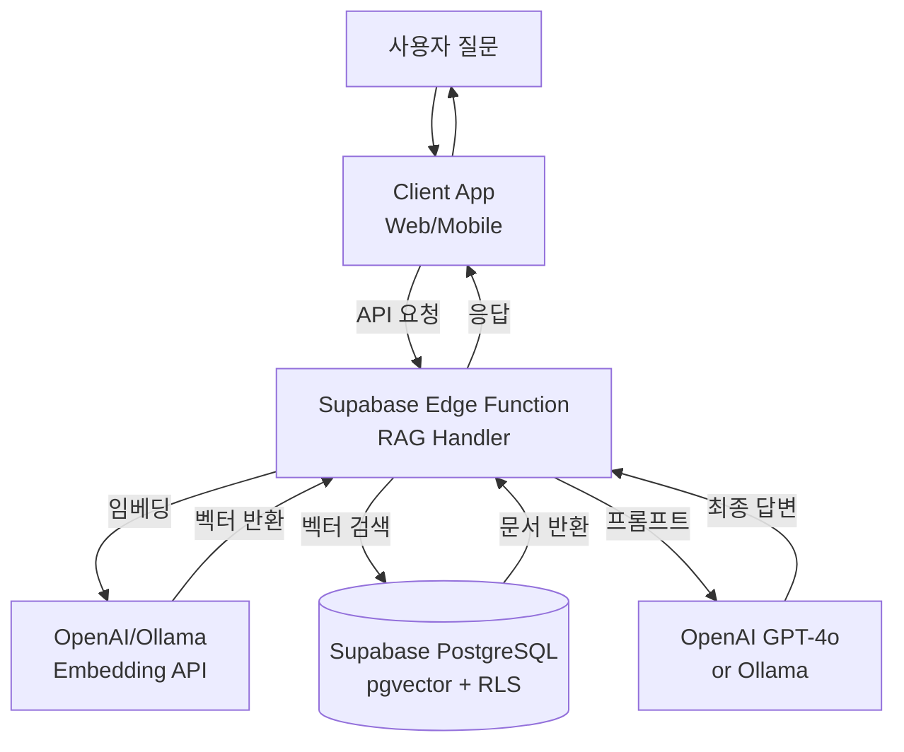

# Supabase와 pgvector를 활용한 RAG 시스템 구축 가이드

> 한국어 개발자를 위한 Supabase 기반 RAG(Retrieval-Augmented Generation) 시스템 완벽 구축 가이드

## 📋 목차

- [프로젝트 소개](#-프로젝트-소개)
- [왜 Supabase인가?](#-왜-supabase인가)
- [시스템 아키텍처](#-시스템-아키텍처)
- [환경 구축](#-환경-구축)
- [빠른 시작](#-빠른-시작)
- [상세 가이드](#-상세-가이드)
- [성능 최적화](#-성능-최적화)
- [트러블슈팅](#-트러블슈팅)
- [FAQ](#-faq)
- [참고 자료](#-참고-자료)

---

## 🎯 프로젝트 소개

이 프로젝트는 **Supabase + pgvector + OpenAI/Ollama**를 사용하여 서버리스 RAG(Retrieval-Augmented Generation) 시스템을 구축하는 실전 가이드입니다.

### 주요 특징

- ✅ **서버리스 아키텍처**: Supabase의 완전 관리형 PostgreSQL 사용
- ✅ **실시간 동기화**: Supabase Realtime으로 실시간 데이터 업데이트
- ✅ **Row Level Security**: 문서별 접근 권한 관리
- ✅ **Edge Functions**: 서버리스 함수로 임베딩 및 검색 처리
- ✅ **확장 가능**: 자동 스케일링 및 백업 지원
- ✅ **개발자 친화적**: 직관적인 Dashboard UI와 풍부한 SDK

### 학습 목표

이 가이드를 완료하면 다음을 할 수 있습니다:

1. Supabase 프로젝트 생성 및 pgvector 설정
2. Python/JavaScript를 사용한 문서 임베딩 및 저장
3. 의미 기반 벡터 검색 구현
4. Row Level Security를 활용한 권한 기반 RAG 구현
5. Edge Functions를 활용한 서버리스 RAG 파이프라인 구축
6. 하이브리드 검색 (벡터 + 전문검색) 구현

### 실제 활용 사례

Supabase 기반 RAG는 다음과 같은 시나리오에서 효과적입니다:

- **📚 기업 지식 베이스**: 팀별 문서 접근 권한을 가진 사내 검색 시스템
- **🏢 SaaS 애플리케이션**: 멀티 테넌트 RAG 시스템 (고객별 데이터 격리)
- **🔒 보안 문서 검색**: RLS 기반 사용자별 문서 접근 제어
- **📱 모바일/웹 앱**: Realtime 기능으로 실시간 검색 결과 업데이트
- **🚀 스타트업 MVP**: 빠른 프로토타이핑과 무료 티어 활용

---

## 📋 주요 사양 (Specs)

### Supabase Vector 기능

| 기능 | 설명 | 비고 |
|------|------|------|
| **pgvector 지원** | PostgreSQL 벡터 확장 | v0.5.1+ |
| **벡터 차원** | 최대 16,000 차원 지원 | OpenAI: 1536, Cohere: 1024 |
| **인덱스 타입** | IVFFlat, HNSW | HNSW 권장 (높은 정확도) |
| **거리 함수** | L2, Inner Product, Cosine | Cosine 가장 일반적 |
| **Row Level Security** | 문서별 접근 권한 | 멀티 테넌트 지원 |
| **Realtime** | 실시간 데이터 동기화 | WebSocket 기반 |

### 지원하는 임베딩 모델

| 모델 | 제공사 | 차원 | 특징 |
|------|--------|------|------|
| **text-embedding-3-small** | OpenAI | 1536 | 빠르고 저렴 |
| **text-embedding-3-large** | OpenAI | 3072 | 높은 정확도 |
| **embed-multilingual-v3.0** | Cohere | 1024 | 다국어 지원, 한국어 우수 |
| **nomic-embed-text** | Ollama | 768 | 로컬 실행, 무료 |
| **bge-m3** | Hugging Face | 1024 | 오픈소스, 한국어 지원 |

### 검색 방식 비교

| 검색 방식 | 설명 | 알고리즘 | 사용 시나리오 |
|----------|------|----------|--------------|
| **Semantic Search** | 벡터 기반 의미 검색 | cosine similarity | 자연어 질문, 의도 파악 |
| **Keyword Search** | 키워드 기반 검색 | Full-Text Search | 정확한 용어 검색 |
| **Hybrid Search** | Semantic + Keyword 결합 | RRF (Reciprocal Rank Fusion) | 최고의 검색 정확도 |

### 예상 비용 (2024년 12월 기준)

#### 무료 티어 (Free Tier)
```
✅ Supabase Free Plan
- Database: 500MB 스토리지
- Bandwidth: 5GB/월
- Row Level Security: 무제한
- Edge Functions: 500,000 호출/월
- 용도: 개발/테스트, 소규모 프로젝트

📊 총 예상 비용: $0/월
```

#### Pro 티어 (프로덕션)
```
✅ Supabase Pro Plan
- 기본 요금: $25/월
- Database: 8GB 스토리지 (추가 $0.125/GB)
- Bandwidth: 50GB/월 (추가 $0.09/GB)
- Edge Functions: 2M 호출/월 (추가 $2/1M)
- 자동 백업, 일일 스냅샷

✅ OpenAI API (임베딩 + LLM)
- text-embedding-3-small: $0.00002/1K 토큰
- GPT-4o-mini: $0.15/1M 입력, $0.6/1M 출력
- 월 10,000 쿼리 예상: ~$50/월

📊 총 예상 비용: $75-100/월
```

#### 엔터프라이즈
```
✅ Supabase Team/Enterprise
- 전용 인스턴스
- 고급 보안 (SSO, SAML)
- 우선 지원
- 커스텀 가격

✅ 대규모 트래픽
- 월 100,000+ 쿼리
- 고가용성 (Multi-region)
- 예상: $500-2,000/월

📊 총 예상 비용: Custom Pricing
```

**비용 최적화 팁:**
- **Free Tier 활용**: 개발 환경은 무료 티어로 충분
- **임베딩 캐싱**: 동일 문서 재임베딩 방지
- **배치 처리**: 여러 문서를 한 번에 임베딩
- **Ollama 사용**: 로컬 임베딩으로 API 비용 절감
- **Edge Functions**: 서버 인프라 비용 제로

---

## 🤔 왜 Supabase인가?

### 기존 RAG vs Supabase

| 기능 | Self-hosted PostgreSQL | Supabase |
|------|------------------------|----------|
| **인프라 관리** | 직접 설치, 운영, 패치 | **완전 관리형 (Serverless)** |
| **확장성** | 수동 스케일링 | **자동 스케일링** |
| **백업** | 직접 설정 | **자동 백업 (일일 스냅샷)** |
| **보안** | 직접 구성 | **RLS, SSL, 암호화 기본 제공** |
| **모니터링** | 별도 도구 필요 | **대시보드 통합** |
| **Realtime** | 별도 구현 필요 | **WebSocket 기본 제공** |
| **Edge Functions** | 없음 | **서버리스 함수 지원** |
| **비용** | 인프라 + 운영 인력 | **무료 티어 + 사용량 기반** |

### RAG에 최적인 이유

1. **완전 관리형**: 인프라 관리 없이 개발에만 집중
2. **Row Level Security**: 사용자별/팀별 문서 접근 권한 관리
3. **Realtime**: 문서 추가/수정 시 실시간 검색 결과 업데이트
4. **Edge Functions**: 임베딩 및 검색 로직을 서버리스로 구현
5. **개발자 경험**: 직관적인 UI, 풍부한 SDK, 활발한 커뮤니티
6. **비용 효율적**: 무료 티어로 시작, 사용한 만큼만 지불
7. **PostgreSQL 기반**: 표준 SQL과 풍부한 생태계 활용 가능

---

## 🏗 시스템 아키텍처

### RAG 워크플로우



### 워크플로우 상세 설명

#### 1단계: 문서 인덱싱 (일회성)
```python
# 1. 문서 업로드
supabase.storage.from_('documents').upload('handbook.pdf', file)

# 2. Edge Function 트리거 (자동 인덱싱)
# - 문서 파싱 및 청킹
# - 임베딩 생성
# - PostgreSQL에 벡터 저장 (RLS 적용)
```

#### 2단계: RAG 질의 (실시간)
```python
# 1. 사용자 질문
query = "연차 휴가는 몇 일까지?"

# 2. Edge Function 호출
response = supabase.functions.invoke('rag-query', {
    'query': query,
    'user_id': user_id  # RLS로 접근 가능한 문서만 검색
})

# 3. 내부 프로세스:
# - 질문 임베딩 생성
# - pgvector로 유사 문서 검색 (cosine similarity)
# - RLS로 사용자 권한 확인
# - LLM에 컨텍스트 전달 및 답변 생성
```

#### 핵심 장점
- **서버리스**: 서버 관리 불필요, 자동 스케일링
- **보안**: RLS로 사용자별 데이터 격리
- **실시간**: Realtime으로 검색 결과 즉시 업데이트
- **비용**: 사용한 만큼만 지불

---

## 🚀 환경 구축

### 시스템 요구사항

- **Supabase 계정**: [https://supabase.com](https://supabase.com) 무료 가입
- **Python**: 3.8 이상 또는 **Node.js**: 16 이상
- **OpenAI API Key** (선택): 임베딩/LLM 사용 시
- **Git**: 코드 관리

### 1. Supabase 프로젝트 생성 (웹 대시보드)

#### 단계 1: 회원가입 및 로그인

1. [Supabase](https://supabase.com) 접속
2. 우측 상단 **"Start your project"** 클릭
3. GitHub, Google, 또는 이메일로 회원가입/로그인

#### 단계 2: 조직(Organization) 생성

처음 로그인하면 조직 생성을 요구합니다:

1. **Organization name**: 개인 또는 회사 이름 입력 (예: `my-company`)
2. **Plan**: `Free` 선택 (무료 티어로 시작)
3. **Create Organization** 클릭

#### 단계 3: 새 프로젝트 생성

1. 대시보드에서 **"New Project"** 버튼 클릭
2. 프로젝트 정보 입력:

   **기본 정보:**
   - **Name**: `my-rag-project` (프로젝트 이름)
   - **Database Password**: 강력한 비밀번호 생성
     - 최소 12자, 대소문자/숫자/특수문자 포함 권장
     - 예: `RAGp@ssw0rd2024!`
     - ⚠️ **반드시 안전한 곳에 저장하세요!**

   **리전 선택:**
   - **Region**: `Northeast Asia (Seoul)` - ap-northeast-2
   - 한국 사용자의 경우 서울 리전 선택 시 지연시간 최소화

   **요금제:**
   - **Pricing Plan**: `Free` (무료 티어)
   - 500MB DB, 5GB 대역폭, 50,000 monthly active users

3. **"Create new project"** 클릭
4. ⏳ 프로젝트 생성 대기 (약 2-3분 소요)
5. ✅ "Project is ready" 메시지가 표시되면 완료

#### 단계 4: API 키 확인 및 복사

프로젝트가 생성되면 API 키를 확인합니다:

1. 좌측 사이드바에서 **⚙️ Settings** 클릭
2. **API** 섹션 선택
3. 다음 정보를 복사하여 안전한 곳에 저장:

   ```
   Project URL: https://xxxxxxxxxxxxx.supabase.co
   anon public: eyJhbGciOiJIUzI1NiIsInR5cCI6IkpXVCJ9...
   service_role secret: eyJhbGciOiJIUzI1NiIsInR5cCI6IkpXVCJ9...
   ```

   - **Project URL**: Supabase 프로젝트 엔드포인트
   - **anon public**: 클라이언트(브라우저)에서 사용 가능한 공개 키
   - **service_role secret**: 서버에서만 사용, RLS를 우회할 수 있는 관리자 키
     - ⚠️ **절대 클라이언트 코드에 포함하지 마세요!**

#### 단계 5: 대시보드 둘러보기

Supabase 대시보드의 주요 기능:

- **🏠 Home**: 프로젝트 개요, 최근 활동
- **📊 Table Editor**: 데이터베이스 테이블 GUI 관리
- **🔍 SQL Editor**: SQL 쿼리 실행 (RAG 설정에 사용)
- **🔐 Authentication**: 사용자 인증 관리
- **💾 Storage**: 파일 스토리지 (문서 업로드 가능)
- **⚡ Edge Functions**: 서버리스 함수 배포
- **📈 Logs**: 실시간 로그 및 모니터링
- **⚙️ Settings**: 프로젝트 설정, API 키, 데이터베이스 연결 정보

### 2. pgvector 확장 활성화 (웹 대시보드에서)

pgvector는 PostgreSQL의 벡터 검색 확장입니다. Supabase에서 기본 제공하므로 활성화만 하면 됩니다.

#### 방법 1: SQL Editor 사용 (권장)

1. 좌측 사이드바에서 **🔍 SQL Editor** 클릭
2. **"New query"** 버튼 클릭
3. 다음 SQL을 입력:

```sql
-- pgvector 확장 활성화
create extension if not exists vector;

-- 설치 확인
select * from pg_extension where extname = 'vector';
```

4. **"Run"** 버튼 클릭 (또는 `Ctrl+Enter`)
5. 결과에 `vector | 0.5.1 | public` 등이 표시되면 성공

#### 방법 2: Database Extensions 메뉴 사용

1. 좌측 사이드바에서 **⚙️ Settings** → **Database** 클릭
2. **Extensions** 탭 선택
3. 검색창에 `vector` 입력
4. **pgvector** 찾아서 토글 버튼으로 활성화
5. 확인 메시지 표시되면 완료

**예상 결과:**
```
extname | extversion | extnamespace
--------|------------|-------------
vector  | 0.5.1      | public
```

### 3. Python 패키지 설치

```bash
# 가상 환경 생성 (권장)
python -m venv venv
source venv/bin/activate  # macOS/Linux
# venv\Scripts\activate   # Windows

# 필수 패키지 설치
pip install supabase openai python-dotenv
pip install pypdf langchain-text-splitters  # 문서 처리용

# 선택 패키지 (로컬 LLM)
pip install ollama  # Ollama 사용 시
```

### 4. 환경 변수 설정

`.env` 파일 생성:

```env
# Supabase 설정
SUPABASE_URL=https://your-project.supabase.co
SUPABASE_KEY=your-anon-key
SUPABASE_SERVICE_KEY=your-service-role-key

# OpenAI 설정 (선택)
OPENAI_API_KEY=sk-your-api-key

# Ollama 설정 (선택)
OLLAMA_BASE_URL=http://localhost:11434
```

**Supabase 키 찾기:**
1. Dashboard → Settings → API
2. `URL`: Project URL
3. `anon public`: 클라이언트용 (공개 가능)
4. `service_role secret`: 서버용 (비밀 유지)

### 5. 데이터베이스 스키마 생성 (웹 대시보드에서)

이제 RAG 시스템을 위한 테이블, 인덱스, 보안 정책을 생성합니다.

#### 방법 1: SQL Editor에서 한 번에 실행 (권장)

1. 좌측 사이드바에서 **🔍 SQL Editor** 클릭
2. **"New query"** 버튼 클릭
3. 다음 전체 SQL을 복사하여 붙여넣기:

```sql
-- 1. documents 테이블 생성 (벡터 저장)
create table documents (
  id uuid primary key default uuid_generate_v4(),
  user_id uuid references auth.users(id) on delete cascade,
  content text not null,
  metadata jsonb,
  embedding vector(1536),  -- OpenAI embedding 차원
  created_at timestamp with time zone default now()
);

-- 2. 벡터 검색 인덱스 생성 (HNSW - 빠르고 정확)
create index documents_embedding_idx
on documents using hnsw (embedding vector_cosine_ops);

-- 3. 전문 검색 인덱스 (하이브리드 검색용)
create index documents_content_idx
on documents using gin(to_tsvector('english', content));

-- 4. Row Level Security 활성화
alter table documents enable row level security;

-- 5. RLS 정책: 사용자는 자신의 문서만 조회
create policy "Users can view own documents"
  on documents for select
  using (auth.uid() = user_id);

-- 6. RLS 정책: 사용자는 자신의 문서만 삽입
create policy "Users can insert own documents"
  on documents for insert
  with check (auth.uid() = user_id);

-- 7. RLS 정책: 사용자는 자신의 문서만 삭제
create policy "Users can delete own documents"
  on documents for delete
  using (auth.uid() = user_id);

-- 8. 벡터 검색 함수 생성
create or replace function match_documents (
  query_embedding vector(1536),
  match_threshold float default 0.7,
  match_count int default 5,
  user_id_filter uuid default null
)
returns table (
  id uuid,
  content text,
  metadata jsonb,
  similarity float
)
language sql stable
as $$
  select
    documents.id,
    documents.content,
    documents.metadata,
    1 - (documents.embedding <=> query_embedding) as similarity
  from documents
  where
    (user_id_filter is null or documents.user_id = user_id_filter)
    and 1 - (documents.embedding <=> query_embedding) > match_threshold
  order by documents.embedding <=> query_embedding
  limit match_count;
$$;
```

4. **"Run"** 버튼 클릭
5. ✅ "Success. No rows returned" 메시지가 표시되면 성공

#### 방법 2: Table Editor에서 GUI로 생성

GUI를 선호하는 경우:

1. 좌측 사이드바에서 **📊 Table Editor** 클릭
2. **"Create a new table"** 버튼 클릭
3. 테이블 설정:
   - **Name**: `documents`
   - **Enable Row Level Security (RLS)**: 체크
4. 컬럼 추가:

| 컬럼명 | Type | Default Value | Primary | Nullable |
|--------|------|---------------|---------|----------|
| id | uuid | `uuid_generate_v4()` | ✅ | ❌ |
| user_id | uuid | - | ❌ | ❌ |
| content | text | - | ❌ | ❌ |
| metadata | jsonb | `{}` | ❌ | ✅ |
| embedding | vector(1536) | - | ❌ | ✅ |
| created_at | timestamptz | `now()` | ❌ | ❌ |

5. **"Save"** 클릭
6. ⚠️ **주의**: 인덱스와 RLS 정책은 SQL Editor에서 추가로 실행해야 합니다.

#### 스키마 확인

테이블이 잘 생성되었는지 확인:

1. **📊 Table Editor** → **documents** 테이블 클릭
2. 우측 상단 **"⋮"** 메뉴 → **"View table definition"** 클릭
3. 컬럼 구조와 인덱스 확인

또는 SQL Editor에서:

```sql
-- 테이블 구조 확인
\d documents

-- 인덱스 확인
select indexname, indexdef
from pg_indexes
where tablename = 'documents';

-- RLS 정책 확인
select * from pg_policies
where tablename = 'documents';
```

### 6. 설치 확인

```python
# test_setup.py
import os
from supabase import create_client
from dotenv import load_dotenv

load_dotenv()

def test_connection():
    print("Supabase 연결 테스트\n" + "="*50)

    # Supabase 클라이언트 생성
    supabase_url = os.getenv('SUPABASE_URL')
    supabase_key = os.getenv('SUPABASE_KEY')

    if not supabase_url or not supabase_key:
        print("❌ 환경 변수가 설정되지 않았습니다.")
        print("💡 .env 파일을 확인하세요.")
        return False

    try:
        supabase = create_client(supabase_url, supabase_key)

        # pgvector 확장 확인
        result = supabase.rpc('exec_sql', {
            'sql': "SELECT extname FROM pg_extension WHERE extname = 'vector'"
        }).execute()

        if result.data:
            print("✅ Supabase 연결 성공")
            print(f"✅ pgvector 확장 활성화됨")
            print(f"✅ Project URL: {supabase_url}")
            return True
        else:
            print("⚠️  pgvector 확장이 활성화되지 않았습니다")
            print("💡 SQL Editor에서 'create extension vector;' 실행")
            return False

    except Exception as e:
        print(f"❌ 연결 실패: {e}")
        return False

if __name__ == "__main__":
    test_connection()
```

**실행:**
```bash
python test_setup.py
```

**예상 출력:**
```
Supabase 연결 테스트
==================================================
✅ Supabase 연결 성공
✅ pgvector 확장 활성화됨
✅ Project URL: https://xxxxx.supabase.co
```

---

## ⚡ 빠른 시작

### 1. 간단한 RAG 스크립트 (simple_rag.py)

```python
import os
from supabase import create_client
from openai import OpenAI
from dotenv import load_dotenv

load_dotenv()

# 클라이언트 초기화
supabase = create_client(
    os.getenv('SUPABASE_URL'),
    os.getenv('SUPABASE_SERVICE_KEY')  # RLS 우회
)
openai_client = OpenAI(api_key=os.getenv('OPENAI_API_KEY'))

def create_embedding(text: str) -> list[float]:
    """텍스트를 벡터로 변환"""
    response = openai_client.embeddings.create(
        model="text-embedding-3-small",
        input=text
    )
    return response.data[0].embedding

def store_document(content: str, user_id: str, metadata: dict = None):
    """문서를 벡터 DB에 저장"""
    print(f"📄 문서 임베딩 중...")
    embedding = create_embedding(content)

    print(f"💾 Supabase에 저장 중...")
    result = supabase.table('documents').insert({
        'user_id': user_id,
        'content': content,
        'metadata': metadata or {},
        'embedding': embedding
    }).execute()

    print(f"✅ 문서 저장 완료: {result.data[0]['id']}")
    return result.data[0]

def search_similar(query: str, user_id: str, limit: int = 5):
    """유사한 문서 검색"""
    print(f"\n🔍 질문 임베딩 중: {query}")
    query_embedding = create_embedding(query)

    # pgvector로 코사인 유사도 검색
    result = supabase.rpc('match_documents', {
        'query_embedding': query_embedding,
        'match_threshold': 0.7,
        'match_count': limit,
        'user_id_filter': user_id
    }).execute()

    print(f"✅ {len(result.data)}개 문서 발견")
    return result.data

def generate_answer(query: str, context_docs: list):
    """LLM으로 답변 생성"""
    # 컨텍스트 구성
    context = "\n\n".join([
        f"[문서 {i+1}]\n{doc['content']}"
        for i, doc in enumerate(context_docs)
    ])

    # 프롬프트 생성
    prompt = f"""다음 문서들을 참고하여 질문에 답변하세요.
답변은 반드시 제공된 문서의 내용에 기반해야 합니다.

<문서>
{context}
</문서>

<질문>
{query}
</질문>

답변:"""

    print(f"\n🤖 AI 답변 생성 중...")
    response = openai_client.chat.completions.create(
        model="gpt-4o-mini",
        messages=[
            {"role": "system", "content": "당신은 문서 기반 질의응답 전문 AI입니다."},
            {"role": "user", "content": prompt}
        ],
        temperature=0.3,
        max_tokens=500
    )

    return response.choices[0].message.content

def main():
    # 테스트 사용자 ID (실제로는 auth.users에서 가져옴)
    test_user_id = "00000000-0000-0000-0000-000000000000"

    # 1. 문서 저장
    print("=" * 60)
    print("1️⃣ 문서 저장 단계")
    print("=" * 60)

    store_document(
        content="회사의 연차 휴가는 입사 후 1년마다 15일이 제공됩니다. 미사용 연차는 다음 해로 이월되지 않습니다.",
        user_id=test_user_id,
        metadata={"source": "회사 규정", "category": "휴가"}
    )

    # 2. 검색 및 답변 생성
    print("\n" + "=" * 60)
    print("2️⃣ RAG 질의 단계")
    print("=" * 60)

    query = "연차는 몇 일이고 이월 가능한가요?"
    similar_docs = search_similar(query, test_user_id)

    if similar_docs:
        answer = generate_answer(query, similar_docs)

        print("\n" + "=" * 60)
        print("📝 최종 답변")
        print("=" * 60)
        print(f"\n질문: {query}")
        print(f"\n답변:\n{answer}")

        print("\n📚 참고 문서:")
        for i, doc in enumerate(similar_docs, 1):
            print(f"  {i}. 유사도: {doc.get('similarity', 0):.3f}")
            print(f"     내용: {doc['content'][:100]}...")
    else:
        print("⚠️  관련 문서를 찾을 수 없습니다.")

if __name__ == "__main__":
    # 먼저 match_documents 함수 생성 필요 (아래 SQL 참조)
    main()
```

### 2. 벡터 검색 함수 생성 (SQL)

Supabase SQL Editor에서 실행:

```sql
-- 코사인 유사도 기반 문서 검색 함수
create or replace function match_documents (
  query_embedding vector(1536),
  match_threshold float default 0.7,
  match_count int default 5,
  user_id_filter uuid default null
)
returns table (
  id uuid,
  content text,
  metadata jsonb,
  similarity float
)
language sql stable
as $$
  select
    documents.id,
    documents.content,
    documents.metadata,
    1 - (documents.embedding <=> query_embedding) as similarity
  from documents
  where
    (user_id_filter is null or documents.user_id = user_id_filter)
    and 1 - (documents.embedding <=> query_embedding) > match_threshold
  order by documents.embedding <=> query_embedding
  limit match_count;
$$;
```

### 3. 스크립트 실행

```bash
python simple_rag.py
```

### 4. 예상 출력

```
============================================================
1️⃣ 문서 저장 단계
============================================================
📄 문서 임베딩 중...
💾 Supabase에 저장 중...
✅ 문서 저장 완료: a1b2c3d4-e5f6-7890-abcd-ef1234567890

============================================================
2️⃣ RAG 질의 단계
============================================================

🔍 질문 임베딩 중: 연차는 몇 일이고 이월 가능한가요?
✅ 1개 문서 발견

🤖 AI 답변 생성 중...

============================================================
📝 최종 답변
============================================================

질문: 연차는 몇 일이고 이월 가능한가요?

답변:
회사의 연차 휴가는 입사 후 1년마다 15일이 제공됩니다.
다만, 미사용 연차는 다음 해로 이월되지 않으므로 당해 연도 내에 사용하셔야 합니다.

📚 참고 문서:
  1. 유사도: 0.892
     내용: 회사의 연차 휴가는 입사 후 1년마다 15일이 제공됩니다. 미사용 연차는 다음 해로 이월되지 않습니다....
```

### 5. 웹 대시보드에서 데이터 확인

스크립트 실행 후 Supabase 대시보드에서 저장된 데이터를 확인할 수 있습니다.

#### 방법 1: Table Editor에서 확인

1. [Supabase Dashboard](https://app.supabase.com) 접속
2. 프로젝트 선택
3. 좌측 사이드바에서 **📊 Table Editor** 클릭
4. **documents** 테이블 선택
5. 저장된 데이터 확인:

   | id | user_id | content | metadata | embedding | created_at |
   |-----|---------|---------|----------|-----------|------------|
   | a1b2... | 0000... | 회사의 연차... | {"source": "회사 규정"...} | [0.123, -0.456...] | 2024-12-10... |

6. 특정 행을 클릭하면 상세 내용 확인 가능
7. **embedding** 컬럼에는 1536차원 벡터가 배열로 저장됨

#### 방법 2: SQL Editor에서 쿼리

더 상세한 정보를 확인하려면:

1. 좌측 사이드바에서 **🔍 SQL Editor** 클릭
2. 새 쿼리 작성:

```sql
-- 전체 문서 조회
select
  id,
  content,
  metadata,
  created_at,
  pg_column_size(embedding) as embedding_size_bytes
from documents
order by created_at desc;

-- 문서 통계
select
  count(*) as total_documents,
  count(distinct user_id) as unique_users,
  avg(length(content)) as avg_content_length
from documents;

-- 메타데이터 분석
select
  metadata->>'category' as category,
  count(*) as count
from documents
group by category
order by count desc;
```

3. **"Run"** 버튼 클릭하여 결과 확인

#### 방법 3: Logs에서 실시간 모니터링

1. 좌측 사이드바에서 **📈 Logs** → **Database** 클릭
2. 최근 쿼리 활동 확인:
   - `INSERT INTO documents` - 문서 저장
   - `SELECT ... match_documents` - 벡터 검색
   - 쿼리 실행 시간 및 성능 지표 확인

#### 방법 4: API Logs로 디버깅

1. 좌측 사이드바에서 **📈 Logs** → **API** 클릭
2. Python 스크립트의 API 호출 이력 확인
3. 오류 발생 시 상세 에러 메시지 확인

#### 데이터 수동 추가 (테스트용)

Table Editor에서 직접 데이터를 추가할 수도 있습니다:

1. **📊 Table Editor** → **documents** 테이블 클릭
2. 우측 상단 **"Insert row"** 버튼 클릭
3. 값 입력:
   - **content**: "재택근무는 주 2회까지 가능합니다."
   - **metadata**: `{"source": "회사 규정", "category": "근무"}`
   - **user_id**: `00000000-0000-0000-0000-000000000000`
   - **embedding**: 비워둠 (나중에 스크립트로 업데이트)
4. **"Save"** 클릭

⚠️ **주의**: embedding을 수동으로 입력하기는 어렵습니다. Python 스크립트를 사용하는 것이 권장됩니다.

#### 데이터 삭제

불필요한 테스트 데이터 삭제:

1. **📊 Table Editor** → **documents** 테이블
2. 삭제할 행 선택
3. 우측 **"Delete"** 버튼 클릭

또는 SQL Editor에서:

```sql
-- 특정 사용자의 모든 문서 삭제
delete from documents
where user_id = '00000000-0000-0000-0000-000000000000';

-- 테이블 전체 초기화 (주의!)
truncate table documents;
```

---

## 🎓 초보자를 위한 완전 처음부터 끝까지 가이드

이 섹션은 Supabase와 RAG를 처음 접하는 분들을 위한 단계별 실전 가이드입니다.

### Step 1: 계정 생성부터 첫 문서 저장까지 (10분)

#### 1️⃣ Supabase 계정 생성

1. 브라우저에서 [supabase.com](https://supabase.com) 접속
2. 우측 상단 **"Start your project"** 클릭
3. GitHub 계정으로 로그인 (가장 간편)
   - GitHub 없으면 Google 또는 이메일로 가입
4. Organization 이름 입력: `my-company` (아무거나 가능)
5. **Free Plan** 선택 → **Create Organization**

#### 2️⃣ RAG 프로젝트 생성

1. 대시보드에서 **"New Project"** 클릭
2. 정보 입력:
   - **Name**: `rag-test`
   - **Database Password**: `MyRAG@2024!` (복사해두세요!)
   - **Region**: `Northeast Asia (Seoul)`
3. **"Create new project"** 클릭
4. ☕ 2분 대기 (프로젝트 생성 중...)

#### 3️⃣ API 키 복사

1. 좌측 사이드바 **⚙️ Settings** → **API** 클릭
2. 메모장 열어서 다음 3가지 복사:

```
URL: https://abcdefghijk.supabase.co
anon key: eyJhbGciOiJI...
service_role key: eyJhbGciOiJI...
```

#### 4️⃣ pgvector 활성화

1. 좌측 사이드바 **🔍 SQL Editor** 클릭
2. **"New query"** 클릭
3. 다음 복사 & 붙여넣기:

```sql
create extension if not exists vector;
```

4. **"Run"** 버튼 클릭
5. ✅ "Success" 메시지 확인

#### 5️⃣ 테이블 생성

같은 SQL Editor에서 **"New query"** 다시 클릭 후:

```sql
create table documents (
  id uuid primary key default uuid_generate_v4(),
  user_id uuid default '00000000-0000-0000-0000-000000000000'::uuid,
  content text not null,
  metadata jsonb,
  embedding vector(1536),
  created_at timestamptz default now()
);

create index on documents using hnsw (embedding vector_cosine_ops);

create or replace function match_documents (
  query_embedding vector(1536),
  match_count int default 5
)
returns table (
  id uuid,
  content text,
  similarity float
)
language sql stable
as $$
  select
    id,
    content,
    1 - (embedding <=> query_embedding) as similarity
  from documents
  order by embedding <=> query_embedding
  limit match_count;
$$;
```

**"Run"** 클릭 → ✅ 성공 확인

#### 6️⃣ Python 환경 설정

컴퓨터에서 터미널(또는 CMD) 열기:

```bash
# 1. 프로젝트 폴더 생성
mkdir my-rag-project
cd my-rag-project

# 2. 가상환경 생성 및 활성화
python -m venv venv

# Windows:
venv\Scripts\activate

# Mac/Linux:
source venv/bin/activate

# 3. 패키지 설치
pip install supabase openai python-dotenv
```

#### 7️⃣ 환경 변수 파일 생성

같은 폴더에 `.env` 파일 생성 (메모장으로):

```env
SUPABASE_URL=https://abcdefghijk.supabase.co
SUPABASE_KEY=eyJhbGciOiJI...  (service_role key 붙여넣기)
OPENAI_API_KEY=sk-...  (OpenAI API 키)
```

**OpenAI API 키 발급 방법:**
1. [platform.openai.com](https://platform.openai.com) 접속
2. 우측 상단 계정 → **"View API keys"**
3. **"Create new secret key"** → 복사하여 .env에 붙여넣기

#### 8️⃣ 첫 RAG 스크립트 작성

`test_rag.py` 파일 생성:

```python
import os
from supabase import create_client
from openai import OpenAI
from dotenv import load_dotenv

load_dotenv()

# 클라이언트 초기화
supabase = create_client(
    os.getenv('SUPABASE_URL'),
    os.getenv('SUPABASE_KEY')
)
openai_client = OpenAI()

# 1. 문서 저장
print("1️⃣ 문서 저장 중...")
text = "회사의 연차 휴가는 15일입니다."

# 임베딩 생성
embedding_response = openai_client.embeddings.create(
    model="text-embedding-3-small",
    input=text
)
embedding = embedding_response.data[0].embedding

# Supabase에 저장
result = supabase.table('documents').insert({
    'content': text,
    'embedding': embedding,
    'metadata': {'source': 'test'}
}).execute()

print(f"✅ 저장 완료: {result.data[0]['id']}")

# 2. 검색
print("\n2️⃣ 검색 중...")
query = "연차는 몇 일?"

# 쿼리 임베딩
query_embedding = openai_client.embeddings.create(
    model="text-embedding-3-small",
    input=query
).data[0].embedding

# 벡터 검색
docs = supabase.rpc('match_documents', {
    'query_embedding': query_embedding,
    'match_count': 3
}).execute()

print(f"\n✅ 검색 결과:")
for doc in docs.data:
    print(f"  - {doc['content']} (유사도: {doc['similarity']:.3f})")
```

#### 9️⃣ 실행!

```bash
python test_rag.py
```

**예상 출력:**
```
1️⃣ 문서 저장 중...
✅ 저장 완료: abc123...

2️⃣ 검색 중...
✅ 검색 결과:
  - 회사의 연차 휴가는 15일입니다. (유사도: 0.985)
```

#### 🔟 대시보드에서 확인

1. Supabase 대시보드로 돌아가기
2. **📊 Table Editor** → **documents** 클릭
3. 방금 저장한 데이터 확인!

🎉 **축하합니다!** 첫 RAG 시스템이 작동했습니다!

### Step 2: 실전 RAG 챗봇 만들기 (20분)

이제 진짜 챗봇처럼 만들어봅시다.

#### 1️⃣ 여러 문서 저장

`upload_docs.py` 생성:

```python
import os
from supabase import create_client
from openai import OpenAI
from dotenv import load_dotenv

load_dotenv()

supabase = create_client(os.getenv('SUPABASE_URL'), os.getenv('SUPABASE_KEY'))
openai_client = OpenAI()

# 회사 규정 문서들
documents = [
    "회사의 연차 휴가는 입사 1년마다 15일이 제공됩니다.",
    "재택근무는 주 2회까지 가능하며, 사전 승인이 필요합니다.",
    "점심시간은 12시부터 1시까지이며, 자율적으로 조정 가능합니다.",
    "야근 수당은 시간당 기본급의 1.5배로 지급됩니다.",
    "육아휴직은 최대 1년까지 사용 가능합니다."
]

print("📚 문서 업로드 중...\n")

for i, doc in enumerate(documents, 1):
    # 임베딩 생성
    embedding = openai_client.embeddings.create(
        model="text-embedding-3-small",
        input=doc
    ).data[0].embedding

    # 저장
    supabase.table('documents').insert({
        'content': doc,
        'embedding': embedding,
        'metadata': {'source': 'company_rules', 'doc_number': i}
    }).execute()

    print(f"✅ [{i}/{len(documents)}] {doc[:30]}...")

print(f"\n🎉 총 {len(documents)}개 문서 업로드 완료!")
```

실행:
```bash
python upload_docs.py
```

#### 2️⃣ RAG 챗봇 만들기

`chatbot.py` 생성:

```python
import os
from supabase import create_client
from openai import OpenAI
from dotenv import load_dotenv

load_dotenv()

supabase = create_client(os.getenv('SUPABASE_URL'), os.getenv('SUPABASE_KEY'))
openai_client = OpenAI()

def ask(question):
    """RAG 기반 질의응답"""
    print(f"\n❓ 질문: {question}")

    # 1. 질문 임베딩
    query_embedding = openai_client.embeddings.create(
        model="text-embedding-3-small",
        input=question
    ).data[0].embedding

    # 2. 유사 문서 검색
    docs = supabase.rpc('match_documents', {
        'query_embedding': query_embedding,
        'match_count': 3
    }).execute()

    if not docs.data:
        return "관련 정보를 찾을 수 없습니다."

    # 3. 컨텍스트 구성
    context = "\n".join([doc['content'] for doc in docs.data])

    # 4. LLM으로 답변 생성
    response = openai_client.chat.completions.create(
        model="gpt-4o-mini",
        messages=[
            {"role": "system", "content": "당신은 회사 규정 전문가입니다. 제공된 문서를 바탕으로 정확하게 답변하세요."},
            {"role": "user", "content": f"문서:\n{context}\n\n질문: {question}"}
        ],
        temperature=0.3
    )

    answer = response.choices[0].message.content

    # 결과 출력
    print(f"💡 답변: {answer}\n")
    print("📚 참고 문서:")
    for i, doc in enumerate(docs.data, 1):
        print(f"  {i}. {doc['content']} (유사도: {doc['similarity']:.3f})")

    return answer

# 사용 예시
if __name__ == "__main__":
    print("=" * 60)
    print("🤖 회사 규정 챗봇")
    print("=" * 60)

    questions = [
        "연차는 몇 일이야?",
        "재택근무 가능해?",
        "점심시간이 언제야?",
        "육아휴직은 얼마나 쓸 수 있어?"
    ]

    for q in questions:
        ask(q)
        print("\n" + "-" * 60)
```

실행:
```bash
python chatbot.py
```

#### 3️⃣ 대시보드에서 모니터링

1. **📊 Table Editor**: 저장된 5개 문서 확인
2. **📈 Logs → API**: 방금 실행한 쿼리 이력 확인
3. **📈 Logs → Database**: SQL 쿼리 성능 확인

### Step 3: PDF 문서 업로드하기

실제 PDF 파일을 RAG에 추가해봅시다.

#### 1️⃣ 패키지 추가 설치

```bash
pip install pypdf langchain-text-splitters
```

#### 2️⃣ PDF 업로드 스크립트

`upload_pdf.py` 생성:

```python
import os
from supabase import create_client
from openai import OpenAI
from dotenv import load_dotenv
import pypdf
from langchain_text_splitters import RecursiveCharacterTextSplitter

load_dotenv()

supabase = create_client(os.getenv('SUPABASE_URL'), os.getenv('SUPABASE_KEY'))
openai_client = OpenAI()

def upload_pdf(pdf_path):
    """PDF를 청킹하여 Supabase에 업로드"""
    print(f"📄 PDF 읽는 중: {pdf_path}")

    # 1. PDF 읽기
    reader = pypdf.PdfReader(pdf_path)
    full_text = ""
    for page in reader.pages:
        full_text += page.extract_text()

    print(f"  총 {len(reader.pages)}페이지, {len(full_text)}자")

    # 2. 청킹
    splitter = RecursiveCharacterTextSplitter(
        chunk_size=1000,
        chunk_overlap=200,
        separators=["\n\n", "\n", ". ", " "]
    )
    chunks = splitter.split_text(full_text)
    print(f"  {len(chunks)}개 청크로 분할")

    # 3. 각 청크 임베딩 및 저장
    print(f"\n💾 Supabase에 업로드 중...")
    for i, chunk in enumerate(chunks):
        embedding = openai_client.embeddings.create(
            model="text-embedding-3-small",
            input=chunk
        ).data[0].embedding

        supabase.table('documents').insert({
            'content': chunk,
            'embedding': embedding,
            'metadata': {
                'source': pdf_path,
                'chunk_index': i,
                'total_chunks': len(chunks)
            }
        }).execute()

        print(f"  [{i+1}/{len(chunks)}] 완료", end='\r')

    print(f"\n\n✅ {len(chunks)}개 청크 업로드 완료!")

# 사용
if __name__ == "__main__":
    # PDF 파일 경로 (본인의 파일로 변경하세요)
    upload_pdf("company_handbook.pdf")
```

#### 3️⃣ 실행 및 확인

```bash
python upload_pdf.py
```

대시보드에서 **Table Editor** → **documents** 확인하면 PDF 청크들이 저장되어 있습니다!

이제 `chatbot.py`로 PDF 내용에 대해 질문할 수 있습니다. 🎉

---

## 📚 상세 가이드

### 1. 문서 처리 및 청킹

대용량 문서를 효과적으로 처리하는 방법:

```python
from langchain_text_splitters import RecursiveCharacterTextSplitter
import pypdf

def process_pdf(file_path: str, chunk_size: int = 1000, chunk_overlap: int = 200):
    """PDF 파일을 청크로 분할"""
    # PDF 읽기
    reader = pypdf.PdfReader(file_path)
    full_text = ""

    for page in reader.pages:
        full_text += page.extract_text() + "\n"

    # 청킹
    text_splitter = RecursiveCharacterTextSplitter(
        chunk_size=chunk_size,
        chunk_overlap=chunk_overlap,
        separators=["\n\n", "\n", ". ", "! ", "? ", ", ", " ", ""]
    )

    chunks = text_splitter.split_text(full_text)

    print(f"📄 총 페이지: {len(reader.pages)}")
    print(f"✂️  청크 수: {len(chunks)}")

    return chunks

def batch_store_documents(chunks: list[str], user_id: str, source: str):
    """여러 청크를 배치로 저장"""
    print(f"\n💾 {len(chunks)}개 청크 저장 중...")

    documents = []
    for i, chunk in enumerate(chunks):
        print(f"  임베딩 중: {i+1}/{len(chunks)}", end='\r')

        embedding = create_embedding(chunk)
        documents.append({
            'user_id': user_id,
            'content': chunk,
            'metadata': {
                'source': source,
                'chunk_index': i,
                'total_chunks': len(chunks)
            },
            'embedding': embedding
        })

    # 배치 삽입
    result = supabase.table('documents').insert(documents).execute()
    print(f"\n✅ {len(result.data)}개 문서 저장 완료")

    return result.data

# 사용 예시
chunks = process_pdf('company_handbook.pdf')
batch_store_documents(chunks, user_id, 'Company Handbook')
```

### 2. 하이브리드 검색 구현

벡터 검색 + 전문 검색을 결합한 하이브리드 검색:

```sql
-- 하이브리드 검색 함수 (Reciprocal Rank Fusion)
create or replace function hybrid_search (
  query_text text,
  query_embedding vector(1536),
  match_count int default 10,
  user_id_filter uuid default null
)
returns table (
  id uuid,
  content text,
  metadata jsonb,
  rank_score float
)
language sql stable
as $$
  with semantic_search as (
    select
      documents.id,
      documents.content,
      documents.metadata,
      row_number() over (order by documents.embedding <=> query_embedding) as rank
    from documents
    where user_id_filter is null or documents.user_id = user_id_filter
    order by documents.embedding <=> query_embedding
    limit 20
  ),
  keyword_search as (
    select
      documents.id,
      documents.content,
      documents.metadata,
      row_number() over (order by ts_rank(to_tsvector('english', documents.content), plainto_tsquery('english', query_text)) desc) as rank
    from documents
    where
      (user_id_filter is null or documents.user_id = user_id_filter)
      and to_tsvector('english', documents.content) @@ plainto_tsquery('english', query_text)
    limit 20
  )
  select
    coalesce(semantic_search.id, keyword_search.id) as id,
    coalesce(semantic_search.content, keyword_search.content) as content,
    coalesce(semantic_search.metadata, keyword_search.metadata) as metadata,
    coalesce(1.0 / (60 + semantic_search.rank), 0.0) +
    coalesce(1.0 / (60 + keyword_search.rank), 0.0) as rank_score
  from semantic_search
  full outer join keyword_search on semantic_search.id = keyword_search.id
  order by rank_score desc
  limit match_count;
$$;
```

**Python에서 사용:**

```python
def hybrid_search(query: str, user_id: str, limit: int = 10):
    """하이브리드 검색 (벡터 + 키워드)"""
    query_embedding = create_embedding(query)

    result = supabase.rpc('hybrid_search', {
        'query_text': query,
        'query_embedding': query_embedding,
        'match_count': limit,
        'user_id_filter': user_id
    }).execute()

    return result.data
```

### 3. Row Level Security 활용

멀티 테넌트 환경에서 팀별 문서 격리:

```sql
-- teams 테이블 생성
create table teams (
  id uuid primary key default uuid_generate_v4(),
  name text not null,
  created_at timestamp with time zone default now()
);

-- team_members 테이블 생성
create table team_members (
  team_id uuid references teams(id) on delete cascade,
  user_id uuid references auth.users(id) on delete cascade,
  role text check (role in ('admin', 'member')),
  primary key (team_id, user_id)
);

-- documents 테이블에 team_id 추가
alter table documents add column team_id uuid references teams(id);

-- RLS 정책: 사용자는 자신이 속한 팀의 문서만 조회
create policy "Users can view team documents"
  on documents for select
  using (
    team_id in (
      select team_id from team_members
      where user_id = auth.uid()
    )
  );

-- RLS 정책: 팀 관리자만 문서 삽입 가능
create policy "Team admins can insert documents"
  on documents for insert
  with check (
    team_id in (
      select team_id from team_members
      where user_id = auth.uid() and role = 'admin'
    )
  );
```

### 4. Edge Functions를 활용한 서버리스 RAG

Supabase Edge Functions (Deno 기반):

```typescript
// supabase/functions/rag-query/index.ts
import { serve } from "https://deno.land/std@0.177.0/http/server.ts"
import { createClient } from 'https://esm.sh/@supabase/supabase-js@2'

const corsHeaders = {
  'Access-Control-Allow-Origin': '*',
  'Access-Control-Allow-Headers': 'authorization, x-client-info, apikey, content-type',
}

serve(async (req) => {
  // CORS preflight
  if (req.method === 'OPTIONS') {
    return new Response('ok', { headers: corsHeaders })
  }

  try {
    const { query, userId } = await req.json()

    // Supabase 클라이언트 생성
    const supabase = createClient(
      Deno.env.get('SUPABASE_URL') ?? '',
      Deno.env.get('SUPABASE_SERVICE_ROLE_KEY') ?? ''
    )

    // 1. OpenAI로 쿼리 임베딩
    const embeddingResponse = await fetch('https://api.openai.com/v1/embeddings', {
      method: 'POST',
      headers: {
        'Authorization': `Bearer ${Deno.env.get('OPENAI_API_KEY')}`,
        'Content-Type': 'application/json',
      },
      body: JSON.stringify({
        model: 'text-embedding-3-small',
        input: query,
      }),
    })

    const embeddingData = await embeddingResponse.json()
    const queryEmbedding = embeddingData.data[0].embedding

    // 2. 벡터 검색
    const { data: documents } = await supabase.rpc('match_documents', {
      query_embedding: queryEmbedding,
      match_threshold: 0.7,
      match_count: 5,
      user_id_filter: userId
    })

    if (!documents || documents.length === 0) {
      return new Response(
        JSON.stringify({ error: 'No relevant documents found' }),
        { headers: { ...corsHeaders, 'Content-Type': 'application/json' }, status: 404 }
      )
    }

    // 3. 컨텍스트 구성
    const context = documents.map((doc, i) =>
      `[문서 ${i + 1}]\n${doc.content}`
    ).join('\n\n')

    // 4. OpenAI로 답변 생성
    const completionResponse = await fetch('https://api.openai.com/v1/chat/completions', {
      method: 'POST',
      headers: {
        'Authorization': `Bearer ${Deno.env.get('OPENAI_API_KEY')}`,
        'Content-Type': 'application/json',
      },
      body: JSON.stringify({
        model: 'gpt-4o-mini',
        messages: [
          { role: 'system', content: '당신은 문서 기반 질의응답 전문 AI입니다.' },
          {
            role: 'user',
            content: `다음 문서들을 참고하여 질문에 답변하세요.\n\n<문서>\n${context}\n</문서>\n\n<질문>\n${query}\n</질문>`
          }
        ],
        temperature: 0.3,
        max_tokens: 500,
      }),
    })

    const completionData = await completionResponse.json()
    const answer = completionData.choices[0].message.content

    return new Response(
      JSON.stringify({
        answer,
        sources: documents.map(d => ({
          content: d.content.substring(0, 200),
          similarity: d.similarity,
          metadata: d.metadata
        }))
      }),
      { headers: { ...corsHeaders, 'Content-Type': 'application/json' } }
    )

  } catch (error) {
    return new Response(
      JSON.stringify({ error: error.message }),
      { headers: { ...corsHeaders, 'Content-Type': 'application/json' }, status: 500 }
    )
  }
})
```

**Edge Function 배포:**

```bash
# Supabase CLI 설치
npm install -g supabase

# 로그인
supabase login

# 프로젝트 링크
supabase link --project-ref your-project-ref

# Edge Function 배포
supabase functions deploy rag-query

# 환경 변수 설정
supabase secrets set OPENAI_API_KEY=sk-your-key
```

**클라이언트에서 호출:**

```python
# Python
response = supabase.functions.invoke('rag-query', {
    'body': {
        'query': '연차는 몇 일인가요?',
        'userId': user_id
    }
})

print(response.json())
```

```javascript
// JavaScript
const { data, error } = await supabase.functions.invoke('rag-query', {
  body: {
    query: '연차는 몇 일인가요?',
    userId: userId
  }
})

console.log(data)
```

---

## 🔧 성능 최적화

### 1. 인덱스 최적화

**HNSW vs IVFFlat 비교:**

| 인덱스 | 정확도 | 속도 | 메모리 사용 | 권장 사용 |
|--------|--------|------|------------|-----------|
| **HNSW** | 높음 (95%+) | 빠름 | 높음 | < 1M 벡터, 높은 정확도 필요 |
| **IVFFlat** | 중간 (80-90%) | 매우 빠름 | 낮음 | > 1M 벡터, 속도 우선 |

**HNSW 인덱스 생성 (권장):**

```sql
-- 기존 인덱스 삭제
drop index if exists documents_embedding_idx;

-- HNSW 인덱스 생성
create index documents_embedding_idx
on documents using hnsw (embedding vector_cosine_ops)
with (m = 16, ef_construction = 64);

-- m: 그래프 연결 수 (16-64, 기본 16)
-- ef_construction: 구축 시 탐색 범위 (64-200, 기본 64)
```

**IVFFlat 인덱스 (대용량):**

```sql
-- IVFFlat 인덱스 생성 (벡터 수의 제곱근을 lists로 사용)
-- 예: 100만 벡터 → lists = 1000
create index documents_embedding_idx
on documents using ivfflat (embedding vector_cosine_ops)
with (lists = 1000);

-- 검색 시 probes 설정 (정확도 조절)
set ivfflat.probes = 10;  -- 기본값: 1, 높을수록 정확하지만 느림
```

### 2. 쿼리 최적화

**임베딩 캐싱:**

```python
from functools import lru_cache

@lru_cache(maxsize=1000)
def create_embedding_cached(text: str) -> tuple:
    """임베딩 캐싱 (같은 텍스트 재계산 방지)"""
    embedding = create_embedding(text)
    return tuple(embedding)  # list는 캐싱 불가, tuple로 변환

# 사용
embedding = list(create_embedding_cached("같은 질문"))
```

**배치 임베딩:**

```python
def create_embeddings_batch(texts: list[str]) -> list[list[float]]:
    """여러 텍스트를 한 번에 임베딩 (API 호출 최소화)"""
    response = openai_client.embeddings.create(
        model="text-embedding-3-small",
        input=texts  # 최대 2048개
    )
    return [item.embedding for item in response.data]

# 사용
chunks = ["chunk 1", "chunk 2", "chunk 3", ...]
embeddings = create_embeddings_batch(chunks)  # 한 번의 API 호출
```

### 3. 연결 풀링

```python
from supabase import create_client, Client

class SupabasePool:
    """Supabase 연결 풀"""
    _instance = None
    _client = None

    def __new__(cls):
        if cls._instance is None:
            cls._instance = super().__new__(cls)
            cls._client = create_client(
                os.getenv('SUPABASE_URL'),
                os.getenv('SUPABASE_KEY')
            )
        return cls._instance

    @property
    def client(self) -> Client:
        return self._client

# 사용
pool = SupabasePool()
supabase = pool.client
```

### 4. 비용 최적화

**Ollama로 로컬 임베딩:**

```python
import ollama

def create_embedding_local(text: str) -> list[float]:
    """Ollama로 로컬 임베딩 (무료)"""
    response = ollama.embeddings(
        model='nomic-embed-text',  # 768 차원
        prompt=text
    )
    return response['embedding']

# OpenAI 대비 비용 절감:
# - OpenAI: $0.00002/1K 토큰 → 100만 토큰 = $20
# - Ollama: $0 (로컬 실행)
```

**벡터 차원 줄이기 (Matryoshka Embeddings):**

```python
# OpenAI text-embedding-3 모델은 차원 축소 지원
response = openai_client.embeddings.create(
    model="text-embedding-3-small",
    input=text,
    dimensions=512  # 기본 1536 → 512로 축소 (70% 스토리지 절감)
)

# Supabase 스키마도 변경
# embedding vector(512)
```

---

## 🔧 트러블슈팅

### 1. pgvector 확장이 활성화되지 않음

**문제:** `extension "vector" does not exist`

**해결책:**
```sql
-- SQL Editor에서 실행
create extension if not exists vector;

-- 확인
select * from pg_extension where extname = 'vector';
```

### 2. RLS로 인한 접근 제한

**문제:** `new row violates row-level security policy`

**해결책:**
```python
# service_role_key 사용 (RLS 우회)
supabase = create_client(
    os.getenv('SUPABASE_URL'),
    os.getenv('SUPABASE_SERVICE_KEY')  # anon_key 대신
)

# 또는 RLS 정책 확인
# SQL Editor:
# select * from pg_policies where tablename = 'documents';
```

### 3. 벡터 차원 불일치

**문제:** `column "embedding" is of type vector(1536) but expression is of type vector(768)`

**해결책:**
```sql
-- 테이블 스키마 변경
alter table documents
alter column embedding type vector(768);  -- 모델 차원에 맞게

-- 또는 인덱스 재생성
drop index documents_embedding_idx;
create index documents_embedding_idx
on documents using hnsw (embedding vector_cosine_ops);
```

### 4. 검색 결과가 없음

**문제:** `match_documents` 함수 호출 시 빈 결과

**해결책:**
```python
# 1. 임계값 낮추기
result = supabase.rpc('match_documents', {
    'query_embedding': embedding,
    'match_threshold': 0.5,  # 0.7 → 0.5로 낮춤
    'match_count': 10
})

# 2. 문서가 실제로 저장되었는지 확인
docs = supabase.table('documents').select('*').execute()
print(f"저장된 문서 수: {len(docs.data)}")

# 3. 임베딩이 NULL이 아닌지 확인
docs_with_embedding = supabase.table('documents')\
    .select('*')\
    .not_.is_('embedding', 'null')\
    .execute()
print(f"임베딩된 문서 수: {len(docs_with_embedding.data)}")
```

### 5. Edge Function 배포 실패

**문제:** `Function deployment failed`

**해결책:**
```bash
# 1. Supabase CLI 버전 확인
supabase --version

# 2. 프로젝트 다시 링크
supabase link --project-ref your-project-ref

# 3. 함수 로그 확인
supabase functions logs rag-query

# 4. 로컬 테스트
supabase functions serve rag-query
```

### 6. OpenAI API 할당량 초과

**문제:** `Rate limit exceeded`

**해결책:**
```python
import time
from tenacity import retry, wait_exponential, stop_after_attempt

@retry(
    wait=wait_exponential(multiplier=1, min=4, max=60),
    stop=stop_after_attempt(5)
)
def create_embedding_with_retry(text: str):
    """재시도 로직 추가"""
    return create_embedding(text)

# 또는 Ollama로 전환 (무료)
```

---

## ❓ FAQ (자주 묻는 질문)

### Q1. Supabase vs 자체 호스팅 PostgreSQL 차이점은?

**A:** Supabase는 PostgreSQL을 기반으로 한 완전 관리형 플랫폼입니다.

| 기능 | 자체 호스팅 | Supabase |
|------|------------|----------|
| 설치 및 운영 | 직접 관리 | 자동 관리 |
| 백업 | 수동 설정 | 자동 일일 백업 |
| 확장성 | 수동 스케일링 | 자동 스케일링 |
| 보안 | 직접 구성 | RLS, SSL 기본 제공 |
| 비용 | 인프라 + 인력 | 무료 티어 + 사용량 기반 |
| Realtime | 별도 구현 | WebSocket 기본 제공 |
| Edge Functions | 없음 | Deno 기반 서버리스 |

### Q2. 무료 티어로 얼마나 사용할 수 있나요?

**A:** Supabase Free Tier 제한:
- **Database**: 500MB 스토리지
- **Bandwidth**: 5GB/월
- **Row Level Security**: 무제한
- **Edge Functions**: 500,000 호출/월
- **프로젝트**: 2개

**실용적인 사용량:**
- 약 30만~50만 개의 1536차원 벡터 저장 가능
- 소규모 앱, 개발/테스트 환경에 충분

### Q3. 어떤 임베딩 모델을 선택해야 하나요?

**A:** 사용 사례에 따라 선택하세요:

| 모델 | 장점 | 단점 | 권장 사용 |
|------|------|------|-----------|
| **OpenAI text-embedding-3-small** | 빠르고 저렴, 높은 품질 | API 비용 | 대부분의 경우 |
| **Cohere embed-multilingual** | 한국어 우수, 다국어 | API 비용 | 한국어 중심 |
| **Ollama nomic-embed-text** | 무료, 로컬 실행 | 품질 낮음, 인프라 필요 | 비용 절감 |

**권장**: 프로덕션은 OpenAI, 개발/테스트는 Ollama

### Q4. 검색 속도를 높이려면?

**A:** 성능 최적화 체크리스트:

1. **HNSW 인덱스 사용** (IVFFlat 대신)
2. **match_count 줄이기** (10 → 5개)
3. **임베딩 차원 축소** (1536 → 512)
4. **임베딩 캐싱** (@lru_cache 사용)
5. **연결 풀링** (SupabasePool)
6. **배치 처리** (여러 문서 한 번에)

### Q5. Row Level Security(RLS)는 필수인가요?

**A:** 사용 사례에 따라 다릅니다:

**RLS 필수:**
- 멀티 테넌트 SaaS (고객별 데이터 격리)
- 팀 기반 협업 툴 (팀별 문서 격리)
- 개인정보 포함 문서

**RLS 선택:**
- 공개 지식 베이스
- 단일 사용자 앱
- 내부 검색 도구

**보안**: 프로덕션에서는 RLS 사용 강력 권장

### Q6. Edge Functions vs 직접 API 서버, 무엇이 나은가요?

**A:** 장단점 비교:

**Edge Functions 장점:**
- 서버 인프라 불필요
- 자동 스케일링
- 글로벌 CDN (낮은 지연시간)
- 비용 절감 (실행 시만 과금)

**Edge Functions 단점:**
- Deno 런타임 (Node.js 아님)
- 실행 시간 제한 (최대 150초)
- 콜드 스타트 지연

**권장**: 간단한 RAG는 Edge Functions, 복잡한 로직은 별도 API 서버

### Q7. 하이브리드 검색이 왜 더 정확한가요?

**A:** 벡터 검색과 키워드 검색의 장점을 결합하기 때문입니다:

- **벡터 검색**: 의미 이해 (예: "연차" → "휴가")
- **키워드 검색**: 정확한 용어 매칭 (예: "AWS" → "AWS")

**RRF (Reciprocal Rank Fusion)**로 두 결과를 결합하면:
- 의미적으로 유사하면서도
- 정확한 키워드를 포함한 문서를 우선 반환

**실험 결과**: 하이브리드 검색이 단일 방식보다 10-30% 더 정확

### Q8. 대용량 문서는 어떻게 처리하나요?

**A:** 청킹 전략:

```python
# 1. 고정 크기 청킹 (간단)
chunk_size = 1000
chunk_overlap = 200

# 2. 의미 기반 청킹 (권장)
from langchain_text_splitters import RecursiveCharacterTextSplitter

splitter = RecursiveCharacterTextSplitter(
    chunk_size=1000,
    chunk_overlap=200,
    separators=["\n\n", "\n", ". ", "! ", "? ", " "]
)

# 3. 문서 구조 기반 청킹 (최적)
# - 제목/섹션별로 분할
# - 메타데이터 포함 (페이지 번호, 섹션명)
```

**권장 청크 크기:**
- **한국어**: 500-1000 자
- **영어**: 1000-1500 토큰
- **코드**: 함수/클래스 단위

### Q9. 멀티모달 검색 (텍스트 + 이미지) 가능한가요?

**A:** 가능합니다! CLIP 모델 사용:

```python
# OpenAI CLIP (상용)
# - 텍스트와 이미지를 같은 벡터 공간에 매핑
# - 아직 공식 API 없음, 추후 지원 예정

# Ollama CLIP (무료)
import ollama

# 이미지 임베딩
image_embedding = ollama.embeddings(
    model='llava',  # 멀티모달 모델
    prompt='',
    images=['image.jpg']
)['embedding']

# 텍스트로 이미지 검색
query_embedding = ollama.embeddings(
    model='llava',
    prompt='빨간 자동차'
)['embedding']
```

### Q10. Supabase 리전을 변경할 수 있나요?

**A:** 프로젝트 생성 후에는 리전 변경이 불가능합니다.

**해결 방법:**
1. 새 프로젝트를 원하는 리전에 생성
2. 데이터 마이그레이션 (pg_dump/restore)
3. 애플리케이션 연결 정보 업데이트

**권장 리전 (한국):**
- **Northeast Asia (Seoul)**: ap-northeast-2
- 지연 시간 최소화, 데이터 주권 준수

---

## 🔗 참고 자료

### 공식 문서

- **[Supabase Docs](https://supabase.com/docs)**: 공식 문서
- **[pgvector Guide](https://supabase.com/docs/guides/database/extensions/pgvector)**: pgvector 사용 가이드
- **[Supabase AI & Vector](https://supabase.com/docs/guides/ai)**: AI 및 벡터 기능 개요
- **[Edge Functions](https://supabase.com/docs/guides/functions)**: Edge Functions 가이드
- **[Row Level Security](https://supabase.com/docs/guides/auth/row-level-security)**: RLS 상세 가이드

### 실전 예제 및 블로그

- **[RAG with Permissions](https://supabase.com/docs/guides/ai/rag-with-permissions)**: RLS 기반 RAG 구현
- **[Build a RAG App with Descope & Supabase](https://www.descope.com/blog/post/rag-descope-supabase-pgvector-1)**: 실전 RAG 앱 구축 가이드
- **[Vectorize + Supabase Integration](https://vectorize.io/blog/vectorize-supabase-simplifying-vector-search-for-your-rag-applications)**: 벡터 검색 최적화
- **[Creating RAG Applications Using Supabase](https://evokehub.com/creating-rag-applications-using-supabase-and-pgvector/)**: RAG 애플리케이션 구축 사례

### SDK 및 통합

- **[Supabase Python Client](https://github.com/supabase-community/supabase-py)**: Python SDK
- **[Supabase JS Client](https://github.com/supabase/supabase-js)**: JavaScript SDK
- **[LangChain Supabase Integration](https://js.langchain.com/docs/integrations/vectorstores/supabase/)**: LangChain 통합
- **[pgvector GitHub](https://github.com/pgvector/pgvector)**: pgvector 오픈소스

### 커뮤니티

- **[Supabase Discord](https://discord.supabase.com/)**: 공식 Discord 커뮤니티
- **[GitHub Discussions](https://github.com/supabase/supabase/discussions)**: GitHub 토론
- **[Stack Overflow - supabase](https://stackoverflow.com/questions/tagged/supabase)**: Q&A
